# 🧠 NEAT-AI Explore

[](LICENSE)
[](https://stsoftwareau.github.io/NEAT-AI-Explore/)
[](https://deno.com/)
[](version.json)

A static HTML/JS/CSS viewer for exploring a **NEAT network snapshot** (neurons,
synapses, impacts, and recorded activations). This is a debug tool for
investigating why discovery candidates fail or succeed.

---

## 🚀 Try it now (example snapshot)

- **Trace explorer**:
  [Open Explorer on GitHub Pages](https://stsoftwareau.github.io/NEAT-AI-Explore/)
- **Graph explorer (3D neighbourhood view)**:
  [Open Graph Explorer on GitHub Pages](https://stsoftwareau.github.io/NEAT-AI-Explore/graph/)
- **Snapshot repo (default example snapshot)**:
  [NEAT-AI-Snapshot](https://github.com/stSoftwareAU/NEAT-AI-Snapshot)
  (published via GitHub Pages as
  `https://stsoftwareau.github.io/NEAT-AI-Snapshot/`)

Both views **auto-load the default snapshot** on first open, so you can click
straight in.

---

## 📱 GitHub Pages + PWA

This repo is configured to deploy a **Progressive Web App (PWA)** to **GitHub
Pages**. The published site lives in `docs/` (mirrors the approach used in
`../GRQ-health`).

- **Published folder**: `docs/` (contains `index.html`, `app.js`, `styles.css`,
  etc.)
- **PWA files**: `docs/manifest.webmanifest`, `docs/sw.js`, `docs/icons/*`,
  `docs/screenshots/*`
- **Shared JS modules**: `docs/impact_attribution.js` and
  `docs/impact_diagnostics.js` are the single source of truth (imported by both
  the app and tests)
- **Deploy workflow**: `.github/workflows/deploy.yml` (push to `Develop`)
- **Workflow lint gate**: `.github/workflows/actionlint.yml` runs
  [`actionlint`](https://github.com/rhysd/actionlint) over every
  `.github/workflows/*.yml` file on each pull request and `Develop` push, so bad
  `${{ }}` expressions, undefined `needs:`, invalid event filters and shellcheck
  issues in `run:` blocks fail the build instead of landing silently. The linter
  binary is pinned to a fixed release for reproducibility.
- **Bash syntax gate**: `.github/workflows/bash-syntax.yml` invokes the
  committed gate script `quality/bash_syntax.sh`, which runs `bash -n` (a
  parse-only no-op) over every `*.sh` file on each pull request. Bash has no
  compile step, so an unparseable script would otherwise land on the default
  branch unnoticed; this gate fails the build the moment a syntax error appears.
  `quality.sh` runs the same gate locally for parity (#479).
- **ShellCheck gate**: `.github/workflows/shellcheck.yml` invokes the committed
  gate script `quality/shellcheck.sh`, which runs
  [`shellcheck`](https://github.com/koalaman/shellcheck) over every `*.sh` file
  on each pull request. `bash -n` only catches parse errors, so common mistakes
  — unquoted expansions, undefined variables — would otherwise slip through;
  this gate fails the build (at `warning` severity) the moment a finding
  appears. `quality.sh` runs the same gate locally for parity (#480).
- **Accessibility workflow**: `.github/workflows/a11y.yml` runs
  [`pa11y-ci`](https://github.com/pa11y/pa11y-ci) against the Explorer, Graph
  and Starfield pages on every pull request. The configuration lives in
  `pa11yci.json` and targets the WCAG 2 AA standard, so regressions in labels,
  contrast, focus traps or ARIA usage are caught before they reach GitHub Pages.
- **Auto-bump workflow**: `.github/workflows/upgrade-dependencies.yml` runs
  weekly (Mondays 06:00 UTC, plus `workflow_dispatch`), invokes
  `deno outdated --update --latest`, and opens a PR against `Develop` with the
  dry-run log embedded in the body. Modelled on NEAT-AI-core's Cargo upgrade
  workflow. Before the upgrade runs, `scripts/jsr_quarantine_check.ts` queries
  the JSR registry for each external import's latest publication time and aborts
  the job if any package is younger than `VIBE_BUMP_QUARANTINE_HOURS` (default
  24h) — closing the cron-window exposure to freshly-published malicious
  versions. `stSoftwareAU/*` scopes bypass the gate as internal.
- **Dependency audit workflow**: `.github/workflows/dependency-audit.yml` runs
  Deno's native `deno audit` over the resolved lockfile (`deno.lock`) on a
  weekly schedule (Mondays 07:00 UTC, one hour ahead of the upgrade cron) and on
  every pull request. `dependency-review.yml` only inspects the diff of an
  incoming change, so it never re-evaluates the standing tree; this scheduled
  scan surfaces a freshly-disclosed advisory against an already-merged (possibly
  transitive) dependency without waiting for the next bump (#355).
- **SBOM generation**: `.github/workflows/deploy.yml` runs
  `scripts/generate_sbom.ts` to emit a Deno-native CycloneDX 1.5 Software Bill
  of Materials (`sbom.cdx.json`) for the shipped PWA and uploads it as a build
  artefact. The generator reads the resolved dependency closure from `deno.lock`
  — one component per JSR/npm package, carrying its purl and the integrity hash
  Deno already pinned — so a later advisory can be matched against exactly what
  was deployed (#358).

---

## 🏗️ Architecture Overview

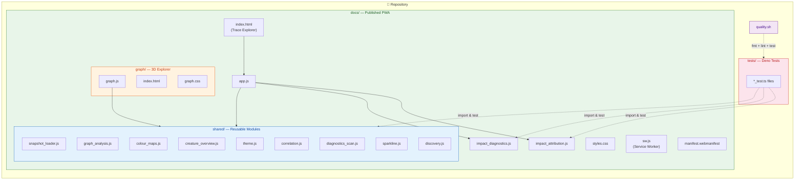
```mermaid
graph TD
    subgraph repo["📁 Repository"]
        direction TB
        subgraph docs_dir["docs/ — Published PWA"]
            direction TB
            index["index.html<br/>(Trace Explorer)"]
            appjs["app.js"]
            styles["styles.css"]
            sw["sw.js<br/>(Service Worker)"]
            manifest["manifest.webmanifest"]

            subgraph shared["shared/ — Reusable Modules"]
                direction TB
                snap_loader["snapshot_loader.js"]
                graph_analysis["graph_analysis.js"]
                colour_maps["colour_maps.js"]
                creature_overview["creature_overview.js"]
                theme_mod["theme.js"]
                correlation["correlation.js"]
                diagnostics["diagnostics_scan.js"]
                sparkline["sparkline.js"]
                discovery["discovery.js"]
            end

            impact_attr["impact_attribution.js"]
            impact_diag["impact_diagnostics.js"]

            subgraph graph_dir["graph/ — 3D Explorer"]
                graph_html["index.html"]
                graph_js["graph.js"]
                graph_css["graph.css"]
            end
        end

        subgraph tests_dir["tests/ — Deno Tests"]
            test_files["*_test.ts files"]
        end

        quality["quality.sh"]
    end

    index --> appjs
    appjs --> shared
    appjs --> impact_attr
    appjs --> impact_diag
    graph_js --> shared
    test_files -.->|import & test| shared
    test_files -.->|import & test| impact_attr
    test_files -.->|import & test| impact_diag
    quality -.->|fmt + lint + test| tests_dir

    style docs_dir fill:#e8f5e9,stroke:#2e7d32,color:#1b5e20
    style shared fill:#e3f2fd,stroke:#1565c0,color:#0d47a1
    style graph_dir fill:#fff3e0,stroke:#e65100,color:#bf360c
    style tests_dir fill:#fce4ec,stroke:#c62828,color:#b71c1c
    style quality fill:#f3e5f5,stroke:#6a1b9a,color:#4a148c
```

---

## 🔖 Versioning (SemVer)

This repo uses **Semantic Versioning** (**SemVer**, `MAJOR.MINOR.PATCH`) as the
human-facing version number. See [SemVer](https://semver.org/).

- **Source of truth**: `version.json`
- **PR automation**: if a PR targets `Develop` and does not change
  `version.json`, a GitHub Action will automatically bump the **patch** version
  and push it to the PR branch.
- **Deploy cache busting**: GitHub Pages deploy replaces a `__BUILD_ID__`
  placeholder in `docs/index.html` and `docs/sw.js` with the commit SHA, so
  users receive updated assets without needing to clear caches.

---

## ⚡ Quick Start

1. **Export a snapshot** from NEAT-AI-Discovery using
   `export_visualisation_snapshot`:

   ```json
   {
     "parquetFile": "/path/to/records.parquet",
     "creature": { ... },
     "outFile": "./snapshot.json"
   }
   ```

2. **Serve the `docs/` folder** with any HTTP server:

   ```bash
   cd docs
   python3 -m http.server 8000
   ```

3. **Open in browser**: `http://localhost:8000`

4. **Load your snapshot**:
   - Use the file picker to load a local JSON file
   - Or use `?snapshotUrl=./snapshot.json` (alias: `?file=...`)
   - For presigned URLs (recommended): use
     `?snapshotUrlB64=<base64url(utf8(url))>`
   - Or copy your snapshot to `docs/` and click "Fetch" with the default path

### Default snapshot (PWA-friendly)

When opened with **no query parameters**, the app now **auto-loads** the default
snapshot URL (hosted via GitHub Pages). This makes the installed PWA usable on
iPhone/iPad without needing the file picker.

### Tooltips (single-file snapshots)

The viewer can display human-friendly observation names and descriptions using a
`tooltips` object embedded in the snapshot (e.g.
`snapshot.tooltips["input-0"] =
{ label, description }`). This avoids needing a
separate `Tooltips.json` file.

Optional fields:

- **group**: a short group name used for clustering/summary in the Observations
  dashboard (e.g. `macro`, `rates`, `equities`). Example:
  `snapshot.tooltips["input-0"] = { label, description, group: "rates" }`.

#### Observation summary on hover (Issue #521)

Every surface that renders an observation label shows that observation's
`description` on mouse-over — the Observation Contributions panel, the
Observations dashboard, the impact/inbound breakdown rows, the trace breadcrumb,
and the graph explorer's labels, focus badge and HUD. Where no description
exists the label alone remains the tooltip. Touch devices reuse the existing tap
/ long-press tooltip patterns.

Snapshot descriptions are always the source of truth, so the viewer works for
non-GRQ networks. Snapshots generated before GRQ embedded `Tooltips.json` carry
no descriptions; for those, the viewer lazily fetches the bundled copy at
`docs/tooltips.json`. The bundle is ~430 KB, so it is **not** precached — a
snapshot with its own tooltips never downloads it.

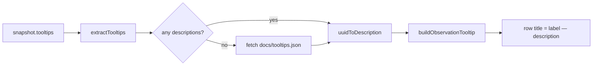
```mermaid
flowchart LR
    S[snapshot.tooltips] --> E[extractTooltips]
    E --> D{any descriptions?}
    D -- yes --> M[uuidToDescription]
    D -- no --> F[fetch docs/tooltips.json]
    F --> M
    M --> T[buildObservationTooltip]
    T --> R["row title = label — description"]
```

### ☁️ Loading snapshots from S3 (presigned URLs)

If you load a snapshot via a presigned S3 URL from GitHub Pages, the S3 bucket
must allow **CORS** for the GitHub Pages origin, otherwise the browser will
block the request.

- **Allowed origin**: `https://stsoftwareau.github.io`
- **Allowed methods**: `GET`, `HEAD`
- **Allowed headers**: `*`

> **💡 Tip:** If you upload `snapshot.json.gz`, either set object metadata
> `Content-Encoding: gzip` and `Content-Type: application/json` so browsers
> transparently decompress, _or_ ensure your browser supports
> `DecompressionStream` (the app will decompress `.gz` client-side when
> possible).

---

## ✨ Features

- **Creature overview dashboard**: After loading a snapshot, see an at-a-glance
  summary of the neural network — neuron/synapse counts, activation function
  distribution, network depth, and an interactive mini topology diagram. Click
  any layer to navigate into the trace explorer.
- **Trace explorer**: Click an output neuron → see inbound synapses → click to
  go upstream toward observations → repeat until you reach inputs. Builds a
  breadcrumb trail.
- **Synapse Sorting**: Sort inbound synapses by |weight|, weight, or |mean
  contribution|.
- **Synapse Colour Coding**: Synapse edges and rows are colour-coded by weight
  strength — green for excitatory (positive), red for inhibitory (negative),
  grey for weak/near-zero. A collapsible colour legend explains the scale.
- **Neuron Detail Cards**: Shows type, squash (colour-coded badge), bias, impact
  score, and recorded stats in themed card components with inline sparkline
  charts for activation history and error distribution histograms.
- **Reconstruction Checks**: If enabled in export, shows max value/activation
  deltas to identify recording or squash function mismatches.
- **Graph explorer**: A 3D neighbourhood view of the NEAT network to build
  intuition about local connectivity and high-impact pathways.
- **Resizable panels (remembered per device)**: Drag the divider between the
  neuron-detail and inbound-synapse panels to rebalance the explorer, and drag
  the edge handle on the graph view's Focus/Legend overlays to widen them. Works
  with both mouse and touch. Each size is saved to `localStorage` and restored
  on the next visit (clamped to the current viewport), and a
  double-click/double-tap on a divider or handle resets it to the default.

---

## 🔍 What the Explorer shows (example snapshot)

The published app auto-loads a default snapshot (hosted separately so this repo
doesn't churn with large snapshot artefacts).

Some interesting findings from that snapshot:

- **output-0 is dominated by a single upstream hidden neuron**:
  `hidden-discovery-739a5119-b981-4ae6-91d1-ca8cc33abc5a → output-0` receives
  ~74.6% of the inbound allocated impact (using the viewer's heuristic
  allocation).
- **A second hidden neuron is the next biggest contributor**:
  `hidden-discovery-6aae3201-115b-4dc4-beee-2d7428399e14 → output-0` receives
  ~14.1% of the inbound allocated impact.
- **There are prunable candidates**: ~7.6% of non-input neurons have exported
  impact < 1e-8 (highlighted as "suspicious" in the UI).

Snapshot metadata:

- **exportedAt**: 20251219T043800Z
- **discoveryVersion**: 0.2.12
- **Network size**: 471 neurons, 16,719 synapses

---

## 📱 Responsiveness (PWA screenshots)

These screenshots are generated from a real browser at iPhone/iPad/desktop
viewports (see `scripts/generate_pwa_assets.ts`).

### iPhone (neurons)

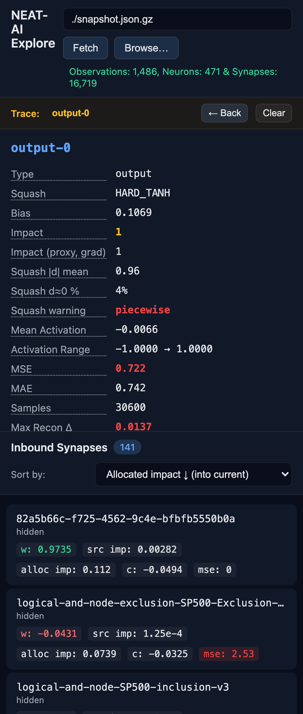

### iPhone (inbound impact allocation modal)

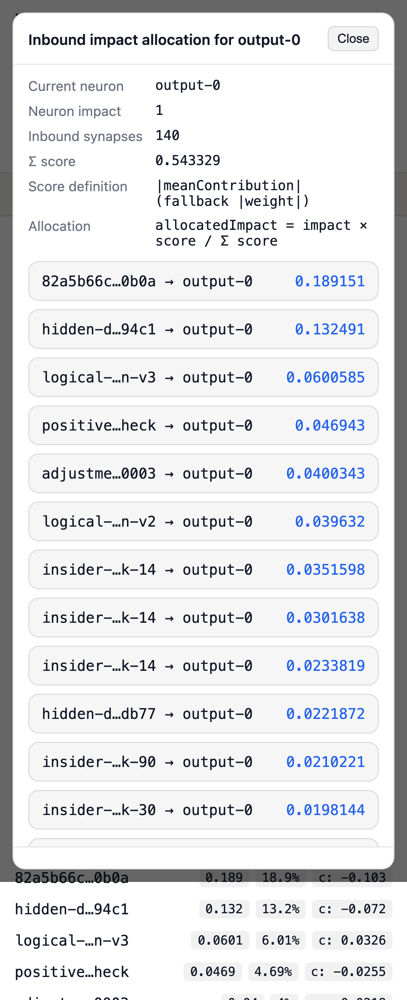

### iPad (neurons)

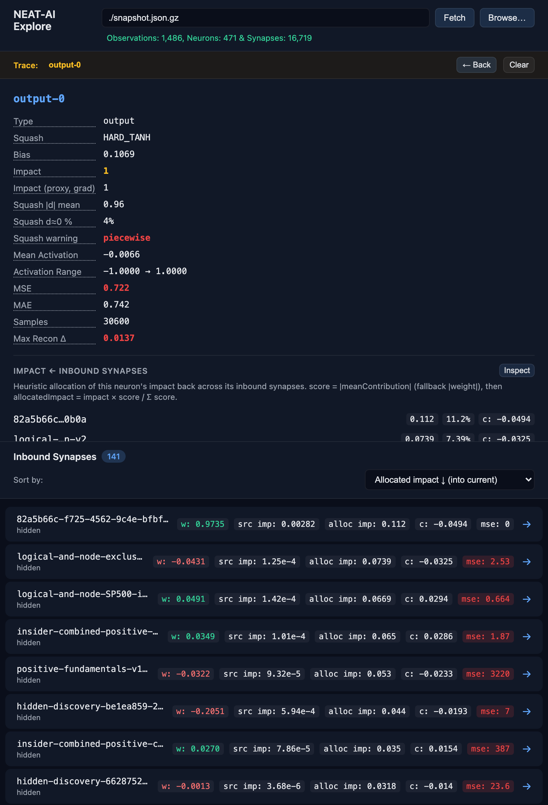

### iPad (inbound impact allocation modal)

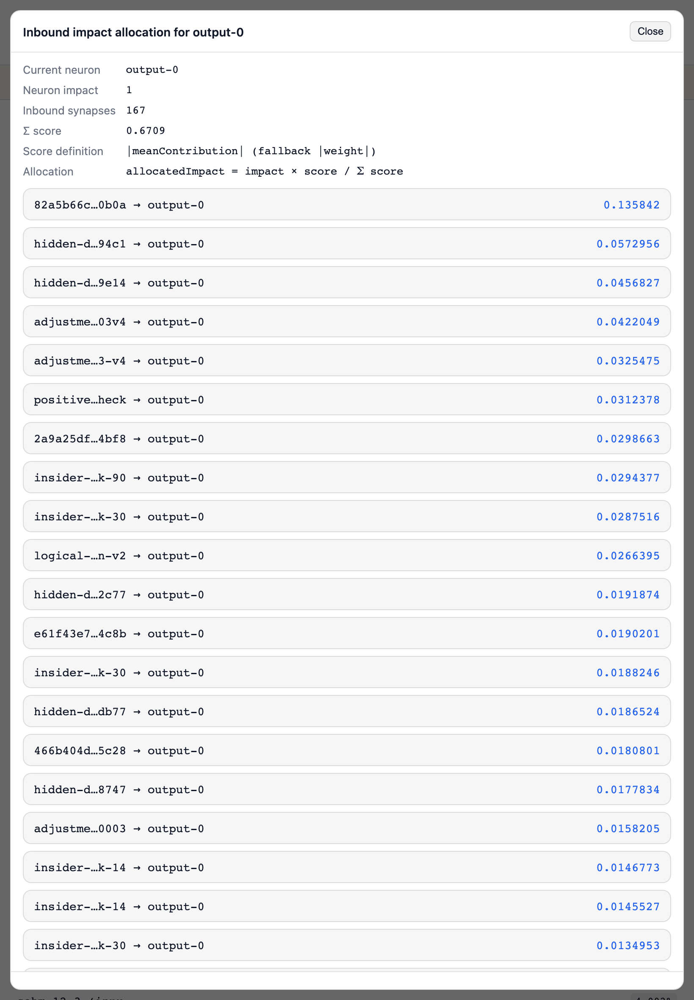

### Desktop (inbound impact allocation modal)

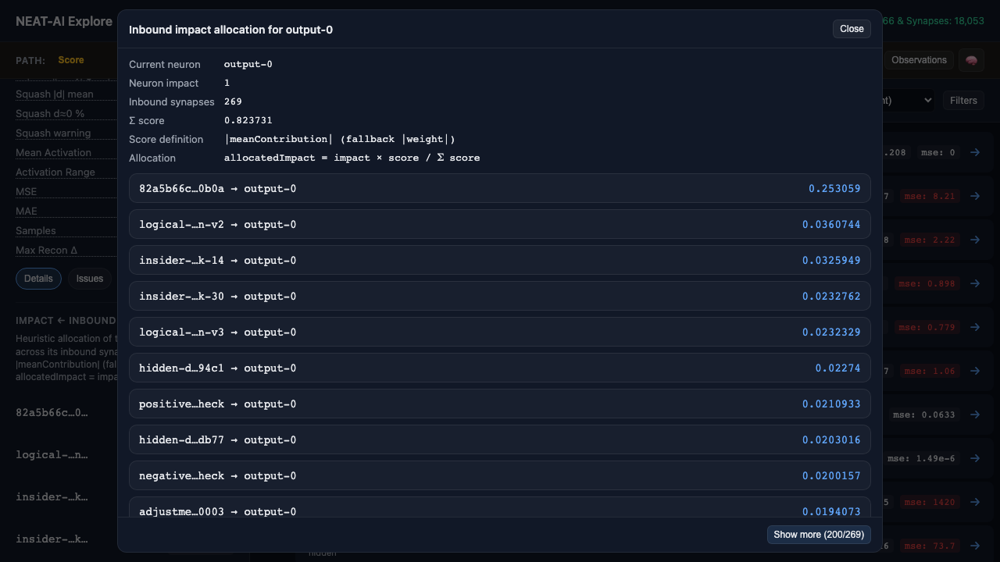

---

## 🎮 Graph explorer (3D neighbourhood view)

The graph explorer is an intuition-building alternative visualisation for large
NEAT networks.

- **Entry point**: `docs/graph/index.html`
- **Controls**:
  - Drag to look
  - Mouse wheel to zoom
  - WASD / arrow keys to fly
  - Click a neuron to focus it (HUD shows key properties + flags)
  - **Touch**: single tap to focus (with ripple), long press for tooltip, pinch
    to zoom toward midpoint, two-finger pan with momentum, swipe left/right to
    cycle neurons in the trace path
- **Layout**: focus-centric neighbourhood view (directly linked neurons are
  closest; moving focus recomputes the local neighbourhood layout)
- **Legend**: includes mapping notes (size/colour/bias/degree)

### Graph explorer (desktop)

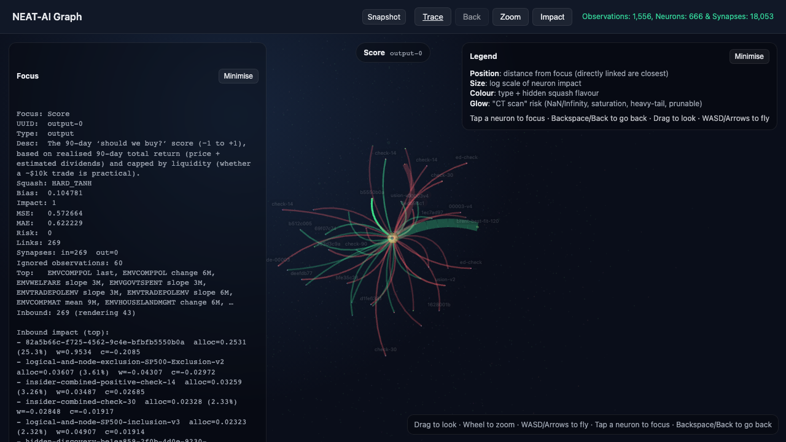

### Graph explorer (click-to-focus HUD)

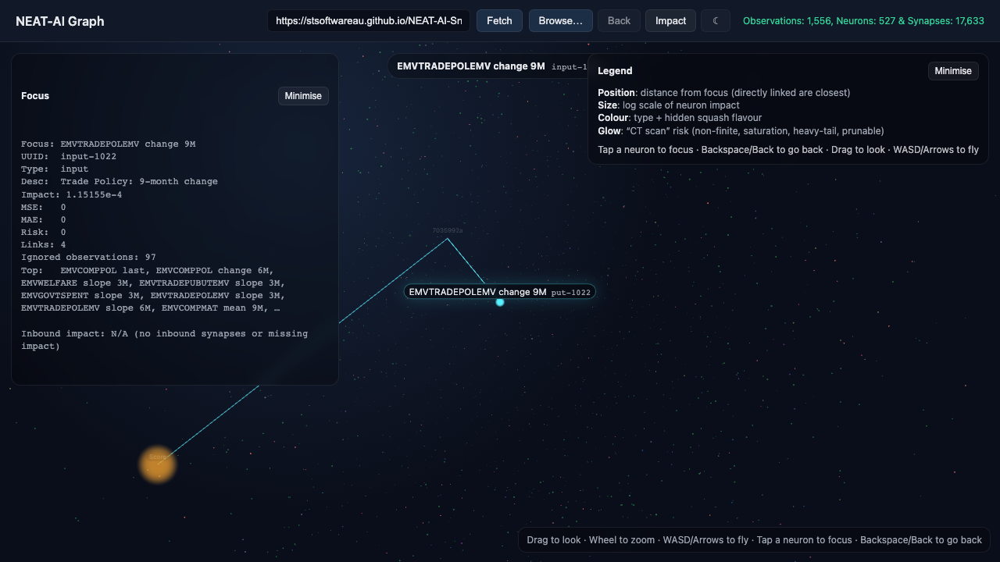

### Graph explorer (tilt + zoom)

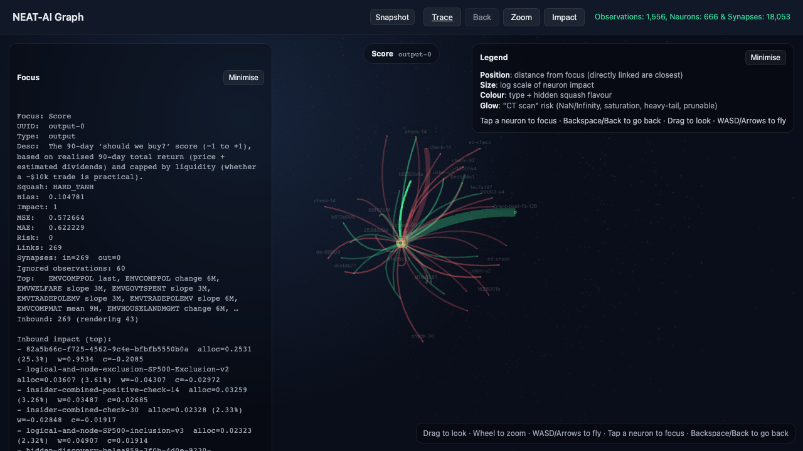

### Aggregated layered graph model (data foundation)

`docs/shared/aggregated_graph_model.js` is the DOM-free model that new graph
views consume instead of the raw graph. At the default snapshot scale (2,461
inputs, 1,655 hidden neurons, 21,492 synapses) a node-per-neuron rendering is
unreadable, so the model aggregates first and returns
`{ nodes, edges, layers, families, meta }`.

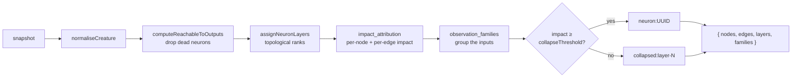
```mermaid
flowchart LR
    S[snapshot] --> N[normaliseCreature]
    N --> R["computeReachableToOutputs<br/>drop dead neurons"]
    R --> L["assignNeuronLayers<br/>topological ranks"]
    L --> I["impact_attribution<br/>per-node + per-edge impact"]
    I --> F["observation_families<br/>group the inputs"]
    F --> C{"impact ≥<br/>collapseThreshold?"}
    C -- yes --> K["neuron:UUID"]
    C -- no --> X["collapsed:layer-N"]
    K --> M["{ nodes, edges, layers, families }"]
    X --> M
```

- **Families** — inputs bucket by their tooltip `group`, falling back to the
  label's **leading subject token**, then to `ungrouped` (Issue #539). The
  published snapshot supplies no `group` metadata, so the fallback does all the
  work there: `close-best-fit-30-7`, `EMVMACROTRADE mean 9M` and
  `P/E ratio (TTM)` group as `close`, `emvmacrotrade` and `p-e`, collapsing
  2,132 singleton families to 232 real ones. `/` is deliberately not a token
  boundary so ratio labels keep their identity.
- **Layers** — a longest-path Kahn sweep; recurrent networks still terminate,
  and output neurons are pinned to the final layer.
- **Impact** — exported `derived.impactsByNeuronUuid` values win; anything
  missing (inputs, typically) is propagated back from the outputs through the
  inbound allocation shares.
- **Collapse** — `collapseThreshold` (default 1% of the strongest neuron) folds
  weak neurons into a per-layer aggregate. Every aggregate node keeps its
  `members` and a stable `id`, so a later per-stock view can re-expand or
  re-weight it without a rewrite.

### Sankey contribution-flow view (Issue #526)

`docs/sankey/` is a candidate replacement graph view that draws contribution
**flow** rather than nodes and edges. It consumes the aggregated layered graph
model and turns it into a **conserved** Sankey: the band into the output is the
Score, and every upstream band is proportional to the contribution that reaches
it. That makes "how does the Score decompose across observation families?" a
proportional, phone-friendly picture — the primary strength of a Sankey — while
thin/absent bands surface dead zones and a single family's band traces forward
to the output.

- **Entry point**: `docs/sankey/index.html` (linked from the trace explorer's
  overflow menu, alongside the 3D graph).
- **Conserved flow** — `buildSankeyFlow` seeds each output with its impact and
  walks layers back-to-front, splitting each node's throughput across its
  inbound edges by contribution (`sankey_flow.js`). Every node's inbound bands
  therefore sum to its outbound bands, so the layer-0 family bands sum back to
  the Score.
- **Aggregation-first** — the model already collapses low-impact hidden neurons;
  the view additionally folds each layer's low-contribution tail into one
  per-layer "other" node (`maxNodesPerLayer`), so the diagram stays legible.
  Since #539 the layer-0 bands it ranks are genuine observation families (232 on
  the published snapshot) rather than single observations, so the bands read as
  family contributions to the Score.
- **Inspectable folds (Issue #538)** — the fold is what keeps the diagram
  readable, but it also hides the thin/absent flows a viewer hunting **dead
  zones** is looking for. Selecting an "other" node lists what it swallowed,
  **weakest first**, with each member's share of the Score; members carrying no
  flow at all are marked _dead_ rather than merely minor. `rankFoldedTail` and
  `pageFoldedTail` (`sankey_flow.js`) are DOM-free and unit-tested; the panel
  (`docs/sankey/fold_panel.js`) keeps exactly one page in the DOM, so a
  2,121-member fold does not lock up a phone.
- **Tooltips** reuse the #521 observation-summary format
  (`buildObservationTooltip`).
- **Touch tooltips (Issue #536)** — native SVG `<title>` only renders on hover,
  so the same tooltip string is also driven into the `#tooltip` panel on tap and
  on keyboard focus (`docs/sankey/tooltip_panel.js`). The panel is clamped
  inside the viewport, and dismisses on tap-away, `Escape`, or blur. Hover and
  the screen-reader `aria-label` are untouched — this is additive.
- **Phone layout (Issue #540)** — a phone gets a _different_ layout, not the
  desktop canvas shrunk: half the per-layer fold budget (so each band is roughly
  twice as tall and its label survives), thicker band and node floors, shorter
  labels, and width-based `@media` rules that reflow the header, legend and meta
  line. The published snapshot lays out as 33 layers, so the phone opens on one
  **full-height screenful** of that strip and pans, rather than fitting the
  whole illegible thing on screen. Pinch, drag, wheel, the `+`/`−`/`Reset`
  buttons and the `+`, `−`, `0` and arrow keys all drive the same `viewBox`
  window (`docs/shared/viewbox_zoom.js`, `docs/sankey/zoom_pan.js`), so
  magnifying is never touch-only. The desktop layout is unchanged.

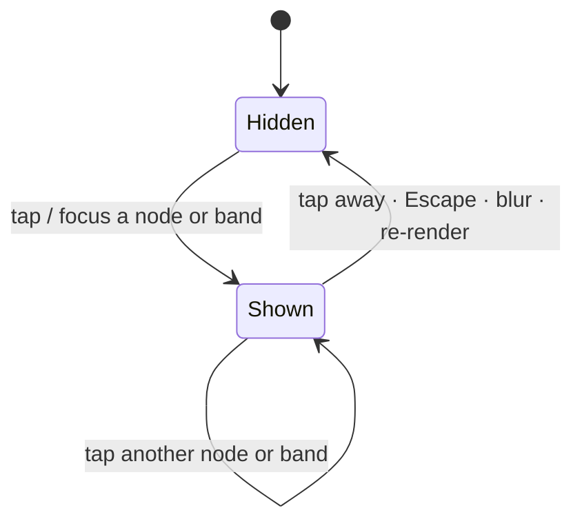
```mermaid
stateDiagram-v2
    [*] --> Hidden
    Hidden --> Shown: tap / focus a node or band
    Shown --> Shown: tap another node or band
    Shown --> Hidden: tap away · Escape · blur · re-render
```

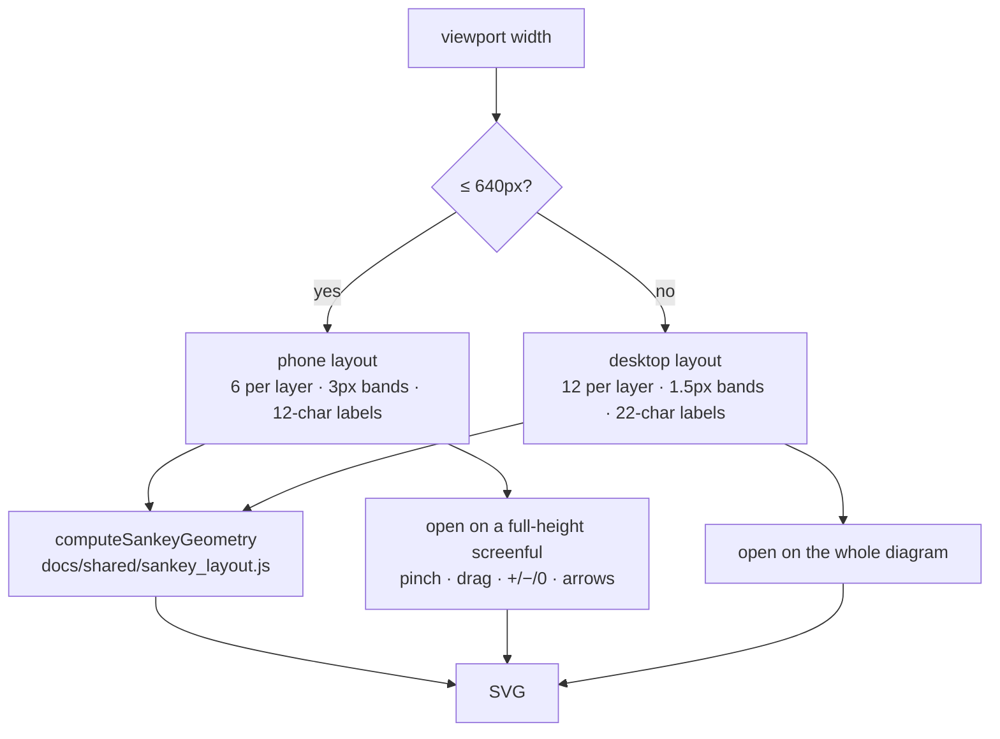
```mermaid
flowchart TD
    W["viewport width"] --> B{"≤ 640px?"}
    B -->|yes| P["phone layout<br/>6 per layer · 3px bands · 12-char labels"]
    B -->|no| D["desktop layout<br/>12 per layer · 1.5px bands · 22-char labels"]
    P --> G["computeSankeyGeometry<br/>docs/shared/sankey_layout.js"]
    D --> G
    G --> S["SVG"]
    P --> Z["open on a full-height screenful<br/>pinch · drag · +/−/0 · arrows"]
    D --> F["open on the whole diagram"]
    Z --> S
    F --> S
```

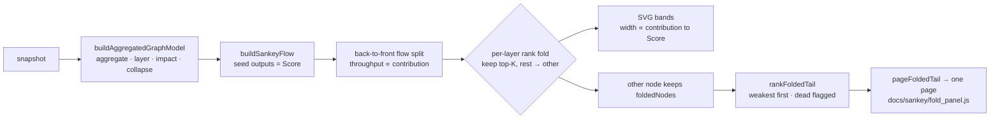
```mermaid
flowchart LR
    S[snapshot] --> M["buildAggregatedGraphModel<br/>aggregate · layer · impact · collapse"]
    M --> F["buildSankeyFlow<br/>seed outputs = Score"]
    F --> B["back-to-front flow split<br/>throughput ∝ contribution"]
    B --> R{"per-layer rank fold<br/>keep top-K, rest → other"}
    R --> V["SVG bands<br/>width ∝ contribution to Score"]
    R --> O["other node keeps foldedNodes"]
    O --> K["rankFoldedTail<br/>weakest first · dead flagged"]
    K --> P["pageFoldedTail → one page<br/>docs/sankey/fold_panel.js"]
```

---

## 🕸️ Layered DAG view (`/dag/`)

`docs/dag/` renders the aggregated model above as a left-to-right diagram —
observation families on the left, hidden layers in topological order, the output
on the right. It ships **alongside** the 3D starfield (`/graph/`), which is
unchanged; reach it from the Trace explorer's ⋯ menu.

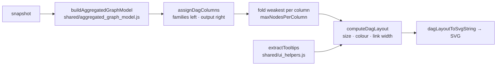
```mermaid
flowchart LR
    S[snapshot] --> A["buildAggregatedGraphModel<br/>shared/aggregated_graph_model.js"]
    A --> C["assignDagColumns<br/>families left · output right"]
    C --> F["fold weakest per column<br/>maxNodesPerColumn"]
    F --> G["computeDagLayout<br/>size · colour · link width"]
    G --> V["dagLayoutToSvgString → SVG"]
    T["extractTooltips<br/>shared/ui_helpers.js"] --> G
```

- **Impact encodings** — node radius and colour intensity scale with per-node
  impact; link width scales with the contribution the merged synapses carry.
  Both reuse `TOPO_MIN/MAX_NODE_R` and `TOPO_MIN/MAX_LINK_W` from
  `shared/topology_diagram.js`, and link colour reuses the diverging weight-sum
  map from `shared/colour_maps.js`.
- **Tooltips** — the same observation summaries as the trace explorer, from
  `extractTooltips` (Issue #521), rendered as SVG `<title>` text and expanded in
  the Details panel.
- **Readability at full scale** — each column draws its strongest nodes and
  folds the remainder into a single grey aggregate. Nothing is dropped silently:
  the summary line states how many neurons are dead, how many the model
  collapsed, and how many the view folded.
- **Detail** — the header control trades readability for completeness (Coarse 8
  rows / Fine 20 rows per column).

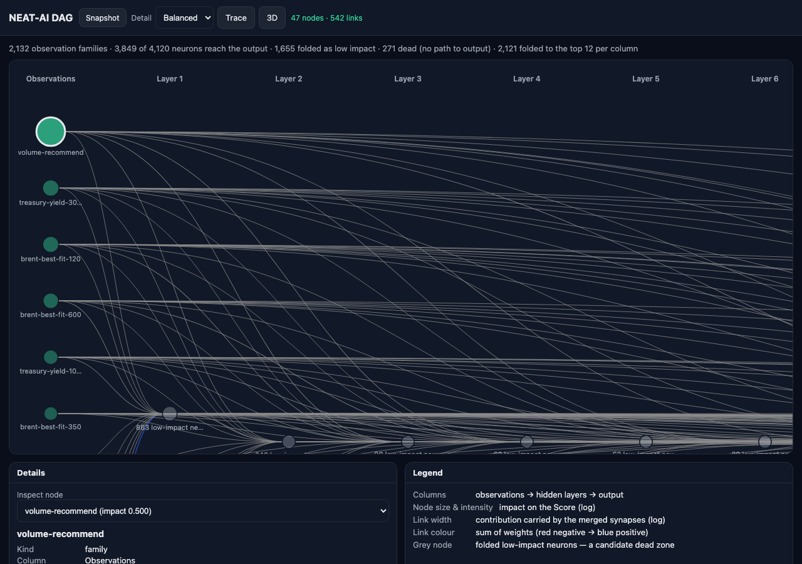

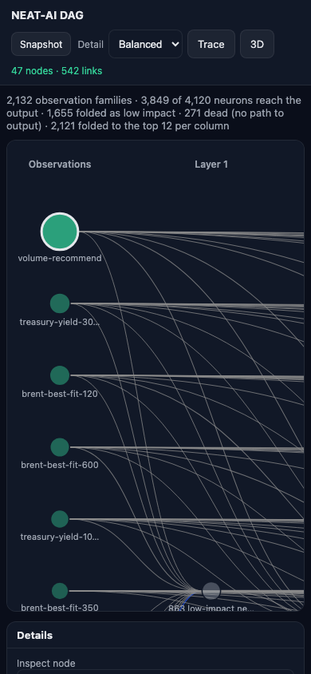

---

## 🎯 Top-impact subgraph view (`/subgraph/`)

`docs/subgraph/` is the third candidate. Instead of drawing the whole network it
extracts only the **highest-contributing paths to the Score** and states how
much of the network that leaves out. On the default snapshot the default
settings draw 12 paths — 25 nodes and 24 links out of 4,120 neurons.

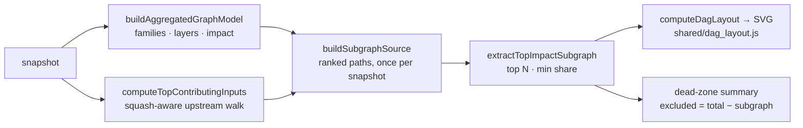
```mermaid
flowchart LR
    S[snapshot] --> A["buildAggregatedGraphModel<br/>families · layers · impact"]
    S --> W["computeTopContributingInputs<br/>squash-aware upstream walk"]
    A --> R["buildSubgraphSource<br/>ranked paths, once per snapshot"]
    W --> R
    R --> E["extractTopImpactSubgraph<br/>top N · min share"]
    E --> G["computeDagLayout → SVG<br/>shared/dag_layout.js"]
    E --> D["dead-zone summary<br/>excluded = total − subgraph"]
```

- **Extraction** — `computeTopContributingInputs` (`shared/graph_analysis.js`)
  ranks every observation by its squash-aware contribution to the output; the
  view keeps the top N that clear the minimum share and carves the matching
  nodes and edges out of the aggregated model.
- **Controls** — **Top paths** (5–50) and **Min share** (0–5%) re-extract from
  the cached ranking, so changing either is instant.
- **Rendering** — the same layered layout, impact encodings and Issue #521
  observation tooltips as the DAG view, so the two candidates read alike.
- **Dead zones** — every observation, neuron and aggregate node excluded from
  the subgraph is counted in the Dead zones panel, alongside the neurons with no
  path to the Score at all. Excluded is always exactly total minus subgraph.
- **Troubleshooting** — picking a path (or tapping a node) shows the observation
  summary, the share of the Score it carries, and the full neuron chain.

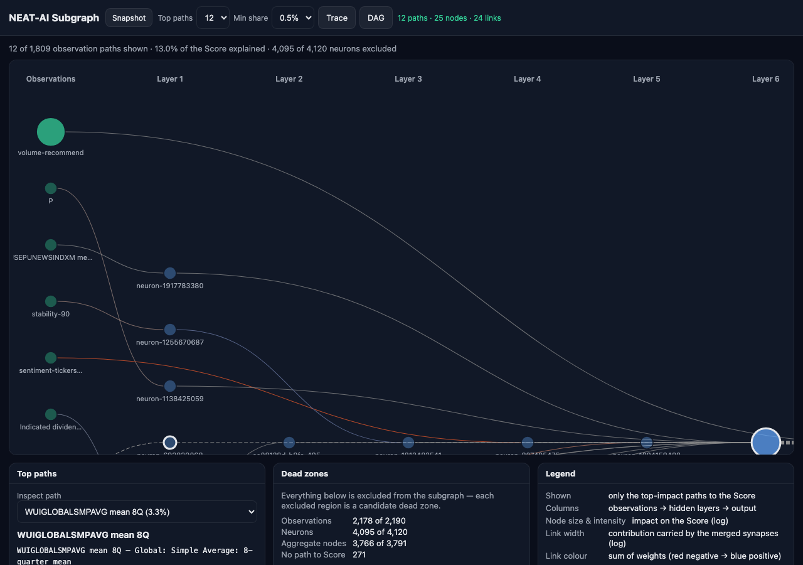

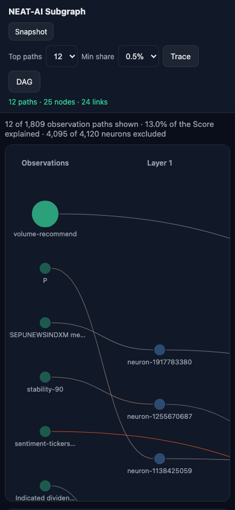

---

## 🧭 Direction terminology (to avoid confusion)

The NEAT network computation direction and the explorer navigation direction are
**opposite**:

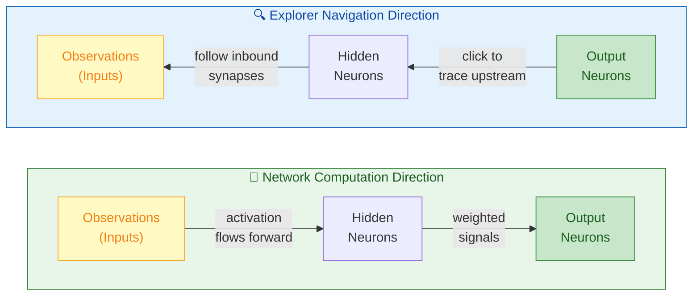
```mermaid
graph LR
    subgraph computation["🧠 Network Computation Direction"]
        direction LR
        obs["Observations<br/>(Inputs)"]
        hidden["Hidden<br/>Neurons"]
        out["Output<br/>Neurons"]
        obs -->|"activation<br/>flows forward"| hidden
        hidden -->|"weighted<br/>signals"| out
    end

    subgraph navigation["🔍 Explorer Navigation Direction"]
        direction RL
        out2["Output<br/>Neurons"]
        hidden2["Hidden<br/>Neurons"]
        obs2["Observations<br/>(Inputs)"]
        out2 -->|"click to<br/>trace upstream"| hidden2
        hidden2 -->|"follow inbound<br/>synapses"| obs2
    end

    style computation fill:#e8f5e9,stroke:#2e7d32,color:#1b5e20
    style navigation fill:#e3f2fd,stroke:#1565c0,color:#0d47a1
    style obs fill:#fff9c4,stroke:#f9a825,color:#f57f17
    style out fill:#c8e6c9,stroke:#388e3c,color:#1b5e20
    style obs2 fill:#fff9c4,stroke:#f9a825,color:#f57f17
    style out2 fill:#c8e6c9,stroke:#388e3c,color:#1b5e20
```

- **Inbound synapses (UI)**: synapses that flow from an upstream neuron into the
  currently selected neuron (i.e. arrows point _toward_ the current neuron)

---

## 📥 Snapshot Loading Flow

How snapshots reach the viewer through `snapshot_loader.js`:

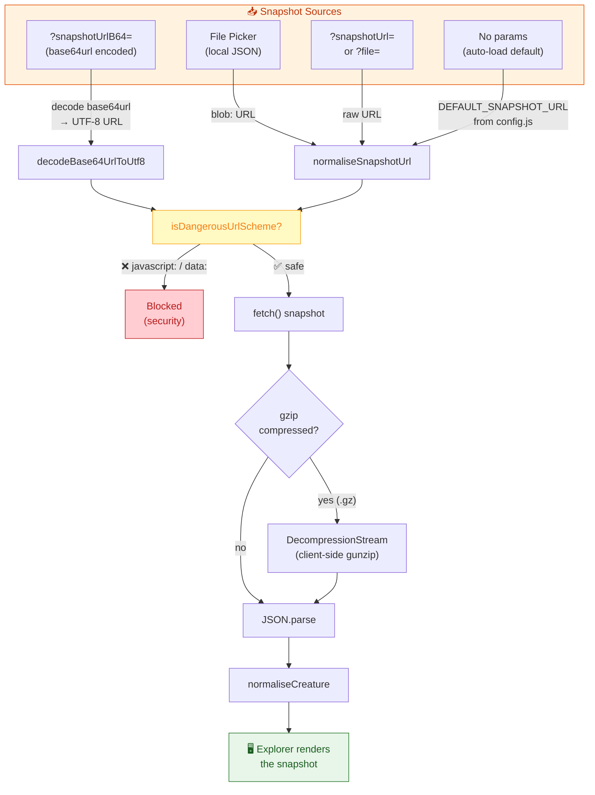
```mermaid
graph TD
    subgraph sources["📥 Snapshot Sources"]
        file_picker["File Picker<br/>(local JSON)"]
        url_param["?snapshotUrl=<br/>or ?file="]
        b64_param["?snapshotUrlB64=<br/>(base64url encoded)"]
        default["No params<br/>(auto-load default)"]
    end

    file_picker -->|"blob: URL"| normalise
    url_param -->|"raw URL"| normalise
    b64_param -->|"decode base64url<br/>→ UTF-8 URL"| decode["decodeBase64UrlToUtf8"]
    decode --> security
    default -->|"DEFAULT_SNAPSHOT_URL<br/>from config.js"| normalise

    security["isDangerousUrlScheme?"]
    normalise["normaliseSnapshotUrl"]
    normalise --> security

    security -->|"❌ javascript: / data:"| blocked["Blocked<br/>(security)"]
    security -->|"✅ safe"| fetch_snap["fetch() snapshot"]

    fetch_snap --> gzip{"gzip<br/>compressed?"}
    gzip -->|"yes (.gz)"| decompress["DecompressionStream<br/>(client-side gunzip)"]
    gzip -->|"no"| parse["JSON.parse"]
    decompress --> parse

    parse --> normalise_creature["normaliseCreature"]
    normalise_creature --> viewer["🖥️ Explorer renders<br/>the snapshot"]

    style sources fill:#fff3e0,stroke:#e65100,color:#bf360c
    style blocked fill:#ffcdd2,stroke:#c62828,color:#b71c1c
    style viewer fill:#e8f5e9,stroke:#2e7d32,color:#1b5e20
    style security fill:#fff9c4,stroke:#f9a825,color:#f57f17
```

---

## 📦 Snapshot JSON Format

The expected format matches the output of NEAT-AI-Discovery's
`export_visualisation_snapshot` function:

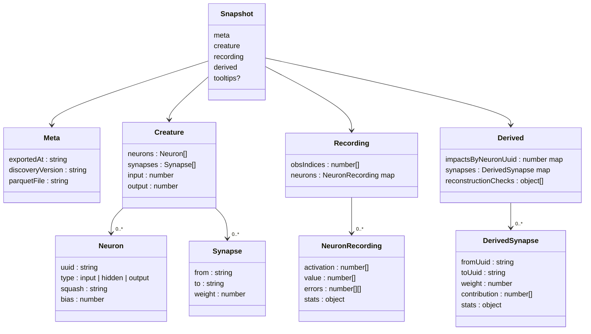
```mermaid
classDiagram
    class Snapshot {
        meta
        creature
        recording
        derived
        tooltips?
    }

    class Meta {
        exportedAt : string
        discoveryVersion : string
        parquetFile : string
    }

    class Creature {
        neurons : Neuron[]
        synapses : Synapse[]
        input : number
        output : number
    }

    class Neuron {
        uuid : string
        type : input | hidden | output
        squash : string
        bias : number
    }

    class Synapse {
        from : string
        to : string
        weight : number
    }

    class Recording {
        obsIndices : number[]
        neurons : NeuronRecording map
    }

    class NeuronRecording {
        activation : number[]
        value : number[]
        errors : number[][]
        stats : object
    }

    class Derived {
        impactsByNeuronUuid : number map
        synapses : DerivedSynapse map
        reconstructionChecks : object[]
    }

    class DerivedSynapse {
        fromUuid : string
        toUuid : string
        weight : number
        contribution : number[]
        stats : object
    }

    Snapshot --> Meta
    Snapshot --> Creature
    Snapshot --> Recording
    Snapshot --> Derived
    Creature --> "0..*" Neuron
    Creature --> "0..*" Synapse
    Recording --> "0..*" NeuronRecording
    Derived --> "0..*" DerivedSynapse
```

```json
{
  "meta": {
    "exportedAt": "20251218T...",
    "discoveryVersion": "0.2.10",
    "parquetFile": "/path/to/records.parquet"
  },
  "creature": {
    "neurons": ["..."],
    "synapses": ["..."],
    "input": 20,
    "output": 1
  },
  "recording": {
    "obsIndices": [0, 1, 2, "..."],
    "neurons": {
      "output-0": {
        "activation": ["..."],
        "value": ["..."],
        "errors": [["..."], "..."],
        "stats": { "...": "..." }
      }
    }
  },
  "derived": {
    "impactsByNeuronUuid": { "output-0": 1.0, "...": "..." },
    "synapses": {
      "hidden-0→output-0": {
        "fromUuid": "hidden-0",
        "toUuid": "output-0",
        "weight": 2.0,
        "contribution": ["..."],
        "stats": { "meanContribution": 1.5, "...": "..." }
      }
    },
    "reconstructionChecks": ["..."]
  }
}
```

---

## 🧪 Testing

Tests use [Deno](https://deno.com/) and live in `tests/`. Run them with:

```bash
deno test -A
```

Or use the quality gate (format + lint + test):

```bash
./quality.sh
```

### Quality gate pipeline

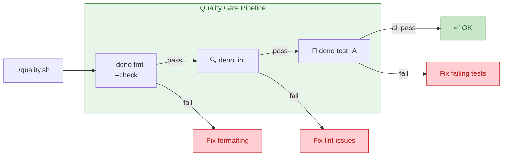
```mermaid
graph LR
    start["./quality.sh"] --> fmt

    subgraph pipeline["Quality Gate Pipeline"]
        direction LR
        fmt["📐 deno fmt<br/>--check"]
        lint["🔍 deno lint"]
        test["🧪 deno test -A"]
        fmt -->|"pass"| lint
        lint -->|"pass"| test
    end

    test -->|"all pass"| ok["✅ OK"]
    fmt -->|"fail"| fix_fmt["Fix formatting"]
    lint -->|"fail"| fix_lint["Fix lint issues"]
    test -->|"fail"| fix_test["Fix failing tests"]

    style pipeline fill:#e8f5e9,stroke:#2e7d32,color:#1b5e20
    style ok fill:#c8e6c9,stroke:#388e3c,color:#1b5e20
    style fix_fmt fill:#ffcdd2,stroke:#c62828,color:#b71c1c
    style fix_lint fill:#ffcdd2,stroke:#c62828,color:#b71c1c
    style fix_test fill:#ffcdd2,stroke:#c62828,color:#b71c1c
```

### Required checks (branch protection)

The default branch (**Develop**) is protected by the `Develop` repository
ruleset (`.github/rulesets/develop.json` is the settings-as-code mirror). The
following status check is **required** and blocks PR merge when it fails:

- **`quality`** — the job from
  [`.github/workflows/deno-quality.yml`](.github/workflows/deno-quality.yml).
  This runs `deno fmt --check`, `deno lint`, `deno check` (repo-wide, including
  `docs/`), and `deno test -A` with coverage. A failing `deno check` — for
  example, the duplicate top-level identifier regression fixed in #201 — will
  turn this check red and disable the **Merge** button until the underlying
  issue is fixed.

Run `./quality.sh` locally before pushing to land green on the first attempt.
See Issue #211 for the rationale and the configuration audit trail.

### Code-owner review for privileged CI paths

Changes under the privileged CI paths require a review from the
[`.github/CODEOWNERS`](.github/CODEOWNERS) reviewing team
(`@stSoftwareAU/developers`), enforced by `"require_code_owner_review": true` in
the `Develop` ruleset (Issue #361):

- `/.github/workflows/` — run with the repository's secrets and (for
  `deploy.yml`) an OIDC `id-token`.
- `/.github/actions/` — composite/local actions invoked by those workflows.
- `/.github/rulesets/` — the branch-protection controls themselves.

This is defence-in-depth on top of the generic single-review rule: a single
contributor cannot quietly alter a privileged workflow to exfiltrate secrets,
push to **Develop**, or publish content to the public GitHub Pages site without
a workflow owner's sign-off. Like the rest of the ruleset, the
`require_code_owner_review` change is settings-as-code only — a repo admin must
re-apply `.github/rulesets/develop.json` to the live ruleset for it to take
effect.

### Unit tests vs benchmarks

- **Unit tests verify correctness** — import a module, call a function with
  known inputs, assert the result. They must not measure performance.
- **Benchmarks verify performance** — use `deno bench` or a dedicated script to
  measure execution time. Benchmarks are expected to be slow and must not run as
  part of the unit-test suite.
- Unit tests run in parallel, so any timing-based assertion is unreliable by
  design.

### "What" tests vs "how" tests

Write **"what" tests** — tests that exercise real behaviour:

```ts
import { myFunction } from "../module.js";
Deno.test("myFunction doubles positive numbers", () => {
  assertEquals(myFunction(3), 6);
});
```

Do **not** write **"how" tests** — tests that read source files as text and grep
for implementation patterns:

```ts
// BAD — breaks on any refactor and tests nothing useful
const src = await Deno.readTextFile("module.js");
assert(src.includes("Math.pow"));
```

> **⚠️ Note:** If you swap quicksort for mergesort, "what" tests still pass
> (correct results). "How" tests break even though behaviour is unchanged, or
> worse, they pass while the code is actually broken.

### What can be unit-tested

Only pure, DOM-free modules can be tested in Deno:

| Module                                  | Testable functions                                                                                                                        |
| --------------------------------------- | ----------------------------------------------------------------------------------------------------------------------------------------- |
| `docs/impact_attribution.js`            | `computeImpactBreakdownToOutputs`, `computeInboundSynapseImpactAllocation`                                                                |
| `docs/impact_diagnostics.js`            | `squashDerivative`, `computeGradientProxyImpact`, `summariseSeriesStats`, etc.                                                            |
| `docs/shared/config.js`                 | `DEFAULT_SNAPSHOT_URL`, `SNAPSHOT_FALLBACK_URLS`, `ALLOWED_SNAPSHOT_ORIGINS`                                                              |
| `docs/shared/graph_analysis.js`         | `buildGraphIndex`, `computeReachableToOutputs`, `computeTopContributingInputs`                                                            |
| `docs/shared/snapshot_loader.js`        | `normaliseSnapshotUrl`, `decodeBase64UrlToUtf8`, `isDangerousUrlScheme`, `normaliseCreature`                                              |
| `docs/shared/colour_maps.js`            | `hash32`, `u01ToSigned`, `u32ToU01`, `neuronColourRgb01`, `synapseWeightStrength01`, `synapseWeightColourRgb01`, `synapseWeightColourCss` |
| `docs/shared/creature_overview.js`      | `computeNeuronBreakdown`, `computeSynapseStats`, `computeNetworkDepth`, `computeActivationDistribution`, `computeLayerTopology`           |
| `docs/shared/transitions.js`            | `prefersReducedMotion`, `synapseStaggerDelay`, duration constants                                                                         |
| `docs/shared/touch_gestures.js`         | `classifyTouch`, `detectSwipeDirection`, `momentumStep`, `clampMomentum`, `pinchZoomToward`, `clampZoomDistance`                          |
| `docs/shared/sparkline.js`              | `computeSparklinePoints`, `computeErrorHistogram`, `squashBadge`, `flattenErrors`                                                         |
| `docs/shared/correlation.js`            | `pearsonCorrelation`, `sampleSeries`, `computeTopInputCorrelations`                                                                       |
| `docs/shared/discovery.js`              | `normaliseCandidate`, `extractDiscoveryCandidates`                                                                                        |
| `docs/shared/diagnostics_scan.js`       | `scan1d`, `scan2d`, `computeNonFiniteIssues`, `computeNotRecordedIssues`, `computeErrorConcentrationIssues`                               |
| `docs/shared/theme.js`                  | `normaliseThemeMode`, `cycleThemeMode`, `themeModeLabel`, `themeModeGlyph`                                                                |
| `docs/shared/panel_resize.js`           | `parsePanelSize`, `clampPanelSize`, `resolveInitialPanelSize`, `computeDragPanelSize`, `loadPanelSize`, `savePanelSize`, `clearPanelSize` |
| `docs/shared/ui_helpers.js`             | `escapeHtml`, `extractTooltips`, `buildObservationTooltip`                                                                                |
| `docs/shared/tooltips_fallback.js`      | `needsFallbackTooltips`, `mergeTooltipMaps`, `fallbackTooltipsUrl`, `loadFallbackTooltips`                                                |
| `docs/shared/selection_attribution.js`  | `normaliseSelectionSquash`, `isSelectionSquash`, `computeSelectionWinShares`                                                              |
| `docs/shared/observation_families.js`   | `normaliseFamilyKey`, `deriveObservationFamily`, `groupObservationsByFamily`                                                              |
| `docs/shared/aggregated_graph_model.js` | `assignNeuronLayers`, `buildAggregatedGraphModel`                                                                                         |
| `docs/shared/sankey_flow.js`            | `buildSankeyFlow`, `bandWidth`, `rankFoldedTail`, `pageFoldedTail`                                                                        |
| `docs/sankey/tooltip_panel.js`          | `clampTooltipPosition`, `anchorPoint`, `createTooltipController`, `attachTooltipTrigger`, `attachTooltipDismissers`                       |
| `docs/sankey/fold_panel.js`             | `formatSharePercent`, `summariseFoldedTail`, `createFoldPanelController`, `attachFoldTrigger`, `attachFoldPanelDismissers`                |
| `docs/shared/sankey_responsive.js`      | `sankeyLayoutForWidth`, `sankeyViewWidth`                                                                                                 |
| `docs/shared/sankey_layout.js`          | `computeSankeyGeometry`, `truncateLabel`                                                                                                  |
| `docs/shared/viewbox_zoom.js`           | `fitWindow`, `fitHeightWindow`, `clampWindow`, `zoomWindow`, `panWindow`, `contentPointAt`, `contentDelta`, `zoomOf`, `maxZoomFor`        |
| `docs/sankey/zoom_pan.js`               | `createZoomPanController`, `attachZoomControls`                                                                                           |

> **💡 Tip:** Browser-only code (DOM, WebGL, Service Worker) cannot be
> unit-tested in Deno — skip it rather than faking it with grep-based
> assertions.

---

## 🇦🇺 Australian English

Comments and documentation use Australian English spelling (e.g., "colour",
"behaviour", "organisation").

> **⚠️ Note:** CSS properties like `prefers-color-scheme` and JavaScript API
> names retain American English spelling as they are web standards.

---

## 🖼️ PWA asset generation (icons + screenshots)

Icons and screenshots are generated by starting a local web server and opening
the app in a headless browser (Playwright). The generator is pure Deno — no
Python toolchain is required.

```bash
# One-off: install the Chromium browser used by playwright.
deno run -A --node-modules-dir=none npm:playwright install chromium

# Regenerate icons + screenshots.
deno run -A --node-modules-dir=none scripts/generate_pwa_assets.ts
```

Outputs:

- `docs/favicon.ico`
- `docs/icons/icon-<size>x<size>.png`
- `docs/icons/icon-source.png`
- `docs/screenshots/desktop-screenshot.png`
- `docs/screenshots/desktop-inbound-modal.png`
- `docs/screenshots/mobile-screenshot.png`
- `docs/screenshots/iphone-screenshot.png`
- `docs/screenshots/iphone-inbound-modal.png`
- `docs/screenshots/ipad-screenshot.png`
- `docs/screenshots/ipad-inbound-modal.png`
- `docs/screenshots/graph-desktop.png`
- `docs/screenshots/graph-desktop-focus.png`
- `docs/screenshots/graph-desktop-tilt.png`

Last updated: 25-May-2026

---

## 🔗 Related Repositories

The NEAT-AI project is split across seven public repositories. Each focuses on
one concern and composes with the others as shown below.

| Repository                                                             | Role                                                                                                              |
| ---------------------------------------------------------------------- | ----------------------------------------------------------------------------------------------------------------- |
| [NEAT-AI](https://github.com/stSoftwareAU/NEAT-AI)                     | Primary Deno/TypeScript neural-network engine (evolution, training, WASM activation).                             |
| [NEAT-AI-core](https://github.com/stSoftwareAU/NEAT-AI-core)           | Shared native Rust library (`neat-core`) with numerics, topology helpers, and the chunked `.bin` training stream. |
| [NEAT-AI-Discovery](https://github.com/stSoftwareAU/NEAT-AI-Discovery) | Rust discovery module invoked by NEAT-AI via Deno FFI to search architectures and hyper-parameters.               |
| [NEAT-AI-Snapshot](https://github.com/stSoftwareAU/NEAT-AI-Snapshot)   | Creature/genome snapshot format and fixtures produced by NEAT-AI and consumed by downstream tools.                |
| [NEAT-AI-scorer](https://github.com/stSoftwareAU/NEAT-AI-scorer)       | Production forward-only scoring application built on `neat-core` via a path dependency.                           |
| [NEAT-AI-Explore](https://github.com/stSoftwareAU/NEAT-AI-Explore)     | Visualiser for creatures that reads NEAT-AI-Snapshot data.                                                        |
| [NEAT-AI-Examples](https://github.com/stSoftwareAU/NEAT-AI-Examples)   | Worked examples and tutorials that depend on NEAT-AI.                                                             |

### Dependency graph

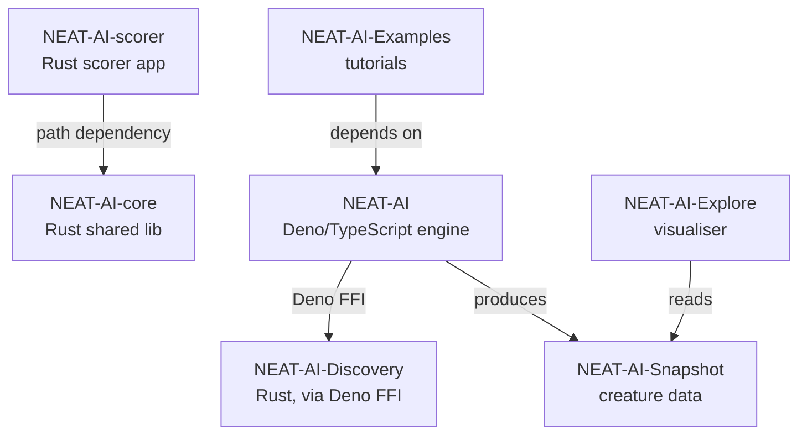
```mermaid
graph TD
    Core[NEAT-AI-core<br/>Rust shared lib]
    Main[NEAT-AI<br/>Deno/TypeScript engine]
    Discovery[NEAT-AI-Discovery<br/>Rust, via Deno FFI]
    Snapshot[NEAT-AI-Snapshot<br/>creature data]
    Scorer[NEAT-AI-scorer<br/>Rust scorer app]
    Explore[NEAT-AI-Explore<br/>visualiser]
    Examples[NEAT-AI-Examples<br/>tutorials]

    Main -->|Deno FFI| Discovery
    Main -->|produces| Snapshot
    Scorer -->|path dependency| Core
    Explore -->|reads| Snapshot
    Examples -->|depends on| Main
```

---

## 📄 Licence

Apache Licence 2.0
