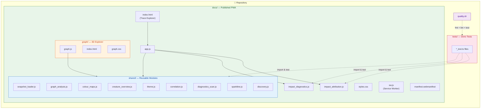
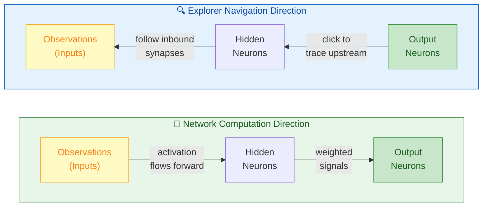
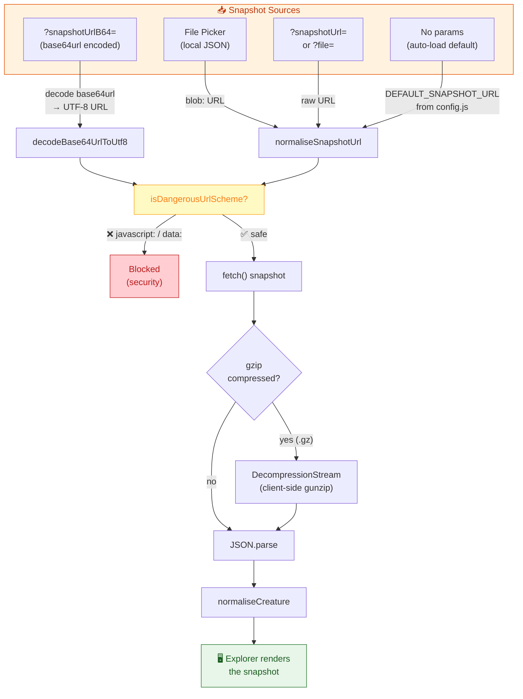
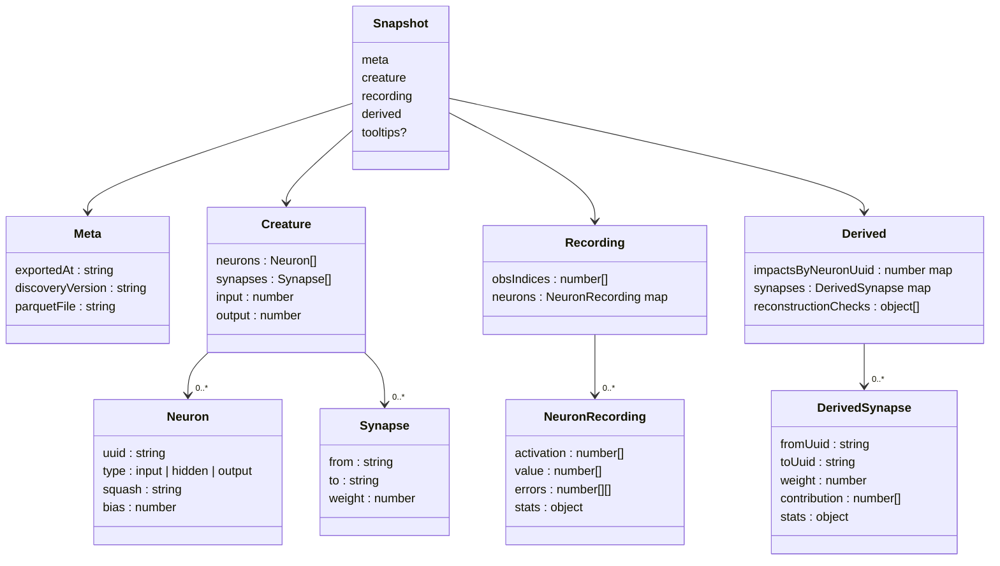
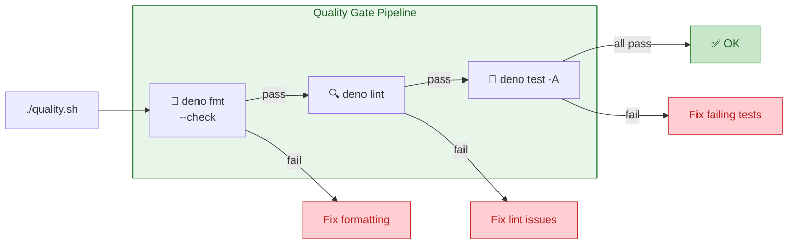
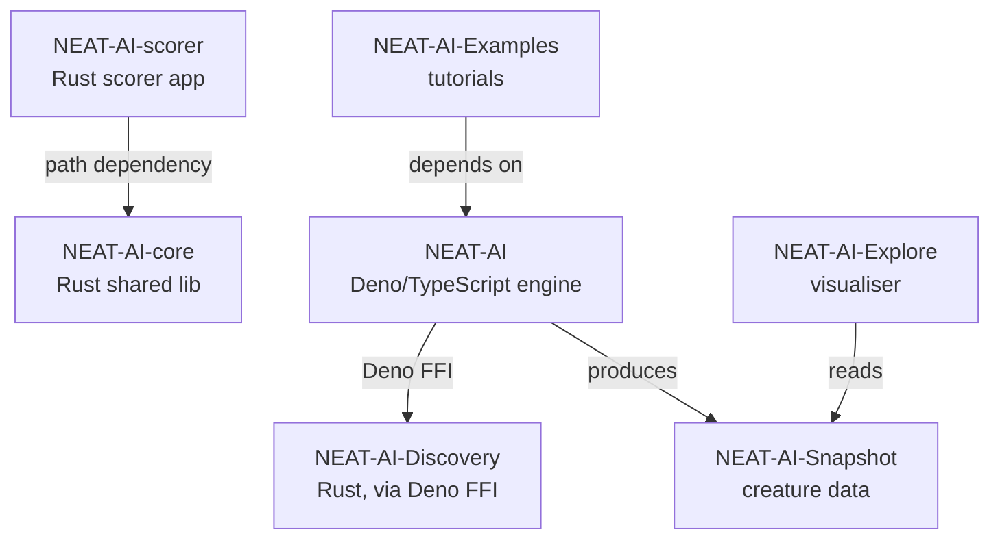

# 🧠 NEAT-AI Explore

[](LICENSE)
[](https://stsoftwareau.github.io/NEAT-AI-Explore/)
[](https://deno.com/)
[](version.json)

A static HTML/JS/CSS viewer for exploring a **NEAT network snapshot** (neurons,
synapses, impacts, and recorded activations). This is a debug tool for
investigating why discovery candidates fail or succeed.

---

## 🚀 Try it now (example snapshot)

- **Trace explorer**:
  [Open Explorer on GitHub Pages](https://stsoftwareau.github.io/NEAT-AI-Explore/)
- **Graph explorer (3D neighbourhood view)**:
  [Open Graph Explorer on GitHub Pages](https://stsoftwareau.github.io/NEAT-AI-Explore/graph/)
- **Snapshot repo (default example snapshot)**:
  [NEAT-AI-Snapshot](https://github.com/stSoftwareAU/NEAT-AI-Snapshot)
  (published via GitHub Pages as
  `https://stsoftwareau.github.io/NEAT-AI-Snapshot/`)

Both views **auto-load the default snapshot** on first open, so you can click
straight in.

---

## 📱 GitHub Pages + PWA

This repo is configured to deploy a **Progressive Web App (PWA)** to **GitHub
Pages**. The published site lives in `docs/` (mirrors the approach used in
`../GRQ-health`).

- **Published folder**: `docs/` (contains `index.html`, `app.js`, `styles.css`,
  etc.)
- **PWA files**: `docs/manifest.webmanifest`, `docs/sw.js`, `docs/icons/*`,
  `docs/screenshots/*`
- **Shared JS modules**: `docs/impact_attribution.js` and
  `docs/impact_diagnostics.js` are the single source of truth (imported by both
  the app and tests)
- **Deploy workflow**: `.github/workflows/deploy.yml` (push to `Develop`)

---

## 🏗️ Architecture Overview



---

## 🔖 Versioning (SemVer)

This repo uses **Semantic Versioning** (**SemVer**, `MAJOR.MINOR.PATCH`) as the
human-facing version number. See [SemVer](https://semver.org/).

- **Source of truth**: `version.json`
- **PR automation**: if a PR targets `Develop` and does not change
  `version.json`, a GitHub Action will automatically bump the **patch** version
  and push it to the PR branch.
- **Deploy cache busting**: GitHub Pages deploy replaces a `__BUILD_ID__`
  placeholder in `docs/index.html` and `docs/sw.js` with the commit SHA, so
  users receive updated assets without needing to clear caches.

---

## ⚡ Quick Start

1. **Export a snapshot** from NEAT-AI-Discovery using
   `export_visualisation_snapshot`:

   ```json
   {
     "parquetFile": "/path/to/records.parquet",
     "creature": { ... },
     "outFile": "./snapshot.json"
   }
   ```

2. **Serve the `docs/` folder** with any HTTP server:

   ```bash
   cd docs
   python3 -m http.server 8000
   ```

3. **Open in browser**: `http://localhost:8000`

4. **Load your snapshot**:
   - Use the file picker to load a local JSON file
   - Or use `?snapshotUrl=./snapshot.json` (alias: `?file=...`)
   - For presigned URLs (recommended): use
     `?snapshotUrlB64=<base64url(utf8(url))>`
   - Or copy your snapshot to `docs/` and click "Fetch" with the default path

### Default snapshot (PWA-friendly)

When opened with **no query parameters**, the app now **auto-loads** the default
snapshot URL (hosted via GitHub Pages). This makes the installed PWA usable on
iPhone/iPad without needing the file picker.

### Tooltips (single-file snapshots)

The viewer can display human-friendly observation names and descriptions using a
`tooltips` object embedded in the snapshot (e.g.
`snapshot.tooltips["input-0"] =
{ label, description }`). This avoids needing a
separate `Tooltips.json` file.

Optional fields:

- **group**: a short group name used for clustering/summary in the Observations
  dashboard (e.g. `macro`, `rates`, `equities`). Example:
  `snapshot.tooltips["input-0"] = { label, description, group: "rates" }`.

### ☁️ Loading snapshots from S3 (presigned URLs)

If you load a snapshot via a presigned S3 URL from GitHub Pages, the S3 bucket
must allow **CORS** for the GitHub Pages origin, otherwise the browser will
block the request.

- **Allowed origin**: `https://stsoftwareau.github.io`
- **Allowed methods**: `GET`, `HEAD`
- **Allowed headers**: `*`

> **💡 Tip:** If you upload `snapshot.json.gz`, either set object metadata
> `Content-Encoding: gzip` and `Content-Type: application/json` so browsers
> transparently decompress, _or_ ensure your browser supports
> `DecompressionStream` (the app will decompress `.gz` client-side when
> possible).

---

## ✨ Features

- **Creature overview dashboard**: After loading a snapshot, see an at-a-glance
  summary of the neural network — neuron/synapse counts, activation function
  distribution, network depth, and an interactive mini topology diagram. Click
  any layer to navigate into the trace explorer.
- **Trace explorer**: Click an output neuron → see inbound synapses → click to
  go upstream toward observations → repeat until you reach inputs. Builds a
  breadcrumb trail.
- **Synapse Sorting**: Sort inbound synapses by |weight|, weight, or |mean
  contribution|.
- **Synapse Colour Coding**: Synapse edges and rows are colour-coded by weight
  strength — green for excitatory (positive), red for inhibitory (negative),
  grey for weak/near-zero. A collapsible colour legend explains the scale.
- **Neuron Detail Cards**: Shows type, squash (colour-coded badge), bias, impact
  score, and recorded stats in themed card components with inline sparkline
  charts for activation history and error distribution histograms.
- **Reconstruction Checks**: If enabled in export, shows max value/activation
  deltas to identify recording or squash function mismatches.
- **Graph explorer**: A 3D neighbourhood view of the NEAT network to build
  intuition about local connectivity and high-impact pathways.

---

## 🔍 What the Explorer shows (example snapshot)

The published app auto-loads a default snapshot (hosted separately so this repo
doesn't churn with large snapshot artefacts).

Some interesting findings from that snapshot:

- **output-0 is dominated by a single upstream hidden neuron**:
  `hidden-discovery-739a5119-b981-4ae6-91d1-ca8cc33abc5a → output-0` receives
  ~74.6% of the inbound allocated impact (using the viewer's heuristic
  allocation).
- **A second hidden neuron is the next biggest contributor**:
  `hidden-discovery-6aae3201-115b-4dc4-beee-2d7428399e14 → output-0` receives
  ~14.1% of the inbound allocated impact.
- **There are prunable candidates**: ~7.6% of non-input neurons have exported
  impact < 1e-8 (highlighted as "suspicious" in the UI).

Snapshot metadata:

- **exportedAt**: 20251219T043800Z
- **discoveryVersion**: 0.2.12
- **Network size**: 471 neurons, 16,719 synapses

---

## 📱 Responsiveness (PWA screenshots)

These screenshots are generated from a real browser at iPhone/iPad/desktop
viewports (see `scripts/generate_pwa_assets.py`).

### iPhone (neurons)


### iPhone (inbound impact allocation modal)


### iPad (neurons)


### iPad (inbound impact allocation modal)


### Desktop (inbound impact allocation modal)


---

## 🎮 Graph explorer (3D neighbourhood view)

The graph explorer is an intuition-building alternative visualisation for large
NEAT networks.

- **Entry point**: `docs/graph/index.html`
- **Controls**:
  - Drag to look
  - Mouse wheel to zoom
  - WASD / arrow keys to fly
  - Click a neuron to focus it (HUD shows key properties + flags)
  - **Touch**: single tap to focus (with ripple), long press for tooltip, pinch
    to zoom toward midpoint, two-finger pan with momentum, swipe left/right to
    cycle neurons in the trace path
- **Layout**: focus-centric neighbourhood view (directly linked neurons are
  closest; moving focus recomputes the local neighbourhood layout)
- **Legend**: includes mapping notes (size/colour/bias/degree)

### Graph explorer (desktop)


### Graph explorer (click-to-focus HUD)


### Graph explorer (tilt + zoom)


---

## 🧭 Direction terminology (to avoid confusion)

The NEAT network computation direction and the explorer navigation direction are
**opposite**:



- **Inbound synapses (UI)**: synapses that flow from an upstream neuron into the
  currently selected neuron (i.e. arrows point _toward_ the current neuron)

---

## 📥 Snapshot Loading Flow

How snapshots reach the viewer through `snapshot_loader.js`:



---

## 📦 Snapshot JSON Format

The expected format matches the output of NEAT-AI-Discovery's
`export_visualisation_snapshot` function:



```json
{
  "meta": {
    "exportedAt": "20251218T...",
    "discoveryVersion": "0.2.10",
    "parquetFile": "/path/to/records.parquet"
  },
  "creature": {
    "neurons": ["..."],
    "synapses": ["..."],
    "input": 20,
    "output": 1
  },
  "recording": {
    "obsIndices": [0, 1, 2, "..."],
    "neurons": {
      "output-0": {
        "activation": ["..."],
        "value": ["..."],
        "errors": [["..."], "..."],
        "stats": { "...": "..." }
      }
    }
  },
  "derived": {
    "impactsByNeuronUuid": { "output-0": 1.0, "...": "..." },
    "synapses": {
      "hidden-0→output-0": {
        "fromUuid": "hidden-0",
        "toUuid": "output-0",
        "weight": 2.0,
        "contribution": ["..."],
        "stats": { "meanContribution": 1.5, "...": "..." }
      }
    },
    "reconstructionChecks": ["..."]
  }
}
```

---

## 🧪 Testing

Tests use [Deno](https://deno.com/) and live in `tests/`. Run them with:

```bash
deno test -A
```

Or use the quality gate (format + lint + test):

```bash
./quality.sh
```

### Quality gate pipeline



### Unit tests vs benchmarks

- **Unit tests verify correctness** — import a module, call a function with
  known inputs, assert the result. They must not measure performance.
- **Benchmarks verify performance** — use `deno bench` or a dedicated script to
  measure execution time. Benchmarks are expected to be slow and must not run as
  part of the unit-test suite.
- Unit tests run in parallel, so any timing-based assertion is unreliable by
  design.

### "What" tests vs "how" tests

Write **"what" tests** — tests that exercise real behaviour:

```ts
import { myFunction } from "../module.js";
Deno.test("myFunction doubles positive numbers", () => {
  assertEquals(myFunction(3), 6);
});
```

Do **not** write **"how" tests** — tests that read source files as text and grep
for implementation patterns:

```ts
// BAD — breaks on any refactor and tests nothing useful
const src = await Deno.readTextFile("module.js");
assert(src.includes("Math.pow"));
```

> **⚠️ Note:** If you swap quicksort for mergesort, "what" tests still pass
> (correct results). "How" tests break even though behaviour is unchanged, or
> worse, they pass while the code is actually broken.

### What can be unit-tested

Only pure, DOM-free modules can be tested in Deno:

| Module                             | Testable functions                                                                                                                        |
| ---------------------------------- | ----------------------------------------------------------------------------------------------------------------------------------------- |
| `docs/impact_attribution.js`       | `computeImpactBreakdownToOutputs`, `computeInboundSynapseImpactAllocation`                                                                |
| `docs/impact_diagnostics.js`       | `squashDerivative`, `computeGradientProxyImpact`, `summariseSeriesStats`, etc.                                                            |
| `docs/shared/config.js`            | `DEFAULT_SNAPSHOT_URL`, `SNAPSHOT_FALLBACK_URLS`, `ALLOWED_SNAPSHOT_ORIGINS`                                                              |
| `docs/shared/graph_analysis.js`    | `buildGraphIndex`, `computeReachableToOutputs`, `computeTopContributingInputs`                                                            |
| `docs/shared/snapshot_loader.js`   | `normaliseSnapshotUrl`, `decodeBase64UrlToUtf8`, `isDangerousUrlScheme`, `normaliseCreature`                                              |
| `docs/shared/colour_maps.js`       | `hash32`, `u01ToSigned`, `u32ToU01`, `neuronColourRgb01`, `synapseWeightStrength01`, `synapseWeightColourRgb01`, `synapseWeightColourCss` |
| `docs/shared/creature_overview.js` | `computeNeuronBreakdown`, `computeSynapseStats`, `computeNetworkDepth`, `computeActivationDistribution`, `computeLayerTopology`           |
| `docs/shared/transitions.js`       | `prefersReducedMotion`, `synapseStaggerDelay`, duration constants                                                                         |
| `docs/shared/touch_gestures.js`    | `classifyTouch`, `detectSwipeDirection`, `momentumStep`, `clampMomentum`, `pinchZoomToward`, `clampZoomDistance`                          |
| `docs/shared/sparkline.js`         | `computeSparklinePoints`, `computeErrorHistogram`, `squashBadge`, `flattenErrors`                                                         |
| `docs/shared/correlation.js`       | `pearsonCorrelation`, `sampleSeries`, `computeTopInputCorrelations`                                                                       |
| `docs/shared/discovery.js`         | `normaliseCandidate`, `extractDiscoveryCandidates`                                                                                        |
| `docs/shared/diagnostics_scan.js`  | `scan1d`, `scan2d`, `computeNonFiniteIssues`, `computeErrorConcentrationIssues`                                                           |
| `docs/shared/theme.js`             | `normaliseThemeMode`, `cycleThemeMode`, `themeModeLabel`, `themeModeGlyph`                                                                |
| `docs/shared/ui_helpers.js`        | `escapeHtml`, `extractTooltips`                                                                                                           |

> **💡 Tip:** Browser-only code (DOM, WebGL, Service Worker) cannot be
> unit-tested in Deno — skip it rather than faking it with grep-based
> assertions.

---

## 🇦🇺 Australian English

Comments and documentation use Australian English spelling (e.g., "colour",
"behaviour", "organisation").

> **⚠️ Note:** CSS properties like `prefers-color-scheme` and JavaScript API
> names retain American English spelling as they are web standards.

---

## 🖼️ PWA asset generation (icons + screenshots)

Icons and screenshots are generated by starting a local web server and opening
the app in a headless browser (Playwright).

```bash
python3 -m venv .venv
source .venv/bin/activate
python -m pip install -U pip
python -m pip install pillow playwright
python -m playwright install chromium
python scripts/generate_pwa_assets.py
```

Outputs:

- `docs/favicon.ico`
- `docs/icons/icon-<size>x<size>.png`
- `docs/icons/icon-source.png`
- `docs/screenshots/desktop-screenshot.png`
- `docs/screenshots/desktop-inbound-modal.png`
- `docs/screenshots/mobile-screenshot.png`
- `docs/screenshots/iphone-screenshot.png`
- `docs/screenshots/iphone-inbound-modal.png`
- `docs/screenshots/ipad-screenshot.png`
- `docs/screenshots/ipad-inbound-modal.png`

Last updated: 15-Jan-2026

---

## 🔗 Related Repositories

The NEAT-AI project is split across seven public repositories. Each focuses on
one concern and composes with the others as shown below.

| Repository                                                             | Role                                                                                                              |
| ---------------------------------------------------------------------- | ----------------------------------------------------------------------------------------------------------------- |
| [NEAT-AI](https://github.com/stSoftwareAU/NEAT-AI)                     | Primary Deno/TypeScript neural-network engine (evolution, training, WASM activation).                             |
| [NEAT-AI-core](https://github.com/stSoftwareAU/NEAT-AI-core)           | Shared native Rust library (`neat-core`) with numerics, topology helpers, and the chunked `.bin` training stream. |
| [NEAT-AI-Discovery](https://github.com/stSoftwareAU/NEAT-AI-Discovery) | Rust discovery module invoked by NEAT-AI via Deno FFI to search architectures and hyper-parameters.               |
| [NEAT-AI-Snapshot](https://github.com/stSoftwareAU/NEAT-AI-Snapshot)   | Creature/genome snapshot format and fixtures produced by NEAT-AI and consumed by downstream tools.                |
| [NEAT-AI-scorer](https://github.com/stSoftwareAU/NEAT-AI-scorer)       | Production forward-only scoring application built on `neat-core` via a path dependency.                           |
| [NEAT-AI-Explore](https://github.com/stSoftwareAU/NEAT-AI-Explore)     | Visualiser for creatures that reads NEAT-AI-Snapshot data.                                                        |
| [NEAT-AI-Examples](https://github.com/stSoftwareAU/NEAT-AI-Examples)   | Worked examples and tutorials that depend on NEAT-AI.                                                             |

### Dependency graph



---

## 📄 Licence

Apache Licence 2.0
