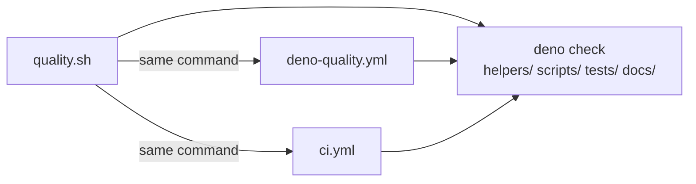

## Summary

Expanded `deno check` to type-check the entire repo
(`helpers/ scripts/ tests/ docs/`) in `quality.sh`,
`.github/workflows/deno-quality.yml`, and `.github/workflows/ci.yml`, so type
errors under `docs/` — including the class of duplicate-identifier bug fixed in
PR #201 — can no longer ship undetected. The three invocations are kept
literally identical so a developer running `bash quality.sh` locally sees the
same outcome as CI.

Closes #210.

## Evidence



Regression-check evidence — added a deliberate duplicate top-level identifier to
`docs/app.js` and ran `bash quality.sh`:

```
const __ISSUE_210_REGRESSION__ = 1;
const __ISSUE_210_REGRESSION__ = 2;
```

`quality.sh` exits 1; the failure is reported by
`tests/app_module_loads_test.ts` (the existing Issue #200 regression test)
because `deno test` is part of the gate:

```
docs/app.js failed to parse: Identifier '__ISSUE_210_REGRESSION__' has
already been declared
FAILED | 522 passed | 1 failed
```

On a clean checkout `bash quality.sh` exits 0 (523 tests pass).

## Test Plan

- `tests/deno_quality_workflow_test.ts` — added _deno-quality workflow's deno
  check covers docs/ (Issue #210)_, asserting the workflow's `deno check` step
  covers `docs/` and is not restricted to the old `helpers/ scripts/ tests/`
  allowlist.
- `tests/ci_workflow_test.ts` — added the matching assertion for `ci.yml`.
- `tests/quality_script_deno_check_test.ts` — new file with two tests that parse
  `quality.sh` and assert the `deno check` line covers `docs/` and is not
  restricted to `helpers/ scripts/ tests/`. This catches accidental reversions
  of the script.
- All four new tests fail against the unchanged code and pass after the
  `quality.sh`, `deno-quality.yml`, and `ci.yml` edits.
- Full quality gate: `./quality.sh` → 523 passed, exit 0.
