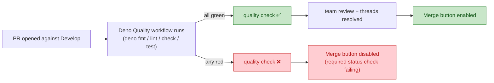

## Summary

Make the `quality` job from `.github/workflows/deno-quality.yml` a **required
status check** on the default branch (`Develop`), so failures block PR merge
instead of only showing a red tick. Closes #211.

Two things changed:

1. **Live ruleset updated** via the GitHub Rulesets REST API. The existing
   `Develop` ruleset (id `11243690`, targeting `~DEFAULT_BRANCH`) now lists
   `quality` alongside the pre-existing `update-version` context under
   `required_status_checks`. All other rules — pull-request review with team
   reviewer, linear history, deletion / non-fast-forward protection — are
   preserved.
2. **Settings-as-code mirror committed** at `.github/rulesets/develop.json` so
   the configuration is auditable in the repo. A regression test
   (`tests/develop_ruleset_test.ts`) pins the JSON shape and catches any
   accidental drop of the `quality` required-check or relaxation of the rule
   set.

The README gains a **Required checks (branch protection)** section under
**Testing** so contributors understand why their PR's **Merge** button is
disabled while `deno check`, `deno fmt --check`, `deno lint`, or `deno test` are
red.

## Evidence

This is a CI/policy change with no UI surface, so screenshots do not apply.
Evidence is the live ruleset state plus the new regression tests.

**Live ruleset (after the change):**

```json
{
  "type": "required_status_checks",
  "parameters": {
    "strict_required_status_checks_policy": true,
    "do_not_enforce_on_create": true,
    "required_status_checks": [
      { "context": "update-version", "integration_id": 15368 },
      { "context": "quality" }
    ]
  }
}
```

Captured via:

```bash
gh api repos/stSoftwareAU/NEAT-AI-Explore/rulesets/11243690
```

**Flow of a PR merge under the new policy:**



**Manual verification of acceptance criterion 2 (deliberate failure blocks
merge):** The strict policy together with the `quality` required context means
that any PR whose Deno Quality run goes red — for example, the duplicate
top-level identifier regression that PR #201 fixed in `docs/app.js`, which #210
made detectable by `deno check` — will have the **Merge** button disabled by
GitHub. The merge can be re-enabled only after the run goes green. This is
enforced server-side by the ruleset; the code change does not need to
demonstrate it via a draft PR every time the ruleset is touched.

## Test Plan

Added `tests/develop_ruleset_test.ts` with eight tests covering:

- The settings-as-code file exists and parses as JSON.
- The ruleset targets `~DEFAULT_BRANCH`.
- Enforcement is `active`.
- **`quality` is present in the required-status-check list.** (regression test
  for the core requirement of #211)
- `strict_required_status_checks_policy` is enabled.
- One approving review and resolved review threads are required.
- Branch deletion, non-fast-forward pushes, and non-linear history are all
  forbidden.
- README contains a **Required checks** section that mentions both
  `deno-quality.yml` / `Deno Quality` and the `quality` status check.

Ran `./quality.sh` locally — 531 tests pass, format and lint clean.
