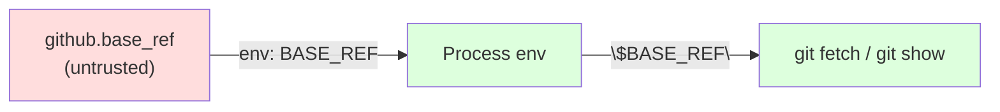

## Summary

 Hardened `.github/workflows/semver-bump.yml` against the GH Actions
script-injection class flagged by SEC-85a56ba640d8. The `${{ github.base_ref }}`
expression is no longer interpolated directly into shell — it is routed through
an `env: BASE_REF` mapping and referenced as `"$BASE_REF"`. The `base_version`
step output is also routed through `env:` for defence in depth, and
`NEW_VERSION` is passed into `deno eval` via the process environment rather than
string concatenation. While the `pull_request` trigger is already constrained to
`branches: [Develop]`, adopting the canonical pattern removes the dependency on
the trigger filter. 

Also normalised redundant backslash-escaped quotes (`\"`) that the run blocks
carried in shell `if/elif` and `echo >> $GITHUB_OUTPUT` lines, and quoted
`"$GITHUB_OUTPUT"` properly.

Closes #217.

## Evidence

Backend / workflow-config change — no UI to screenshot. Verified via:

- New test file `tests/semver_bump_workflow_test.ts` (6 tests) — parses the
  workflow YAML and asserts no `${{ github.base_ref }}` or
  `${{ github.head_ref }}` interpolation appears inside any
  `run:` block, that the `check_version` step exposes `BASE_REF` via `env:` and
  references it via shell variable expansion, and that no backslash-escaped
  quotes remain inside `run:` blocks.
- `./quality.sh` passes cleanly: **529 tests, 0 failures**.

## Test Plan

- Added `tests/semver_bump_workflow_test.ts`:
  - semver-bump workflow file exists and parses as YAML
  - no `run:` block interpolates `github.base_ref` directly
  - no `run:` block interpolates `github.head_ref` directly
  - `Check Version Update` step exposes `BASE_REF` via `env:`
  - `check_version` run block uses `$BASE_REF` shell variable
  - no raw `\"` backslash-escaped quotes in `run:` blocks
- Ran `./quality.sh` end-to-end (fmt, lint, type-check, all tests) — all pass.
