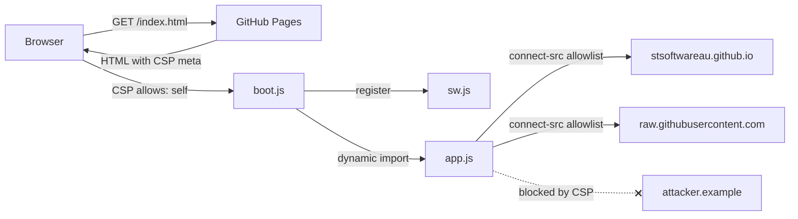

## Summary

Added a Content-Security-Policy meta tag to each deployed PWA entry HTML
(`docs/index.html`, `docs/graph/index.html`, `docs/starfield/index.html`) so
that GitHub Pages — which cannot set CSP response headers — still ships a
defence-in-depth policy. The inline `<script type="module">` boot blocks were
extracted to `docs/boot.js`, `docs/graph/boot.js`, and `docs/starfield/boot.js`
so the policy can stay strict with `script-src 'self'` (no `'unsafe-inline'`).
`connect-src` mirrors the existing `ALLOWED_SNAPSHOT_ORIGINS` allowlist in
`docs/shared/config.js`, capping snapshot egress to the two official hosts.
Closes #218.

## Policy

```
default-src 'self';
script-src 'self';
style-src 'self' 'unsafe-inline';    /* inline style attrs in HTML */
img-src 'self' data: blob:;
connect-src 'self'
  https://stsoftwareau.github.io
  https://raw.githubusercontent.com;
worker-src 'self';
manifest-src 'self';
base-uri 'self';
form-action 'none';
```

Also added `X-Content-Type-Options: nosniff` and
`Referrer-Policy: strict-origin-when-cross-origin` meta tags.

`frame-ancestors`, `sandbox`, and `report-uri` are deliberately omitted — CSP3
§3.4 specifies they MUST be ignored when delivered via a `<meta>` tag, and
including them produces console warnings without any enforcement. Real
clickjacking protection requires HTTP response headers, which GitHub Pages does
not let us set today.

## Architecture



## Evidence

All three pages boot in headless Chromium with the CSP active and no real
violations (only the benign meta-ignored-directive warnings before
`frame-ancestors` was removed):

```
Loading http://127.0.0.1:.../index.html?noSw=1
  ✓ /index.html loaded with no CSP violations
Loading http://127.0.0.1:.../graph/index.html?noSw=1
  ✓ /graph/index.html loaded with no CSP violations
Loading http://127.0.0.1:.../starfield/index.html?noSw=1
  ✓ /starfield/index.html loaded with no CSP violations
```


Reproduce: `deno run -A scripts/verify_csp.ts`.

## Test Plan

- `tests/csp_meta_test.ts` (new): pins each directive per entry HTML — CSP meta
  presence, `default-src 'self'`, `script-src 'self'` with no
  `'unsafe-inline'`/`'unsafe-eval'`, `connect-src` mirroring
  `ALLOWED_SNAPSHOT_ORIGINS`, `base-uri 'self'`, `form-action 'none'`, `img-src`
  with `data:`/`blob:`, `worker-src`/`manifest-src` self, and zero inline
  `<script>` bodies (so the policy can stay strict).
- `tests/csp_meta_test.ts::CSP in ... omits meta-ignored directives` guards
  against re-adding `frame-ancestors`, `sandbox`, or `report-uri` to the
  meta-delivered policy.
- `tests/pwa_test.ts::docs PWA files exist` extended to require the three new
  boot scripts.
- `tests/pwa_test.ts::sw.js STATIC_FILES precaches the per-page boot.js
  scripts (#218)`
  ensures the SW continues to precache the boot scripts so the PWA boots
  offline.
- `tests/pwa_test.ts::inject_build_id.ts substitutes __BUILD_ID__ in every
  entry HTML and boot.js (#218)`
  guards the cache-busting story for the newly-extracted files.
- `tests/sw_static_files_test.ts` two tests previously checked inline-script
  behaviour in `docs/index.html`; updated to check the new boot scripts instead.
  Original intent is preserved (try/catch around dynamic import, PWA recovery
  wiring, no "clear browser cache" instruction).

## Notes

- `style-src` keeps `'unsafe-inline'` because several elements use literal
  `style="..."` attributes (`display: none`, legend swatch colours, etc.).
  Removing those would be a separate refactor.
- The inline-script extraction is functionally identical — the boot module
  preserves the `__BUILD_ID__` placeholder + Date.now() dev fallback, the SW
  registration order, and the PWA recovery flow.
- `scripts/inject_build_id.ts` previously only patched `docs/index.html` and
  `docs/sw.js`. It now also patches `docs/graph/index.html`,
  `docs/starfield/index.html`, and the three boot files, closing a pre-existing
  cache-busting gap for the graph/starfield shells.

## Deno regression avoided

Kept the verification path on Deno + `npm:playwright` (extending the existing
`scripts/verify_*_layout.ts` pattern) instead of adding a Node-based Cypress or
Vitest harness for the CSP smoke check.

## Pre-PR Security Self-Check

- [x] **Input validation**: no new input surfaces; `connect-src` allowlist
      mirrors the existing `ALLOWED_SNAPSHOT_ORIGINS`.
- [x] **Secrets**: no `.env`, credentials, or `.config*.json` files staged.
- [x] **Injection surface**: no new SQL/shell/HTTP construction; CSP narrows the
      egress allowlist.
- [x] **Output encoding**: unchanged.
- [x] **Authentication/authorisation**: N/A — static viewer.
- [x] **Error handling**: boot script preserves the existing try/catch and PWA
      recovery flow (no stack traces leaked to users).
- [x] **Dependencies**: no new third-party deps.
