## Summary

Ported `scripts/verify_starfield_layout.py` to Deno
(`scripts/verify_starfield_layout.ts`) using `npm:playwright@1.60.0`, then
deleted the Python original. The Graph-view screenshot verifier now runs on the
same Deno + JSR + npm stack as the rest of the repo — no Python required.

This is the first real `npm:playwright` consumer in the repo; the widened
quarantine gate from #223 protects the version pin. Closes #224.

## Evidence

The script was run end-to-end against a clean checkout and produced the three
expected screenshots in `docs/screenshots/`. Same scenes as the Python version:

| Scene          | Screenshot                                                              |
| -------------- | ----------------------------------------------------------------------- |
| Initial render |              |
| Click-to-focus |  |
| 3D tilt + zoom |    |

Run log:

```text
$ deno run -A scripts/verify_starfield_layout.ts
Wrote docs/screenshots/graph-desktop.png
Wrote docs/screenshots/graph-desktop-focus.png
Wrote docs/screenshots/graph-desktop-tilt.png
```

### Flow

```mermaid
flowchart LR
    A[deno run scripts/verify_starfield_layout.ts] --> B[serveDir docs/ on ephemeral 127.0.0.1 port]
    B --> C[chromium.launch headless]
    C --> D[goto /graph/index.html dark + 1280x800]
    D --> E[wait #status.ok 'Observations:']
    E --> F[focus default output, screenshot graph-desktop.png]
    F --> G[focus neighbour then highest-risk neighbour, screenshot graph-desktop-focus.png]
    G --> H[mouse drag + wheel zoom, screenshot graph-desktop-tilt.png]
    H --> I[close browser + shutdown server]
```



## Test Plan

- New `tests/verify_starfield_layout_check_test.ts`:
  - `deno check scripts/verify_starfield_layout.ts` exits cleanly (regression
    guard for type errors and unresolved npm versions).
  - The script imports the bare `playwright` specifier (no inline `npm:` form),
    so the project's `no-import-prefix` lint rule and the quarantine gate stay
    effective.
  - `deno.json` pins `playwright` to an exact `X.Y.Z` version (no wildcards or
    ranges).
- `./quality.sh` is green (`deno fmt --check`, `deno lint`, `deno check`,
  `deno test -A`) — 554 passed, 0 failed.
- Manual end-to-end run produced the three expected PNGs (above).
