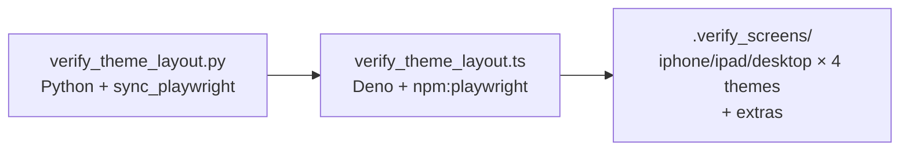

## Summary

Ports `scripts/verify_theme_layout.py` to Deno + `npm:playwright` as `scripts/verify_theme_layout.ts`, mirroring the pattern already established by `verify_starfield_layout.ts` (Issue #224). The new script reproduces the original behaviour exactly — same viewport matrix (iPhone 390×844, iPad 768×1024, Desktop 1280×800), same theme scenarios (`light`, `dark`, `auto-light`, `auto-dark`), same extra states (iPhone touch tooltip + impact modal; Desktop impact modal), and the same `.verify_screens/` dot-folder output. The Python original is deleted so the verification stack is single-language Deno. Closes #225.

## Evidence

This is a developer-only verification tool with no runtime UI surface, so the relevant evidence is the type check + lint + test gate.

- `./quality.sh` passes cleanly: 557 tests, 0 failed.
- New regression test `tests/verify_theme_layout_check_test.ts` confirms `deno check scripts/verify_theme_layout.ts` exits 0, the bare `playwright` specifier is used (no inline `npm:` prefix), and the Python file is gone.
- Reuses the `npm:playwright@1.60.0` pin from `deno.json` (landed via #224) — no new dependency, no version bump.

## Test Plan

- `tests/verify_theme_layout_check_test.ts` — three assertions:
  - `deno check scripts/verify_theme_layout.ts` exits cleanly (catches future API drift or pin breakage).
  - Script imports `playwright` via the bare specifier (so the JSR quarantine gate sees the pinned version).
  - `scripts/verify_theme_layout.py` is removed.
- `./quality.sh < /dev/null` passes (format, lint, type check, full Deno test suite).
