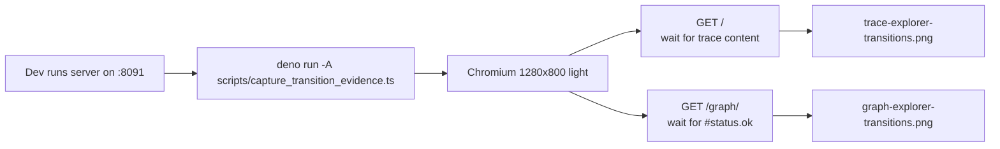

## Summary

Ported `scripts/capture_transition_evidence.py` to Deno using `npm:playwright`
(via the existing `deno.json` imports map added in #224), then deleted the
Python original. The Deno port preserves the script's intent: target the
developer's already-running dev server at `http://localhost:8091/`, navigate
to the trace and graph explorers, wait up to 60 s for the snapshot to
render, and write screenshots to `docs/evidence/`. Closes #226.

## Evidence

Backend/CLI script — no UI to screenshot. Verified via:

- `deno check scripts/capture_transition_evidence.ts` → exits 0.
- `tests/capture_transition_evidence_check_test.ts` → 3 tests passing
  (deno-check, bare-specifier guard, Python-removed guard).
- `./quality.sh` → green (560 tests passing).

The script targets the developer's running dev server (it does not start one
itself), so end-to-end browser execution requires `python3 -m http.server
8091 --directory docs` (or equivalent) running locally — out of scope for
unattended CI but documented in the script header.

## Test Plan

- Added `tests/capture_transition_evidence_check_test.ts` covering:
  - `deno check scripts/capture_transition_evidence.ts` exits cleanly.
  - Imports `playwright` via the bare specifier (not inline `npm:`).
  - `scripts/capture_transition_evidence.py` no longer exists.
- Re-ran the full `./quality.sh` gate (560 tests) to confirm no regression.
