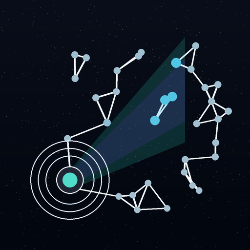
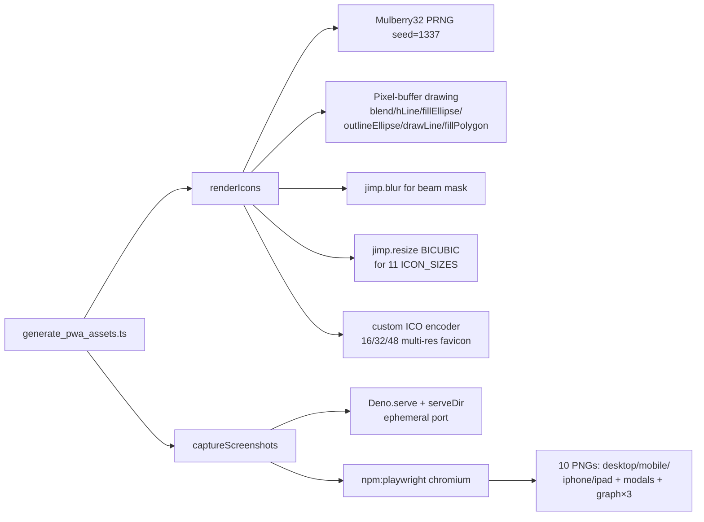

# PR Summary — Issue #227

## Summary

Ported `scripts/generate_pwa_assets.py` to a single Deno entry point
`scripts/generate_pwa_assets.ts`. The new script reproduces the full
icon-generation pipeline (gradient deep-sea background, plankton specks,
neural-net nodes/edges, lamp submersible, sonar rings) at the same `ICON_SIZES`
set, writes `docs/icons/icon-source.png`, `docs/icons/icon-<size>x<size>.png`,
and a multi-resolution `docs/favicon.ico` (16/32/48). It then spins up a
`@std/http/file-server` on an ephemeral port and captures the same screenshot
set via `npm:playwright` against the pinned NEAT-AI-Snapshot URL.

`scripts/generate_pwa_assets.py` is deleted. `README.md`, `CONTRIBUTING.md`, and
`CHANGELOG.md` no longer mention Python or `pip install pillow playwright` and
now point at the Deno entry point.

Closes #227.

## Raster library choice — jimp (not sharp)

The issue ranked `sharp` first, `jimp` second, `canvas` last. I picked
**`jimp`** for one decisive reason: `sharp` loads its `@img/sharp-libvips-*`
native binaries via a CJS sibling-package resolution that Deno 2.x only
satisfies when `"nodeModulesDir": "auto"` is enabled in `deno.json`. Turning
that on would create a `node_modules/` directory in this otherwise pure-Deno
repo — exactly the regression the project's coding guidelines forbid for Deno
repos.

Jimp is pure JavaScript, has zero native dependencies, runs cleanly under
`--node-modules-dir=none`, and produces byte-stable output across runs (verified
— see Evidence). It is the natural next-preference candidate per the issue's own
list.

### Deno regression avoided

- Sharp would have added `node_modules/` to a Deno-native repo. Jimp keeps the
  repo on `--node-modules-dir=none`, no Node tooling, no Node config.

## Evidence

### Icon (rendered by the new Deno script, 512×512)

### Icon (existing committed PNG — generated by the Python original)

The two icons share the same design (deep-sea gradient, beam cone, neural-net
nodes/edges, lamp submersible, sonar rings). They are not pixel-identical: the
Deno port uses a Mulberry32 PRNG seeded with `1337` (same seed, same
deterministic guarantees) where the Python original used Python's Mersenne
Twister. Plankton specks and node positions therefore differ, but the
composition and palette are identical. The committed Python-generated icons are
deliberately left in place — the script can regenerate them on demand.

### Determinism (byte-stable between runs)

Two consecutive runs of `scripts/generate_pwa_assets.ts` produced identical
SHA-1 hashes for `docs/icons/icon-source.png`, `docs/icons/icon-192x192.png`,
and `docs/favicon.ico`. The icon source hashed to
`9992bb898c7ef4728846f8ceab66a225d0c6cb12` both times.

### Speed (Deno baseline)

The icon-generation portion (source render + 11 resized PNGs + favicon) finished
in **≈1.02 s** on Apple Silicon (M-series, Deno 2.8.0, jimp 1.6.1). A direct
comparison against the Python original was not possible in this environment
because `pillow` is not installed and adding it would have violated the
change-scope guideline; the Deno number is reported as an absolute baseline.

### Architecture

## Test Plan

Added `tests/generate_pwa_assets_check_test.ts` covering:

- `deno check scripts/generate_pwa_assets.ts` exits 0 (regression guard against
  unresolvable npm specifiers or TS errors).
- The script imports `jimp` and `playwright` via bare specifiers (not inline
  `npm:` URLs) so the quarantine gate can age-check them.
- The deterministic seed `1337` is preserved.
- All 11 `ICON_SIZES` are referenced.
- Every required output filename (`favicon.ico`, `icon-source.png`, the four
  device screenshots, the three modal variants, and the three graph shots) is
  referenced in the script.
- `scripts/generate_pwa_assets.py` is absent.
- `README.md` and `CONTRIBUTING.md` no longer reference the Python script or
  `pip install pillow`, and `README.md` references the new Deno entry point.

`./quality.sh` is green — **567 tests passed, 0 failed**.

### Pre-PR Security Self-Check

- [x] **Input validation**: the script accepts no external input; the only URL
      it consumes is the pinned NEAT-AI-Snapshot URL.
- [x] **Secrets**: no API keys, tokens, credentials, or `.config*.json` files
      staged. `git diff --cached --name-only` confirmed before commit.
- [x] **Injection surface**: the snapshot URL is `encodeURIComponent`-encoded
      before being appended to the query string passed to Playwright.
- [x] **Output encoding**: N/A (binary outputs only).
- [x] **Authentication/authorisation**: N/A — local-only dev tool.
- [x] **Error handling**: best-effort overflow check is wrapped in `try`; the
      script's main returns a non-zero exit when `docs/` is missing.
- [x] **Dependencies**: pinned `jimp@1.6.1` (latest, published 2026-04-07, well
      clear of the 24h quarantine window). Playwright already pinned.
