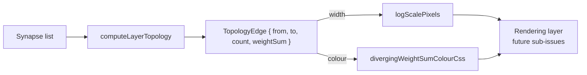

## Summary

Foundation for the topology visualisation upgrade (#235). Adds:

- `weightSum` aggregate to every `TopologyEdge` returned by
  `computeLayerTopology`, computed alongside the existing `count`.
- New `docs/shared/scale.js` exporting
  `logScalePixels(value, maxValue, minPx, maxPx)` for log-compressed pixel
  sizing.
- New `divergingWeightSumColourCss(weightSum, maxAbsWeightSum)` export in
  `docs/shared/colour_maps.js` — a symmetric red ↔ grey ↔ blue palette with WCAG
  AA contrast on both light and dark theme backgrounds.

Pure helper surface only; no rendering changes. Downstream sub-issues will
consume these. Closes #238.

## Evidence

Backend/library change only — no UI to screenshot. Verified via 645 passing
tests (`./quality.sh`), including the new coverage listed below.

The diverging palette was hand-checked against the contrast formula in the test
(WCAG 2.x relative luminance against light bg `rgb(248,249,250)` and dark bg
`rgb(18,18,20)`) and clears 3:1 across the full weight-sum range.

## Test Plan

- `tests/scale_test.ts` (new, 10 tests) — `logScalePixels` covers `value=0`,
  `value=maxValue`, monotonic increase, log compression lift, negative/zero/NaN
  guards, and clamping above `maxValue`.
- `tests/colour_maps_test.ts` (added 8 tests) — `divergingWeightSumColourCss`
  covers valid CSS shape, positive/negative hue dominance, near-zero and zero
  grey, symmetric ±x equality (red ↔ blue swap, green identical), clamp beyond
  `maxAbsWeightSum`, invalid `maxAbsWeightSum` fallback to grey, and WCAG AA 3:1
  contrast against both light and dark theme backgrounds for samples across the
  weight-sum range.
- `tests/creature_overview_test.ts` (added 3 tests) — `computeLayerTopology` now
  exposes a finite `weightSum` per inter-layer edge: algebraic sum (signs
  cancel), tolerates missing/NaN `weight` without contaminating other synapses,
  and existing `count` / layer-grouping / sort-order assertions remain green.
- Full quality gate (`./quality.sh`): **645 passed, 0 failed**.
