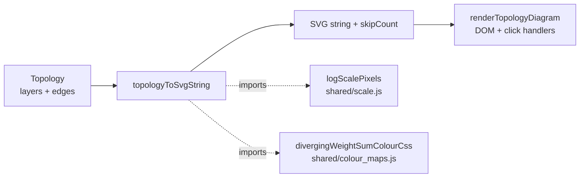

## Summary

Replaced the topology diagram's decorative encodings with real signal: dot radii
now scale logarithmically with neuron count per layer, link thicknesses scale
logarithmically with synapse count, and link colour comes from
`divergingWeightSumColourCss` (red for negative weight sums, neutral near zero,
blue for positive). Arrow heads and skip arcs inherit the same diverging colour;
skip arcs stay visually distinct via their preserved dash pattern and slightly
higher opacity. SVG layout (`cy`, `svgH`, `padX`, `nodeSpacing`, label position,
arc clearance) is recomputed against the variable max radius so the largest dot
is never clipped. Closes #239.

The render is now a pure helper, `topologyToSvgString`, in
`docs/shared/topology_diagram.js` — DOM-free and fully unit-testable. The
DOM/event wiring in `renderTopologyDiagram` is now a thin wrapper around it.

## Evidence

The 2,887-neuron input layer renders as the largest (green) dot on the left;
subsequent hidden layers' dot sizes shrink monotonically with neuron count; the
5-neuron output layer is the small (orange) dot on the right. Long skip arcs
span the diagram, retaining their dashed `4 3` stroke pattern.

## Test Plan

New tests in `tests/topology_diagram_test.ts` cover every acceptance criterion:

- Dot radius is log-scaled by neuron count (fixture `{3, 16, 64, 2}` —
  `r64 > r16 > r3 > r2`, all in `[MIN_R, MAX_R]`).
- Link thickness is log-scaled by synapse count (fixture `{5, 200}` —
  `w200 > w5`, both in `[MIN_W, MAX_W]`).
- Link colour diverges with weight-sum sign — positive renders blue-leaning rgb
  (B > R), negative renders red-leaning (R > B), symmetric magnitudes produce
  mirrored channels.
- Skip arcs preserve `stroke-dasharray="4 3"`.
- Arrow heads share the same diverging rgb as the line they terminate (no more
  `var(--highlight)` / `var(--muted)`).
- viewBox accommodates the largest dot (`cy + biggestR + 16 <= viewBoxH`) and
  the long skip-arc control point stays inside the canvas (`cpY >= 0`).
- Empty topology returns empty SVG and zero counts.
- Skip-summary `skipEdgeCount` / `skipSynapseCount` are exposed for the caller's
  summary line.
- Layer nodes carry `data-layer-index` so click-to-explore still works.

Existing `computeLayerTopology` tests (unchanged) still pass. `./quality.sh`
runs cleanly (683 tests, 0 failures).
