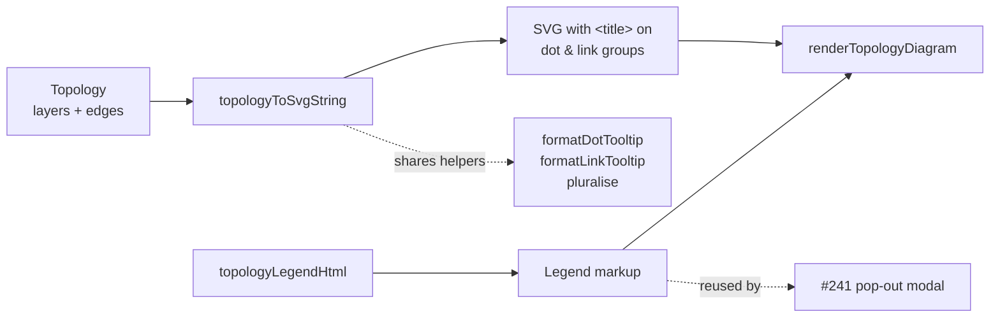

## Summary

Added an inline legend below the topology diagram and richer hover tooltips for
both layer dots and inter-layer links. The legend explains the three visual
encodings introduced in #239 (dot size → log-scaled neuron count, link thickness
→ log-scaled synapse count, link colour → diverging weight-sum red↔blue) with
matching mini-swatches. Tooltips now surface the layer index plus pluralised
neuron count for dots, and the synapse count plus `Σw` (two decimal places, sign
preserved) for links — the arrow-head polygon now shares the link's
`<g class="topoLink">` tooltip group so hovering the arrow surfaces the same
tooltip text. Closes #240.

The legend markup is factored as a pure DOM-free helper (`topologyLegendHtml`)
alongside `formatDotTooltip` / `formatLinkTooltip` / `pluralise` in
`docs/shared/topology_diagram.js`, so the same markup can be reused inside the
pop-out modal (#241) without duplication.

## Evidence

## Test Plan

New tests in `tests/topology_diagram_test.ts` cover every acceptance criterion:

- `pluralise: 0/1/N grammar matches spec` — `"0 neurons"`, `"1 neuron"`,
  `"2 neurons"` (same for `synapse`).
- `formatDotTooltip` — produces `Layer {i} ({type}) · N neuron(s)` with correct
  pluralisation across 0/1/N.
- `formatLinkTooltip` — produces `N synapse(s) · Σw = X.XX` with two-decimal
  `Σw`, sign preserved (`-1.234` → `-1.23`).
- `topologyToSvgString: dot title surfaces layer index and count` — asserts the
  `<title>` text content under each `<g class="topoNode">` in a multi-layer
  fixture.
- `topologyToSvgString: link title surfaces synapse count and Σw` — asserts the
  `<title>` text content for adjacent and skip links.
- `topologyToSvgString: arrow-head sits inside the link tooltip group` — asserts
  the polygon is a sibling of `<title>` inside the same `.topoLink` group so
  hovering the arrow surfaces the link tooltip.
- `topologyLegendHtml: three labelled rows with swatches` — asserts the
  `<dl class="topoLegend">` container has three `.topoLegendRow` entries, the
  three documented `<dt>` labels (Dot size / Link thickness / Link colour), a
  `<circle>` for the dot swatch, two `<line>` swatches for thin/thick samples,
  and the `.topoLegendGradient` swatch for the colour ramp.
- Visual confirmation across light and dark themes via the screenshots above
  (captured with `scripts/capture_legend_evidence.ts`).

Existing topology rendering tests still pass. `./quality.sh` runs cleanly (690
tests, 0 failures).
