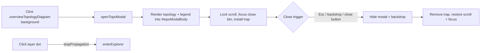

# Topology diagram: click-to-pop-out landscape modal (Issue #241)

## Summary

Makes the in-place network-topology diagram clickable. Clicking the diagram
background (anywhere outside a layer dot) opens a landscape (16/9) pop-out modal
that re-renders the upgraded topology + legend at a larger size. Closing the
modal returns focus to the element that opened it, restores page scroll, and
removes the focus trap. Per-layer dot clicks keep their existing behaviour
(enter the explorer) — propagation is stopped so the same click does not also
open the modal.

Closes #241.

### Architecture

### Files changed

- `docs/index.html` — adds the `.topoModalBackdrop` and `#topoModal` scaffold
  (dialog, aria-modal, aria-labelledby, hidden by default) with close button,
  title, and body slot.
- `docs/styles.css` — landscape sizing for `.topoModal`
  (`width: min(90vw, 1400px); aspect-ratio: 16/9; max-height: 80vh`),
  full-viewport backdrop, body that scrolls vertically when the SVG is tall, and
  a `cursor: zoom-in` hint on the in-place diagram.
- `docs/shared/topo_modal.js` — new pure controller
  (`createTopoModalController`) that wires open/close/Esc/backdrop with the
  existing `modal_focus.js` helpers.
- `docs/app.js` — instantiates the controller, refactors the topology render
  into a reusable `renderTopologyInto(container, topology)` helper, opens the
  modal on container click, and stops propagation on dot clicks so the modal is
  only opened by background clicks.
- `docs/sw.js` — caches the new `topo_modal.js` shared module so the PWA picks
  it up on next install.
- `scripts/capture_topo_modal_evidence.ts` — Playwright capture script for the
  two evidence screenshots referenced below.
- `tests/topo_modal_test.ts` — controller tests (open/close cycle, focus trap
  install + cleanup, backdrop click, close-button click, Escape, scroll lock,
  focus restoration to opener).
- `tests/topo_modal_markup_test.ts` — HTML/CSS structural guards (dialog/aria,
  backdrop, landscape sizing).

## Evidence

Landscape pop-out modal in both themes:

## Test Plan

- `tests/topo_modal_test.ts` — 9 tests:
  - `open()` reveals modal + backdrop, calls render once with the body, focuses
    the close button, locks `<html>` overflow, marks `aria-hidden="false"`.
  - `close()` hides modal + backdrop, restores `<html>` overflow, returns focus
    to the trigger.
  - Backdrop click, close-button click, and `Escape` keydown all close.
  - Non-Escape keys do not close.
  - `close()` is a no-op when already closed.
  - Focus trap is installed on `open()` and removed on `close()`.
  - `isOpen()` reflects the modal's hidden state.
- `tests/topo_modal_markup_test.ts` — 3 tests guarding the static scaffold
  (`role="dialog"`, `aria-modal="true"`, `aria-labelledby="topoModalTitle"`,
  `hidden`, close button, title, body, backdrop) and the landscape CSS
  (`aspect-ratio: 16/9`, `width: min(90vw, 1400px)`, `max-height: 80vh`, fixed
  full-viewport backdrop).
- Full quality gate: `./quality.sh` → 716 tests pass, format/lint/type all
  clean.
