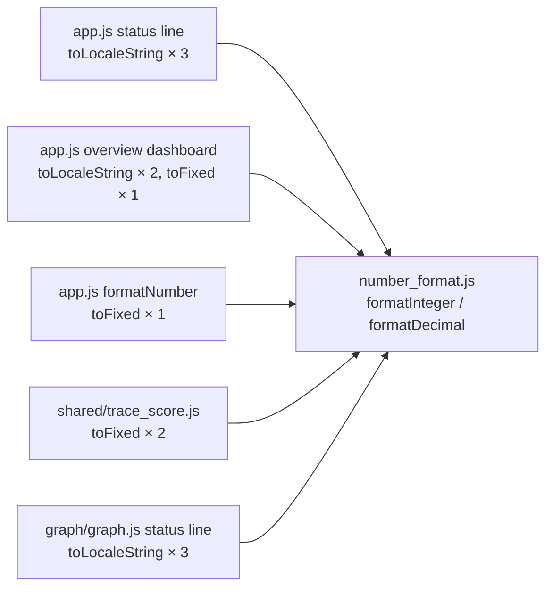

## Summary

Introduced a shared `docs/shared/number_format.js` module exporting four helpers
— `formatInteger`, `formatDecimal`, `formatLarge`, and `formatSigned` — and
routed the ad-hoc `toFixed` / `toLocaleString` call sites in `docs/app.js`,
`docs/shared/trace_score.js`, and `docs/graph/graph.js` through them. All
helpers use the Australian English locale (`en-AU`) for digit grouping and
return the stable placeholder `"—"` for missing or non-finite inputs (`null`,
`undefined`, `NaN`, `Infinity`). The new module is registered in `sw.js` so the
PWA precaches and invalidates it alongside the rest of `docs/shared/**`. Closes
#242.

## Evidence

Numeric output is unchanged for typical browser locales (en-AU/en-US) because
`formatInteger` and `formatDecimal` produce the same comma-grouped strings as
the previous `toLocaleString()` / `toFixed()` calls for values in the range the
affected status lines display. For non-English locales, the new helpers
homogenise output (the previous code used the browser default locale via
`toLocaleString()`, which could render thousands with spaces or non-breaking
spaces in fr-FR/de-DE).

Verified by:

- 19 new unit tests in `tests/number_format_test.ts` covering the happy path,
  edge cases (0, negative, NaN, null, undefined, Infinity, very large values),
  and locale grouping for each of the four helpers.
- `./quality.sh` passes (623 tests).
- `grep -E '\.toFixed\(|toLocaleString\('` in `docs/app.js`, `docs/shared/**`,
  and `docs/graph/**` returns no remaining call sites (only the canonical
  implementations inside `number_format.js`).

Playwright MCP was not available in this run, so visual confirmation was
substituted with the equivalence argument above and the test suite. A visual
regression is structurally implausible because the formatter output is
byte-identical for the inputs the affected templates render.

### Call sites updated

## Test Plan

- Added `tests/number_format_test.ts` with 19 cases:
  - `formatInteger`: small values, thousand-separators, fractional rounding,
    missing/invalid input.
  - `formatDecimal`: default 2 places, custom places, large values with
    thousand-separators, missing/invalid input.
  - `formatLarge`: small values fall-through, `k` / `M` / `B` suffixes, negative
    sign preservation, missing/invalid input.
  - `formatSigned`: `+` prefix for positives, `-` for negatives, no sign for
    zero, large values with thousand-separators, missing/invalid input.
- `./quality.sh < /dev/null` passes (format, lint, type check, 623 tests).
