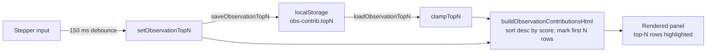

## Summary

Rank the Observation contributions panel by absolute impact, visually highlight
the top-N rows, and add a numeric stepper (1–100, default 10) that persists the
choice across reloads via `localStorage` under the panel-scoped key
`obs-contrib.topN`. Closes #243.

Key behaviours:

- `buildObservationContributionsHtml` now sorts defensively by `|score|`
  descending so the panel is self-contained regardless of caller-supplied order.
- A new `clampTopN` helper (pure, DOM-free, exported) normalises stepper input —
  flooring decimals, clamping into `[1, MAX_TOP_N]`, and falling back to
  `DEFAULT_TOP_N` (10) for `NaN`/non-numeric values.
- A new `docs/shared/observation_contributions_storage.js` module wraps
  `localStorage.get/set` with try/catch so private-mode or quota-exceeded
  failures cannot break the panel.
- `docs/app.js` reads the persisted value on first render, debounces stepper
  input (150 ms) before re-rendering, and writes back to storage. Stepper
  click/keydown events are stopped from toggling the surrounding `
`.
- `docs/styles.css` adds a subtle accent-coloured left-border + tint for
  `.observationContributionsRow.top-influencer` and an inline stepper style,
  with a phone-viewport rule that wraps the stepper onto its own line when the
  summary is tight.
- `docs/sw.js` caches the new storage module so reloads stay offline-safe.

## Evidence

The screenshot shows the panel rendered with `topN=4`: the summary label reads
"(top 4)", the stepper input is right-aligned and pre-filled with `4`, and the
first four rows carry the accent-coloured left-border and faint background tint.

## Test Plan

New / updated unit tests (all run under `deno test -A`):

- `tests/observation_contributions_panel_test.ts`
  - `clampTopN`: clamps to `[1, MAX_TOP_N]`; floors decimals; rejects
    `NaN`/`null`/`undefined`/non-numeric strings (falls back to default); parses
    numeric strings from `input.value`.
  - `DEFAULT_TOP_N` is 10 and `MAX_TOP_N` is 100.
  - `buildObservationContributionsHtml` sorts by `|score|` descending when given
    unsorted input; ranks negative scores by absolute value.
  - Default top-N is 10; `topN=3` marks exactly the first three rows; `topN`
    greater than rendered rows marks all rendered rows; invalid `topN` falls
    back to the default; oversized `topN` clamps to `MAX_TOP_N`.
  - Summary label reflects `min(topN, rendered)` so existing 3-row test
    (`"(top 3)"`) keeps passing.
  - Stepper renders inside the summary with `type="number"`, `min=1`, `max=100`,
    `step=1`, and `value` set to the clamped current topN; invalid input renders
    the default value.
- `tests/observation_contributions_storage_test.ts`
  - `OBSERVATION_TOP_N_KEY` is the panel-scoped `obs-contrib.topN`.
  - `loadObservationTopN`: returns default when storage empty, when storage is
    `null`, when `getItem` throws, or when the persisted value is corrupt;
    clamps oversized / undersized values; round-trips with
    `saveObservationTopN`.
  - `saveObservationTopN`: clamps before writing; returns `false` without
    throwing when storage is `null` or `setItem` throws.

Full quality gate (`./quality.sh`) passes — 674 tests, no lint/format/type
errors.
