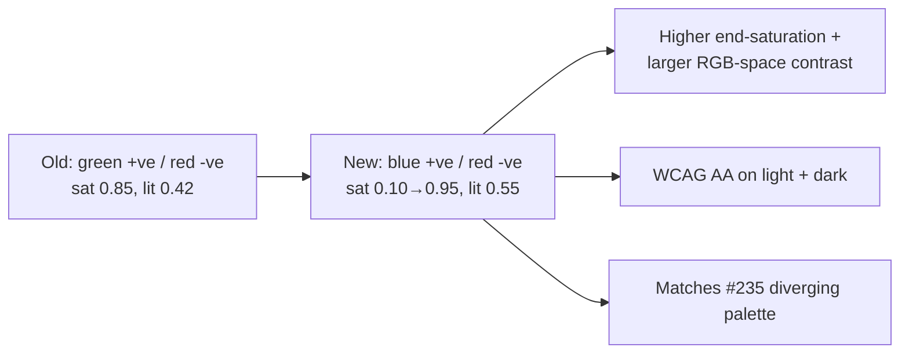

## Summary

Replaces the inbound-synapses panel weight colour scale with the diverging
red↔blue palette decided in #235, lays the legend out on a single line on
desktop (with graceful wrap on narrow viewports), and removes the
click-to-expand `
`/`
` collapse so the swatches are always
visible. The strong-end swatches now have higher saturation and noticeably
larger end-to-end contrast than the old green/red palette, while still clearing
WCAG AA (3:1 for non-text graphical objects) against both the light and dark
theme backgrounds. Closes #244.

### Changes

- `docs/shared/colour_maps.js` — `synapseWeightColourRgb01` now returns blue
  (hue 225°) for positive weights and red (hue 15°) for negative, with near-zero
  held neutral grey. Saturation ramps 0.10 → 0.95 (was 0.08 → 0.85); lightness
  held at 0.55 to match `divergingWeightSumColourCss` and keep dark-theme
  contrast inside WCAG AA.
- `docs/app.js` — legend is now a plain `
` (no
  `
`/`
`), labels reordered Strong − → Strong + to match a
  left-negative / right-positive number line, and the title attribute calls out
  the red/blue + signed-weight semantics.
- `docs/styles.css` — `.synapseLegend` defaults to `flex-wrap: nowrap` on wider
  viewports and only wraps below the existing 639 px breakpoint; swatch width
  bumped from 18 px to 24 px.
- `tests/colour_maps_test.ts` — existing behavioural assertions flipped from
  green-dominance to blue-dominance for positive weights, and new tests added
  for the diverging palette: neutral grey at `weight=0` across several
  `maxAbsWeight` values, symmetric ±k hues falling inside the blue / red bands,
  strong-end saturation + RGB-space contrast strictly greater than the captured
  old green/red baseline, determinism of the CSS output, and WCAG AA contrast
  against the light/dark theme backgrounds.
- `scripts/capture_synapse_legend_evidence.ts` — Playwright capture helper that
  renders the legend through a tiny harness page and screenshots it at both
  desktop and narrow viewports, mirroring the pattern used by the other
  `capture_*_evidence.ts` scripts.

## Evidence

Desktop (≥640 px) — all five swatches on one line, diverging red↔blue:

Narrow viewport (≤639 px) — graceful wrap:

Old → new palette flow:

## Test Plan

- Updated `tests/colour_maps_test.ts`:
  - `synapseWeightColourRgb01 positive weights are blueish (#244)`
  - `synapseWeightColourRgb01 negative weights are reddish (#244)`
  - `synapseWeightColourRgb01 stronger positive is more saturated (#244)`
  - `synapseWeightColourCss positive weight produces blueish colour (#244)`
  - `synapseWeightColourCss negative weight produces reddish colour (#244)`
- Added tests:
  - `synapseWeightColourRgb01 at weight=0 lands in the neutral-grey band (#244)`
  - `synapseWeightColourRgb01 symmetric ±k fall in opposite blue/red hue bands (#244)`
  - `synapseWeightColourRgb01 strong ends have higher saturation + contrast than old green/red baseline (#244)`
  - `synapseWeightColourCss is deterministic for the same inputs (#244)`
  - `synapseWeightColourCss meets WCAG AA on light + dark themes (#244)`
- `./quality.sh` passes locally (721 tests).
