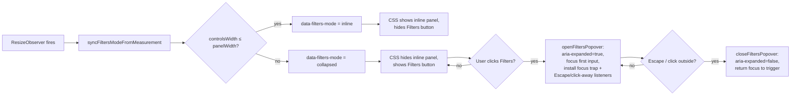

# Inbound synapses: inline filter controls + narrow-screen collapsed popover

## Summary

The inbound-synapses panel used to hide its Min alloc imp / Top K filter inputs
behind a `

Filters
` block even when the header row
had plenty of space. This PR lifts the filters out of `
` so they sit
inline on the same row as the heading, count badge, and Sort select on roomy
viewports, and collapses them behind a single "Filters" popover button only when
the row would otherwise overflow.

The inline ↔ collapsed switch is driven by a `data-filters-mode` attribute on
`.synapseHeader`. A `ResizeObserver` measures the panel and decides which mode
to apply via a pure helper in `docs/shared/filter_layout.js`, so the choice
tracks actual fit rather than a hard-coded media query. When `ResizeObserver` is
unavailable the code falls back to the `MOBILE_MAX` (639px) heuristic.

The same `#synapseFilterPanel` element is reused in both modes — the inputs keep
their existing IDs (`#synapseMinAlloc`, `#synapseTopK`) so the wiring in
`docs/app.js` still drives the inbound list.

Closes #245.

## Evidence

### Desktop (≥640px): heading + sort + filters all on one row

### Mobile (collapsed): controls hide behind a "Filters" button

### Mobile (popover open): clicking Filters reveals the same inputs

### Mode-switch flow

## Test Plan

- `tests/filter_layout_test.ts` (new) — 10 pure-decision tests for
  `decideFiltersMode` and `decideFiltersModeByWidth` covering happy path,
  boundary, overflow, non-finite, and zero/negative inputs.
- `tests/synapse_filters_inline_test.ts` (new) — 4 structural tests asserting
  `docs/index.html` carries `data-filters-mode="inline"` by default, the inputs
  are no longer nested in `
`, the
  `#synapseFiltersToggle` button exists with `aria-controls`, and the
  `#synapseFilterPanel` container is present.
- `tests/app_module_loads_test.ts` — re-run to confirm `docs/app.js` still
  parses cleanly after the new import + popover wiring.
- `tests/sw_static_files_test.ts` — re-run after adding
  `./shared/filter_layout.js` to `STATIC_FILES` in `docs/sw.js`.
- `tests/synapse_render_test.ts` and `tests/responsive_test.ts` — re-run
  unchanged to confirm no regressions in adjacent areas.
- `./quality.sh` — passes locally (`704 passed | 0 failed`).
- `deno run -A scripts/verify_issue_245_layout.ts` — generates the three
  evidence screenshots from a real Chromium run against the published `docs/`
  directory.
