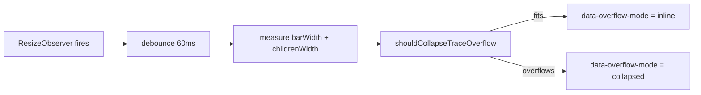

## Summary

Stop the Trace Explorer's overflow controls (Observations / 🧠 / Synapses) from collapsing behind the "⋯" popover whenever there is spare width on the trace bar. The decision now comes from a real measurement of the bar's children vs its content width, not a hard-coded `(max-width: 639px)` media query. Closes #246.

- New pure helper `shouldCollapseTraceOverflow({ barWidth, childrenWidth, padding })` in `docs/shared/trace_header.js` so the threshold is verifiable without a DOM.
- `docs/app.js` now wires a `ResizeObserver` on `.traceBar` (with a 60 ms debounce and a `window.resize` fallback) that flips `data-overflow-mode="inline" | "collapsed"` on `.traceOverflow`. Measurement sums the direct flex children (descending into `display: contents` wrappers) so wrapping does not hide overflow.
- `docs/styles.css` switches the overflow wrapper from a media-query-driven popover to attribute-driven styles. The popover behaviour, focus handling, and keyboard navigation in `collapsed` mode are unchanged.

## Evidence

Wide viewport (700 px) — controls render inline, no "⋯":

Narrow viewport (360 px) — the row genuinely cannot fit, controls collapse behind "⋯":

Capture script: `scripts/verify_issue_246_layout.ts` (mirrors the #245 evidence pattern).

## Test Plan

- Added 5 unit tests in `tests/trace_header_test.ts` for `shouldCollapseTraceOverflow` covering the happy path (fits ⇒ inline, overflows ⇒ collapsed), the `childrenWidth === barWidth` edge case (⇒ inline), padding handling, and invalid/zero input (⇒ inline fallback).
- Existing `tests/trace_header_test.ts` cases for `formatTraceScore`, `shouldUseCompactHeader`, and `nextOverflowState` still pass — `shouldUseCompactHeader` is unchanged (it still gates the theme-toggle placement, which is unrelated to the overflow collapse).
- `./quality.sh` passes locally (728/728 tests, lint, fmt).
