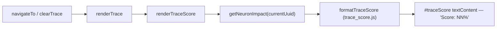

## Summary

Retires the duplicate `#tracePathScore` plumbing that lived alongside the
canonical `#traceScore` badge on the Trace Explorer breadcrumb. Closes #247.

**Canonical choice:** `#traceScore` (the element actually present in
`docs/index.html`, wired by `renderTraceScore()` and styled by `.traceScore` in
`docs/styles.css`) is kept as the single source of truth. The `#tracePathScore`
/ `#tracePathScoreValue` / `updateTracePathScoreUI` plumbing in `docs/app.js`
was never paired with a real DOM element — the update function ran but its
`getElementById` lookups returned `null`, so the calls were silent no-ops.
Either path would have satisfied the issue; keeping `#traceScore` is the smaller
change because the element, CSS and render flow already exist and are tested.

Removed from `docs/app.js`:

- `import { formatTraceScore as formatPathAllocationScore } from "./shared/trace_header.js"`
- `el.tracePathScore` and `el.tracePathScoreValue` lookups
- `updateTracePathScoreUI(allocation)` function definition
- All three call sites (`cancelTrace`, `renderImpactBreakdown` early-exit and
  success branches)

`docs/index.html` already only carries `#traceScore`, so no HTML change was
needed — the duplicate was JS-only dead code.

`docs/shared/trace_header.js` and its `formatTraceScore` formatter are left in
place: they are pure utilities with their own unit-test coverage
(`tests/trace_header_test.ts`) and unrelated to the breadcrumb badge.

## Evidence

This is a pure dead-code removal — no user-visible rendering changes, because
the `#tracePathScore` lookups were already `null` in production. The regression
test verifies the static HTML and the wiring contract rather than a screenshot.

## Test Plan

- `tests/trace_score_single_label_test.ts` (new) — two tests:
  - Asserts `<nav class="traceBar">` in `docs/index.html` contains exactly one
    `id="traceScore"` and neither `id="tracePathScore"` nor
    `id="tracePathScoreValue"`.
  - Asserts `docs/app.js` carries no `getElementById("tracePathScore"…)` lookups
    and no `updateTracePathScoreUI` references, while still wiring `#traceScore`
    and calling `renderTraceScore()`.
  - Both fail against the unfixed code (the second test caught the dead
    `tracePathScore` plumbing).
- `./quality.sh` passes locally: 723 tests, zero lint/format errors.
