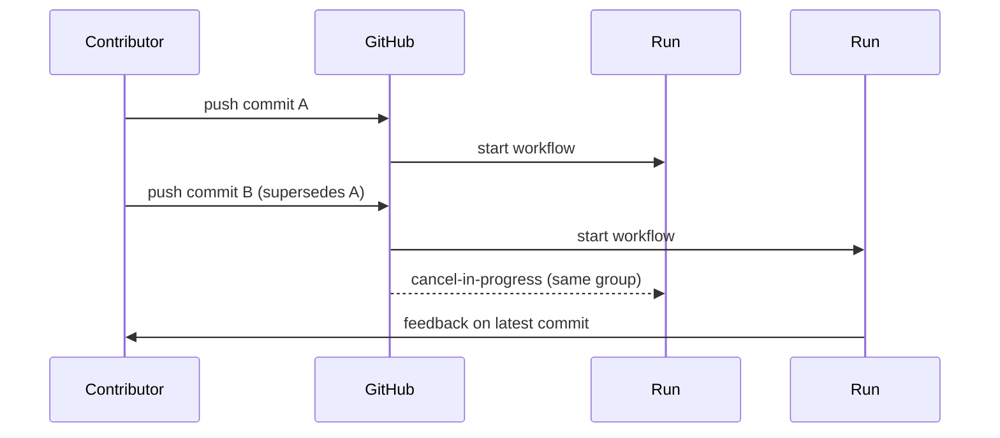

## Summary

Added workflow-level `concurrency:` blocks to every PR-triggered workflow in
`.github/workflows/` so superseded runs are cancelled when a contributor
pushes new commits to a PR. Each block keys on
`${{ github.workflow }}-${{ github.ref }}` with
`cancel-in-progress: true` — the canonical pattern. The Pages
deploy workflow keeps its existing `group: "pages"` /
`cancel-in-progress: false` policy because Pages deploys must serialise.
Closes #258.

The issue listed `ci.yml`, but it does not exist in this repo — it was
consolidated into `deno-quality.yml` under Issue #259, so that file picked
up the concurrency block in its place. `upgrade-dependencies.yml` is
schedule / `workflow_dispatch` only (not PR-triggered) so it is not in
scope.

## Workflows updated

- `a11y.yml`
- `deno-quality.yml`
- `dependency-review.yml`
- `gitleaks.yml`
- `markdown-lint.yml`
- `semgrep.yml`
- `semver-bump.yml`
- `shellcheck.yml`

`deploy.yml` is unchanged.

## Evidence

Backend / CI-config change with no UI surface, so no screenshot. Behaviour
is verified by the new test in `tests/workflow_concurrency_test.ts`, which
parses every workflow YAML and asserts that PR-triggered ones declare the
canonical concurrency block while `deploy.yml` keeps its Pages-serialising
policy.

## Test Plan

- Added `tests/workflow_concurrency_test.ts` with two cases:
  - `every PR-triggered workflow declares a concurrency group (#258)` —
    parses each `.github/workflows/*.yml`, skips `deploy.yml`, and for
    every workflow that triggers on `pull_request` asserts the
    `concurrency.group` references both `github.workflow` and
    `github.ref` and `cancel-in-progress` is `true`.
  - `deploy.yml keeps its Pages-serialising concurrency policy (#258)` —
    asserts `group: pages` and `cancel-in-progress: false` so the Pages
    pipeline is not accidentally regressed by future edits.
- Confirmed the new test failed against `main` before the workflow edits
  and passes after.
- `./quality.sh` passes: 726 tests, 0 failures.
