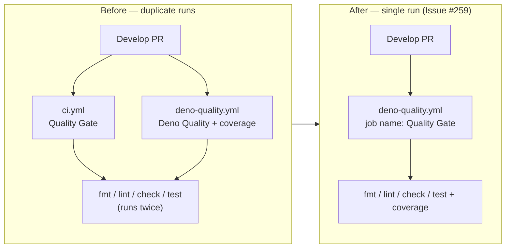

## Summary

Consolidated the two duplicate Deno quality CI workflows by deleting
`.github/workflows/ci.yml` and keeping `.github/workflows/deno-quality.yml` (the
superset — same four checks plus `--coverage` and Codecov upload). Closes #259.

Before this change, every Develop pull request paid double for the same four
checks (`deno fmt --check`, `deno lint`, `deno check`, `deno test`), each
workflow re-running `setup-deno@v2.x` from scratch with no cache between them.
The two jobs always passed or failed together and produced two duplicate
"Quality Gate" / "Deno Quality" entries in the Checks panel — friction without
signal.

To keep any existing required-status-check rule referencing the **Quality Gate**
display name intact, the surviving job is renamed:

```yaml
jobs:
  quality:
    name: Quality Gate
```

The job ID remains `quality` (so the existing `develop` ruleset required-check,
which references the job ID, still resolves), and the display label now matches
the old `ci.yml` workflow name.

## Evidence

Backend / CI-only change — no UI screenshots. The deletion plus rename is
verified by Deno unit tests; the full quality gate (`./quality.sh`) runs 724
tests and passes cleanly.



Files touched:

| File                                  | Change                            |
| ------------------------------------- | --------------------------------- |
| `.github/workflows/ci.yml`            | **Deleted** (duplicate subset)    |
| `.github/workflows/deno-quality.yml`  | Added `name: Quality Gate` to job |
| `tests/ci_workflow_test.ts`           | **Deleted** (workflow gone)       |
| `tests/deno_quality_workflow_test.ts` | New tests pin job name + absence  |

## Test Plan

Added to `tests/deno_quality_workflow_test.ts`:

- `deno-quality 'quality' job is named 'Quality Gate' (Issue #259)` — loads the
  workflow YAML and asserts the job-level `name` is `Quality Gate`, so the
  renamed display label cannot silently regress.
- `legacy ci.yml workflow has been removed (Issue #259)` — stats
  `.github/workflows/ci.yml` and asserts it does **not** exist, so the duplicate
  workflow cannot be reintroduced without an explicit test failure.

Removed:

- `tests/ci_workflow_test.ts` — its target workflow no longer exists; every
  behaviour it covered is exercised by `tests/deno_quality_workflow_test.ts`.

Verification:

- `deno test -A tests/deno_quality_workflow_test.ts` → 14 passed, 0 failed.
- `./quality.sh < /dev/null` → 724 passed, 0 failed.

## Deno regression avoided

Stayed on Deno-native `deno test`/`deno fmt`/`deno lint`/`deno check` via
`setup-deno@v2.x` — no Node tooling was introduced when collapsing the two
workflows.
