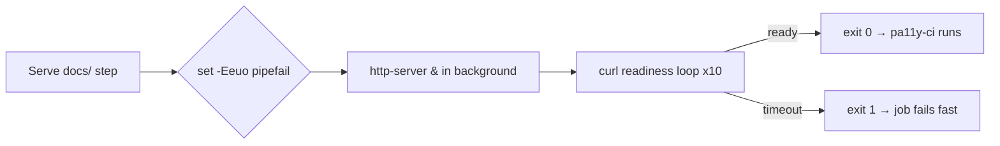

## Summary

Added `set -Eeuo pipefail` to the "Serve docs/ in the background" step in
`.github/workflows/a11y.yml`, matching the convention already used in
`semver-bump.yml`. Without strict bash flags, a typo'd `${VAR}` expansion would
silently become an empty string, and a failing `curl | grep` chain inside the
readiness loop would be swallowed by the pipeline — both of which can wedge the
loop and produce a confusing downstream `pa11y-ci` failure. Closes #260.

## Evidence

Backend / CI-config change with no UI surface — no screenshot. Behaviour is
verified by a new regression test in `tests/a11y_workflow_test.ts` which parses
the workflow YAML, locates the http-server readiness step, and asserts its
`run:` block begins with `set -euo pipefail` (or `-Eeuo`). The test was
confirmed to fail against the unfixed workflow and to pass after the edit.

## Test Plan

- Added
  `a11y workflow http-server readiness loop uses strict bash flags
  (#260)` in
  `tests/a11y_workflow_test.ts` — finds the http-server step and asserts its
  bash starts with `set -euo pipefail` (or `-Eeuo`).
- Confirmed the new test fails against the milestone branch before the workflow
  edit and passes after.
- `./quality.sh` passes locally (727 tests, 0 failures).

## Deno regression avoided

Stayed within the existing Deno test harness — the new regression test is a Deno
YAML parser check, not a Node-based linter.
