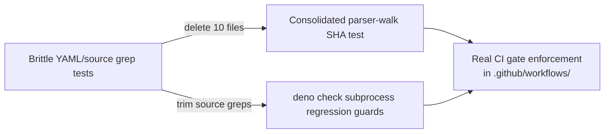

## Summary

Deleted the workflow YAML grep-style tests and trimmed the source-text greps out
of the per-script `*_check_test.ts` files. These tests asserted that a
particular `run:` block literally contained a substring (or that a `.ts` file's
source matched a regex). Refactors that preserve identical CI behaviour —
splitting a `run:` block in two, swapping `deno fmt --check` for
`deno task fmt-check`, rewording a comment — would break dozens of tests while
leaving the gate working correctly. The CI gate's true contract is observable in
CI itself; pretending a unit test gates it is theatre.

The SHA-pin policy is now enforced by one consolidated parser-walk test
(`tests/workflow_action_sha_pinning_test.ts`) that walks every `uses:` value in
every workflow and asserts it matches `[0-9a-f]{40}` — exactly the pattern the
issue called for. The brittle comment-walk companion test that parsed YAML
comments and backslash-escapes was removed.

Closes #263.

## Evidence

This is a test-suite cleanup — no UI surface to screenshot. Verification is that
`./quality.sh` still passes after the deletions and trims:

- 644 tests pass, 0 fail (down from 716 before — the 72 removed tests were all
  HOW-tests on CI config, not behavioural assertions).
- The consolidated SHA-pin parser-walk test continues to pass against every
  workflow file in `.github/workflows/`.
- The per-script `deno check` subprocess regression guards
  (capture_transition_evidence, verify_theme_layout, verify_starfield_layout,
  generate_pwa_assets, evidence_scripts) all continue to run and pass — that is
  the real behavioural contract those tests were ever supposed to assert.

### Files deleted (10 — pure YAML/shell substring greps)

- `tests/a11y_workflow_test.ts`
- `tests/deno_quality_workflow_test.ts`
- `tests/dependency_review_workflow_test.ts`
- `tests/gitleaks_workflow_test.ts`
- `tests/markdown_lint_workflow_test.ts`
- `tests/semgrep_workflow_test.ts`
- `tests/semver_bump_workflow_test.ts`
- `tests/shellcheck_workflow_test.ts`
- `tests/upgrade_dependencies_workflow_test.ts`
- `tests/quality_script_deno_check_test.ts`

### Files trimmed (kept the `deno check` subprocess / JSON-value tests; dropped source-text greps)

- `tests/workflow_action_sha_pinning_test.ts` — kept the parser-walk SHA test;
  dropped the brittle YAML-comment-walk test.
- `tests/capture_transition_evidence_check_test.ts` — kept `deno check` and the
  `.py` removal check; dropped the `from "playwright"` regex.
- `tests/verify_theme_layout_check_test.ts` — same.
- `tests/verify_starfield_layout_check_test.ts` — kept `deno check` and the
  deno.json playwright-pin JSON-value check; dropped the source regex.
- `tests/generate_pwa_assets_check_test.ts` — kept `deno check` and the `.py`
  removal check; dropped the bare-specifier regex, the `1337` seed literal, the
  icon-size literals, the output-filename literals, and the README/CONTRIBUTING
  substring assertions.

### Files left untouched (already behavioural)

- `tests/jsr_quarantine_check_test.ts` — proper module unit tests that import
  functions from `scripts/jsr_quarantine_check.ts` and call them with mocked
  fetchers. Listed in the issue body but does not match the described
  anti-pattern.
- `tests/evidence_scripts_check_test.ts` — already only invokes
  `deno check docs/evidence/` as a subprocess.
- `tests/workflow_concurrency_test.ts`, `tests/workflow_job_timeout_test.ts` —
  already use the recommended parser-walk pattern across every workflow.

## Test Plan

- Ran `./quality.sh < /dev/null` — passes (644 tests, 0 failures).
- Verified `tests/workflow_action_sha_pinning_test.ts` still walks every
  workflow and would fail if any `uses:` ref were not a 40-char SHA.
- Verified the trimmed `_check_test.ts` files still run `deno check` as a
  subprocess and would fail on a real type or resolution regression.

## Deno regression avoided

No Node-only tooling was introduced. The cleanup is pure Deno test deletion plus
trims; the consolidated SHA-pin test continues to use `@std/yaml` and the bare
Deno test runner.
