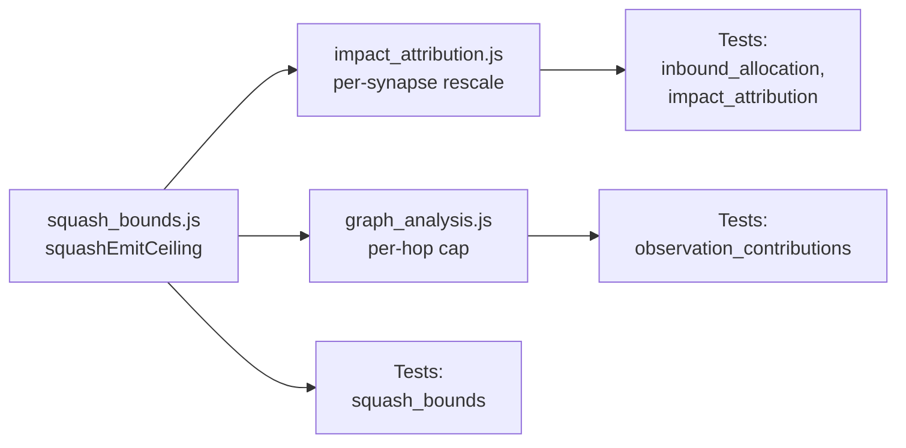

## Summary

Make per-synapse contribution attribution squash-function-aware so the
influence reported for an input never exceeds what the receiving neuron's
activation function can actually emit. Closes #270.

A neuron's activation cannot exceed what its squash can emit (TANH/HARD_TANH:
±1, SIGMOID/LOGISTIC/STEP/BIPOLAR: 0..1 or ±1, RELU/IDENTITY: unbounded). The
previous attribution used raw `|meanContribution|` or `|weight|` without
capping by the receiving neuron's emit ceiling, so ten synapses each feeding
value 10 into a TANH neuron were each reported as contributing 10 — when in
reality the neuron's own output is squashed to ≤ 1 and each synapse can
contribute at most a fair share of that ceiling (~0.1 each).

This change:

- Adds `docs/shared/squash_bounds.js` exporting
  `squashEmitCeiling(squash, recordedActivationMax?)` with a reusable table.
- Threads `toNeuronSquash` + optional `recordedActivationMax` through
  `computeInboundSynapseImpactAllocation` and rescales `allocatedImpact`
  such that Σ `allocatedImpact` ≤ the emit ceiling (fair-share rescaling
  when the raw Σ saturates).
- Propagates the cap through `computeTopContributingInputs` at every hop
  via new optional `getNeuronSquash` and `getRecordedActivationMax`
  callbacks — the walk's normalised shares are unchanged, but each hop's
  allocation now respects the receiver's ceiling.
- Wires the new params through both `docs/app.js` call sites that already
  have access to `neuronsByUuid` and `getNeuronStats(uuid)` for the
  recorded activation envelope.

Issue #264 (the flaky timing assertion in `observation_contributions_test.ts`)
was already closed by a prior commit — the current test file references
issue #264 in its comments and contains no `elapsedMs` assertion. Nothing
further to do there.

## Evidence

This is a backend/CLI library change with no UI surface to screenshot. The
new behaviour is verified by 11 new unit tests across three files:

- `tests/squash_bounds_test.ts` (7 tests) — bounded ±1 / 0..1 families,
  unbounded families with and without `recordedActivationMax`, unknown /
  missing squash returning `Infinity` with **zero console output**, and
  non-positive envelope values ignored.
- `tests/inbound_allocation_test.ts` (7 new tests) — TANH ten-synapse
  saturation (each gets ~0.1, sum ≤ 1), SIGMOID one-strong-synapse (≤ 1),
  RELU and IDENTITY fall-back-to-current behaviour, RELU with envelope
  tightens the cap, unknown squash silent fall-back, and the
  `neuronImpact > ceiling` case.
- `tests/impact_attribution_test.ts` (1 new test) — TANH receiver in the
  allocation step honours the cap.
- `tests/observation_contributions_test.ts` (2 new tests) — squash-aware
  walk preserves normalised shares; `null` squash callback falls back
  cleanly.

Full quality gate (`./quality.sh < /dev/null`) passes: **678 tests, 0
failed**.

## Deno regression avoided

Stayed Deno-native throughout: new module is plain ES JS importable by both
`docs/` (browser) and the Deno test suite, new tests use `Deno.test` + the
in-repo `test_helpers.ts`. No Node tooling, dev-deps, or `package.json`
touched.

## Test Plan

- [x] `docs/shared/squash_bounds.js` exports `squashEmitCeiling`.
- [x] `computeInboundSynapseImpactAllocation` accepts `toNeuronSquash` and
      `recordedActivationMax` and rescales allocated impact.
- [x] `computeTopContributingInputs` propagates the cap at each hop via
      optional `getNeuronSquash` / `getRecordedActivationMax` callbacks.
- [x] Existing tests pass; new tests added for TANH saturation, SIGMOID
      single-synapse, RELU/IDENTITY fall-back, unknown squash, and envelope
      tightening.
- [x] `./quality.sh < /dev/null` passes (678 tests, 0 failed).
- [x] Issue #264 confirmed already closed — current test file contains no
      `elapsedMs` assertion.
