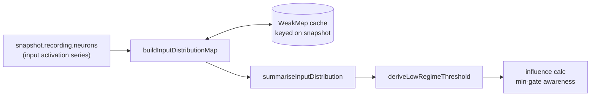

## Summary

Added `docs/shared/input_distribution.js` — distribution primitives that
auto-derive regime thresholds (e.g. "very low volume") from each input neuron's
recorded activation distribution, so the influence calc's min-gate awareness can
flow thresholds from the snapshot data rather than hard-coded magic numbers.
Closes #271.

Three exports:

- `summariseInputDistribution(values)` — returns
  `{ min, max, p05, p25, p50, p75, p95, count }`. Filters non-finite values,
  samples evenly to at most 2048 points (matches the existing `sampleEvenly`
  pattern in `docs/graph/graph.js`), and computes quantiles by linear
  interpolation (R type-7 / NumPy default).
- `deriveLowRegimeThreshold(summary, opts?)` — returns `summary.p05` by default;
  accepts a `regimeQuantile` override (`"p25"`, `"p50"`, `"p75"`, `"p95"`).
  Unknown keys fall back to `p05` so a typo can't crash the influence calc.
- `buildInputDistributionMap(snapshot, neuronsByUuid)` — returns
  `Map<inputUuid, summary>` for every input neuron. Cached in a `WeakMap` keyed
  on the snapshot object so subsequent calls in the same session reuse the work.

## Evidence

Backend-only change — no UI surface to screenshot. Verified by the new test
suite plus the full quality gate.

### Data flow



Quality gate output:

```
running 15 tests from ./tests/input_distribution_test.ts
... ok | 15 passed | 0 failed (50ms)
...
ok | 746 passed | 0 failed (11s)
==> OK
```

## Test Plan

`tests/input_distribution_test.ts` — 15 cases covering every acceptance
criterion in the issue:

- Quantile correctness on a known sorted series (1..100) — exact expected values
  for `p05`/`p25`/`p50`/`p75`/`p95` under linear interpolation.
- Single-value series, NaN/Infinity filtering, non-array input.
- Sub-2048 series uses the full series (count matches input length).
- Series longer than 2048 samples evenly (count capped at 2048; min/max
  preserved; p50 close to underlying median).
- Empty / all-non-finite input returns a summary with `count: 0` and no NaNs.
- `deriveLowRegimeThreshold` returns `p05` by default and honours `p25`/`p50`
  overrides, with safe fallback on an unknown key.
- `buildInputDistributionMap` covers input-only filtering, missing recording →
  `count: 0` summary, and `WeakMap` cache reuse on repeated calls.

## Deno regression avoided

Added a new pure-JS module under `docs/shared/` and a Deno test file under
`tests/`. No Node tooling, no `package.json`, no `npm`/`pnpm` introduction — the
new primitive is consumed by the existing Deno-native test pipeline
(`./quality.sh`).
