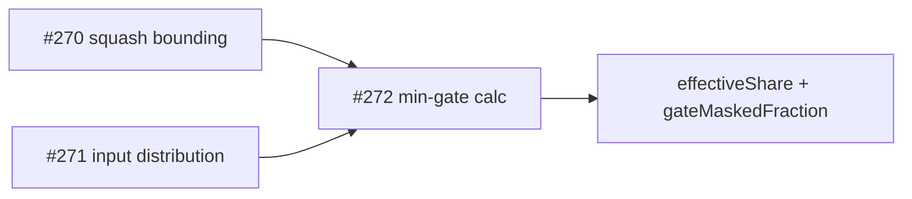
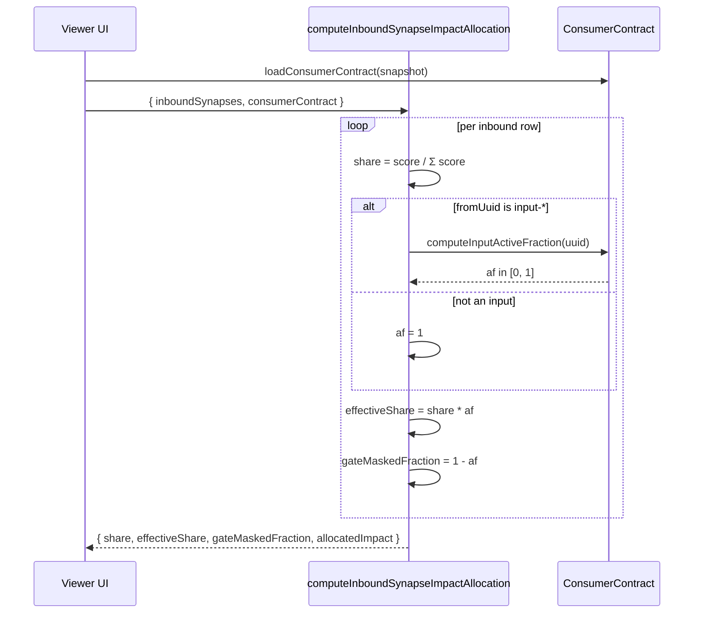

## Summary

Teach the influence calc about downstream `min(...)` gates via a consumer
contract so an input is credited with influence only on the samples where
its value would actually drive the gate. Closes #272.

- New module `docs/shared/consumer_contract.js` with JSDoc typedefs for the
  contract schema and three helpers: `loadConsumerContract`,
  `getGatesForInput`, and `computeInputActiveFraction`.
- `computeInboundSynapseImpactAllocation` (in `docs/impact_attribution.js`)
  accepts an optional `consumerContract`. For `input-*` inbound edges that
  participate in a gate the calc now derives an active-fraction (the share
  of samples on which the input is the strict per-sample minimum across
  every other gate operand) and surfaces:
  - `effectiveShare` = `share * activeFraction` (post-gate)
  - `gateMaskedFraction` = `1 - activeFraction` (0..1 diagnostic)
  - existing `share` and `allocatedImpact` keep their pre-gate semantics
    so the UI can display both.
- `computeTopContributingInputs` (in `docs/shared/graph_analysis.js`)
  accepts the same `consumerContract` and applies the active-fraction at
  the input boundary of the multi-hop walk; per-input rows now carry
  `gateMaskedFraction` for diagnostic display.
- The contract may be embedded as `creature.consumerContract` in the
  snapshot or passed in explicitly; missing operands collapse to unmasked
  behaviour rather than throwing.

## Evidence

Backend / pure-JS change — no UI alterations to screenshot in this PR.
Verified via the new unit suite (12 tests, all green) plus the full
quality gate (`./quality.sh`: fmt + lint + type check + 690 tests).

## Test Plan

- `tests/min_gate_attribution_test.ts` — 12 tests covering:
  - `loadConsumerContract` (embedded, explicit, missing, validation).
  - `getGatesForInput` (filters by input UUID, including a multi-gate
    snapshot).
  - `computeInputActiveFraction` (100%, 0%, 30% scenarios).
  - `computeInboundSynapseImpactAllocation` with the four acceptance
    scenarios: input is min 100%, input is min 0%, partial gating (30%
    scales linearly), no contract → behaviour unchanged, missing operand
    → unmasked + no throw.
- `./quality.sh` — passes (fmt, lint, deno check, 690 unit tests).

## Deno regression avoided

Implemented the consumer-contract helpers in the existing Deno-native
`docs/shared/` module pattern (pure JS + JSDoc + Deno-only unit tests);
no Node tooling, `package.json`, or third-party test runner was
introduced.
