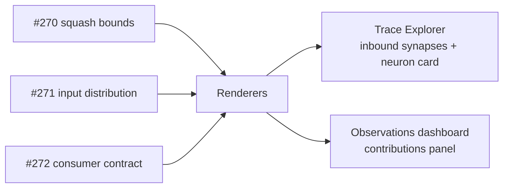

# PR Summary — Issue #273

## Summary

Threads the squash-bounded + gate-aware influence values through the Trace
Explorer (inbound synapse rows + neuron card) and the Observations dashboard /
contributions panel, completing the user-visible step of the parent
influence-calc fix (#266). The calc layer now receives `toNeuronSquash`,
`recordedActivationMax` and the resolved `consumerContract` at every call site,
and the renderers surface the post-gate values as the primary number with a
"pre-gate" badge and an inline "Gate" indicator chip on the neuron card.

Closes #273.

## What changed

- **`docs/app.js`**
  - Imports `loadConsumerContract` + `computeInputActiveFraction` from
    `shared/consumer_contract.js` and `buildGateChipHtml` from
    `shared/gate_chip.js`.
  - Adds a module-scoped `CONSUMER_CONTRACT` and resolves it on every snapshot
    load.
  - Threads `consumerContract` into all three calc-layer call sites:
    `computeTopContributingInputs` (panel feed), `renderImpactBreakdown` (impact
    breakdown card) and `renderSynapseList` (inbound synapse rows).
  - Inbound synapse rows: when `gateMaskedFraction > 0` the row gains a
    `pre-gate:` badge with a tooltip _"Pre-gate share — masked by downstream
    min(...) gate in X% of samples"_.
  - Neuron card: new `renderGateChip(uuid)` helper renders a small "Gate" chip
    beside the current neuron title whenever any inbound input is masked by a
    downstream gate, linking to the consumer-contract section.
- **`docs/shared/observation_contributions.js`**
  - `buildObservationContributionsRow` prefers `effectiveShare` for the primary
    percent when supplied, renders a pre-gate badge when
    `gateMaskedFraction > 0`, and updates the panel note to explain the badge.
  - Extends the `ObservationContribution` typedef with `effectiveShare`,
    `gateMaskedFraction` and `preGateShare`.
- **`docs/shared/gate_chip.js`** (new)
  - DOM-free helper exporting `shouldRenderGateChip` and `buildGateChipHtml`.
    Renders a span or anchor pill with a tooltip that reports the worst-case
    masking fraction.
- **`docs/graph/graph.js`**
  - Resolves and propagates the consumer contract + squash bounds into the
    inbound impact allocation so the graph HUD agrees with the Trace Explorer.
- **`docs/sw.js`**: precaches the two new shared modules.
- **`docs/styles.css`**: styling for `.preGateBadge` and `.gateChip` (subdued
  amber chip, light + dark theme).
- **`scripts/capture_obs_panel.ts`** (new): deterministic screenshot harness for
  #266 / #273 evidence (static HTML, no network snapshot).

## Evidence

### Observations panel — before

No effective-share / pre-gate distinction; every row shows a single percent.

### Observations panel — after

Gated rows (`input-rsi`, `input-spread`) show the effective share as the primary
number with a `pre-gate:` badge carrying the un-masked share. The neuron card
title shows a "Gate" indicator chip.

### Neuron card — after

Gate indicator chip rendered beside the neuron title.

### Architecture (#266 wire-up)

## Test Plan

- `tests/observation_contributions_panel_test.ts` — added five tests covering:
  `effectiveShare` becomes the primary percent when supplied; pre-gate badge
  only renders when `gateMaskedFraction > 0`; zero `gateMaskedFraction`
  suppresses the badge; layout / order rules from #186 / #243 still hold for
  gated rows; the panel note text mentions the pre-gate badge.
- `tests/gate_chip_test.ts` (new) — eight DOM-free tests covering empty /
  invalid inputs, zero-fraction suppression, span vs anchor rendering,
  worst-case tooltip, HTML escaping for label + URL, and custom labels.
- All existing tests untouched.
- `./quality.sh < /dev/null` — `704 passed | 0 failed`.

## Pre-PR Security Self-Check

- [x] **Input validation**: new helpers coerce numeric inputs via
      `Number(...)` + `Number.isFinite` and reject non-array `rows`.
- [x] **Secrets**: no `.env`, `.config*.json`, or credential files staged.
- [x] **Injection surface**: every label / URL / tooltip passed through
      `escapeHtml` before interpolation; the gate-chip test asserts URL
      escaping.
- [x] **Output encoding**: pre-gate tooltip strings are escaped before being
      placed in `title="..."`.
- [x] **Authentication/authorisation**: N/A (static client-side viewer).
- [x] **Error handling**: helpers return `""` / no-op on malformed input rather
      than throwing.
- [x] **Dependencies**: no new third-party dependencies introduced.
