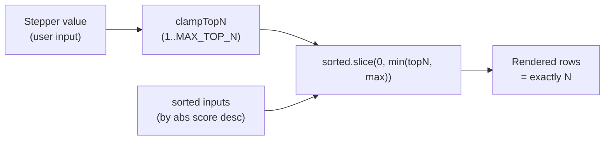

## Summary

Made the Observation contributions top-N stepper actually cap the number of
rendered rows. Previously the stepper only toggled a CSS highlight while up to
50 rows always rendered. After this change, setting `topN: N` in
`buildObservationContributionsHtml` renders exactly `min(N, MAX_OBSERVATION_ROWS, inputs.length)`
rows. `MAX_OBSERVATION_ROWS` remains a hard safety ceiling. Closes #275.

The fix is a one-line change in `docs/shared/observation_contributions.js`:
move `clampTopN` above the slice and use
`Math.min(clampedTopN, max)` as the slice limit. The `top-influencer` CSS
class and `data-top-influencer` attribute remain on every rendered row, so
the existing CSS hook at `docs/styles.css:852` is backwards-compatible.

## Evidence

This is a pure-JS render-logic change in a DOM-free module. Verified via
deno tests (no browser screenshot needed for the rendering contract).

`./quality.sh` passes (731 tests, 0 failed).

## Test Plan

Modified tests in `tests/observation_contributions_panel_test.ts`:

- `buildObservationContributionsHtml: caps at MAX_OBSERVATION_ROWS when topN allows it`
  (renamed from "caps at 50 rows") — now passes explicit `topN: MAX_TOP_N` to
  exercise the hard ceiling.
- `buildObservationContributionsHtml: topN=3 renders and marks exactly 3 rows`
  (renamed from "marks exactly first 3 rows") — asserts exactly 3 rows render
  and all 3 are marked; the obsolete "markers appear before input-3" check is
  dropped because input-3 no longer renders.

New regression tests covering the acceptance criteria:

- `(#275): topN=5 with 20 inputs renders exactly 5 rows` — primary regression
  for the bug.
- `(#275): topN=10 with 3 inputs renders all 3 rows` — fewer-than-topN case.
- `(#275): default topN renders DEFAULT_TOP_N rows when more inputs are available`
  — verifies the default contract.

No timing-based or wall-clock assertions added (per #264).
