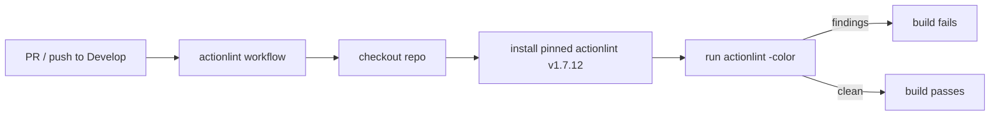

# PR Summary — Add actionlint CI lint gate (#292)

## Summary

The repository ships several `.github/workflows/*.yml` files but had **no CI
step running actionlint**, the standard GitHub Actions linter. Workflow
regressions — malformed `${{ }}` expressions, undefined `needs:`, invalid event
filters, shellcheck issues inside `run:` blocks — could land unnoticed.

This change adds `.github/workflows/actionlint.yml`, a dedicated lint gate that
runs actionlint over every workflow on each pull request and `Develop` push, so
regressions fail the build. The linter binary is installed via actionlint's
official download script pinned to release `v1.7.12` (avoiding any unofficial
third-party action), and the job obeys the repo-wide workflow policies: pinned
`actions/checkout`, a 5-minute job timeout (#257), and a cancelling concurrency
group (#258).

`Closes #292.`

> Note: the issue's premise that "no workflows were found" is stale — the repo
> already has workflows; what was genuinely missing was the actionlint gate,
> which this PR adds.

## Evidence

Backend/CI change — no web interface to screenshot. Verified by:

- The new workflow passes actionlint locally (`actionlint -color
  .github/workflows/actionlint.yml` → no findings — it lints itself cleanly).
- New tests pass and all existing workflow-policy tests stay green.
- Full quality gate passes: **713 passed | 0 failed**.

Workflow shape:

## Test Plan

Added `tests/workflow_actionlint_gate_test.ts` (parses the workflow YAML and
asserts real configuration, in line with the existing `workflow_*_test.ts`
suite):

- `actionlint workflow exists and invokes the linter (#292)` — a `run:` step
  invokes `actionlint`.
- `actionlint workflow runs on pull requests (#292)` — triggered on
  `pull_request`.
- `actionlint workflow caps its job timeout (#292)` — positive
  `timeout-minutes` ≤ 60.
- `actionlint workflow declares a cancelling concurrency group (#292)` — group
  keys on `github.workflow` + `github.ref` with `cancel-in-progress: true`.

The new workflow is also covered by the existing cross-workflow policy tests
(SHA pinning #190, checkout consistency #293, concurrency #258, job timeout
#257), all of which pass.

## Deno regression avoided

The lint gate runs as a `run:` step using actionlint's official install script
rather than adding any Node tooling; no `package.json`, `node_modules`, or
Node-only config was introduced.
