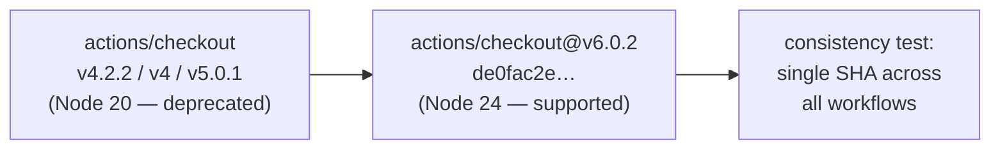

## Summary

The runner emitted a Node.js 20 deprecation warning for `actions/checkout`. Nine
workflows were pinned to `actions/checkout` v4/v5 builds that run on the
deprecated Node 20 runtime (Node 20 is scheduled for automatic upgrade to Node
24 on GitHub-hosted runners, with full removal on 2026-09-16), while `a11y.yml`
had already moved to v6.0.2.

This PR unifies every `actions/checkout` reference across all workflows on the
current major — `actions/checkout@de0fac2e4500dabe0009e67214ff5f5447ce83dd`
(v6.0.2, Node 24) — so no workflow lags on a deprecated runtime. The pin stays a
40-char commit SHA, preserving the supply-chain policy from #190.

Bumped workflows: `deno-quality.yml`, `dependency-review.yml`, `deploy.yml`,
`gitleaks.yml`, `markdown-lint.yml`, `semgrep.yml`, `semver-bump.yml`,
`shellcheck.yml`, `upgrade-dependencies.yml`. (`a11y.yml` was already on
v6.0.2.)

Closes #293.

## Evidence

This is a CI configuration change — no web interface to screenshot. Verified via
the test suite and `./quality.sh` (706 tests, 0 failures).



Before — four distinct SHAs across workflows (one on v6.0.2, the rest on
deprecated Node 20 builds). After — a single SHA everywhere:

```
all actions/checkout references → de0fac2e4500dabe0009e67214ff5f5447ce83dd
```

## Test Plan

- Added `tests/workflow_checkout_consistency_test.ts`:
  - `every workflow uses actions/checkout (#293)` — at least one reference
    exists.
  - `all actions/checkout references resolve to one SHA (#293)` — fails when any
    workflow drifts onto a different (e.g. deprecated Node 20) build. Confirmed
    it failed against the pre-fix tree (4 unique SHAs) and passes after.
- Existing `tests/workflow_action_sha_pinning_test.ts` still passes — every
  `uses:` remains pinned to a 40-char commit SHA.
- Full `./quality.sh` run: fmt, lint, type check and 706 tests pass.
