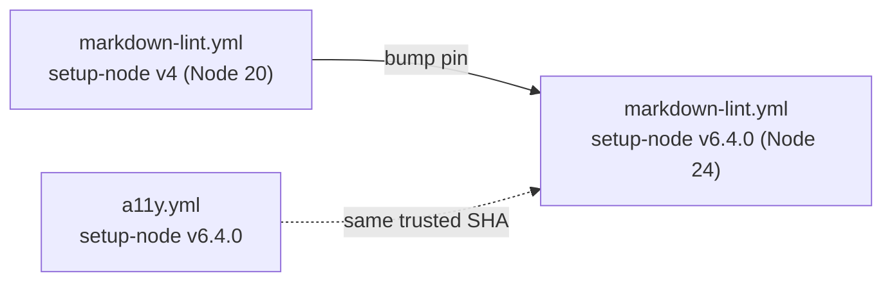

## Summary

Bumped `actions/setup-node` in `markdown-lint.yml` off the deprecated Node 20
build (v4, `@49933ea5288caeca8642d1e84afbd3f7d6820020`) to the Node 24 build
(v6.4.0, `@48b55a011bda9f5d6aeb4c2d9c7362e8dae4041e`). GitHub flips the runner
default to Node 24 on 2026-06-02 and removes Node 20 entirely on 2026-09-16, so
the old pin would have started failing. The v6.4.0 SHA is the same trusted pin
already used by `a11y.yml`, keeping `actions/setup-node` consistent across the
repo. Closes #294.

The action's only input used here (`node-version: "lts/*"`) is unchanged between
v4 and v6.4.0, so behaviour is identical — only the runtime moves to a supported
Node version.

### Deno regression avoided

This is a Deno repo; the workflow change keeps Node tooling confined to the
existing markdown-lint job (markdownlint-cli2) and introduces no new Node
dependency or config — only the action's runtime version was bumped.

## Evidence

CI/workflow change with no web interface to screenshot. Verified via a new TDD
unit test that parses the workflow YAML and asserts the pin currency.

Quality gate: `./quality.sh` → `725 passed | 0 failed`.

## Test Plan

Added `tests/workflow_setup_node_node24_test.ts` (mirrors the existing
`workflow_*_node24_test.ts` suite):

- `at least one workflow uses actions/setup-node (#294)` — guards the collector
  against silently matching nothing.
- `no workflow pins the deprecated Node 20 actions/setup-node build (#294)` —
  fails if any workflow re-introduces the v4/Node 20 SHA.
- `every actions/setup-node reference pins the Node 24 build (#294)` — fails
  unless every reference resolves to the v6.4.0/Node 24 SHA.

Confirmed the test failed against the unfixed `markdown-lint.yml` and passes
after the bump.
