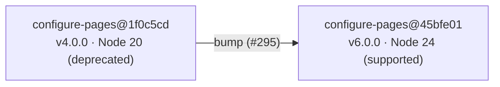

# Bump `actions/configure-pages` off the deprecated Node 20 runtime (#295)

## Summary

The Pages deploy workflow pinned `actions/configure-pages` to
`1f0c5cde4bc74cd7e1254d0cb4de8d49e9068c7d` (v4.0.0), which runs on the
deprecated Node.js 20 runtime. Node 20 is scheduled for removal on
GitHub-hosted runners on 2026-09-16, so the runner emitted a Node 20
deprecation warning.

This change bumps the pin to `45bfe0192ca1faeb007ade9deae92b16b8254a0d`
(v6.0.0), the current major, which runs on the supported **Node 24**
runtime. The reference stays pinned to a 40-char commit SHA per the
SHA-pinning policy (#190).

Closes #295.

## Evidence

Backend/CI-only change — no web interface to screenshot. Verified via the
Deno test suite.

- Confirmed v6.0.0 is the current major and runs on Node 24:
  `actions/configure-pages` `action.yml` at `v6.0.0` declares
  `using: 'node24'`; the tag resolves to commit
  `45bfe0192ca1faeb007ade9deae92b16b8254a0d`.
- New tests failed against the old node20 pin and pass after the bump.
- Full `./quality.sh` passes: **709 passed, 0 failed**.

## Test Plan

Added `tests/workflow_configure_pages_node24_test.ts`, which parses every
`.github/workflows/*.yml` and asserts:

- at least one workflow references `actions/configure-pages`;
- no workflow pins the deprecated Node 20 build
  (`1f0c5cde4bc74cd7e1254d0cb4de8d49e9068c7d`);
- every `actions/configure-pages` reference resolves to the Node 24 build
  (`45bfe0192ca1faeb007ade9deae92b16b8254a0d`).

These reproduce the issue (the deprecated-pin and node24 assertions failed
before the workflow change) and pass after the bump. The existing
`workflow_action_sha_pinning_test.ts` continues to pass, confirming the new
reference is still SHA-pinned.
