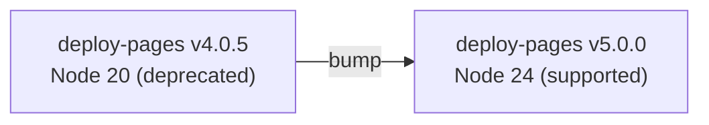

# Bump `actions/deploy-pages` to v5.0.0 (Node 24 runtime)

## Summary

The Pages deploy workflow pinned `actions/deploy-pages` to
`d6db90164ac5ed86f2b6aed7e0febac5b3c0c03e` (v4.0.5), which runs on the
deprecated Node.js 20 runtime. Node 20 is scheduled for automatic upgrade to
Node 24 on GitHub-hosted runners and full removal on 2026-09-16, so the runner
emitted a Node 20 deprecation warning.

This change re-pins the action to its current major, v5.0.0
(`cd2ce8fcbc39b97be8ca5fce6e763baed58fa128`), which runs on the supported
Node 24 runtime. The pin remains a 40-character commit SHA in line with the
SHA-pinning policy (#190), with the version recorded in the adjacent comment.

Closes #296.

## Evidence

This is a CI/workflow configuration change — there is no web interface to
screenshot. Verified with the new regression test and the full quality gate.

`.github/workflows/deploy.yml` deploy step:

```yaml
- name: Deploy to GitHub Pages
  id: deployment
  # actions/deploy-pages@v5.0.0 (Node 24 runtime, #296)
  uses: actions/deploy-pages@cd2ce8fcbc39b97be8ca5fce6e763baed58fa128
```

Confirmed v5.0.0's `action.yml` declares `using: 'node24'` and that
v5.0.0 was published 2026-03-25 (well outside the dependency-bump quarantine
window).



## Test Plan

- Added `tests/workflow_deploy_pages_node24_test.ts`, mirroring the existing
  `configure-pages` (#295) and `upload-pages-artifact` (#297) currency tests:
  - asserts at least one workflow uses `actions/deploy-pages`;
  - asserts no workflow pins the deprecated Node 20 build (v4.0.5);
  - asserts every `actions/deploy-pages` pin resolves to the Node 24 build (v5.0.0).
- Confirmed the new test fails against the unfixed workflow and passes after
  the bump (TDD).
- `./quality.sh` passes cleanly: 719 passed, 0 failed.
