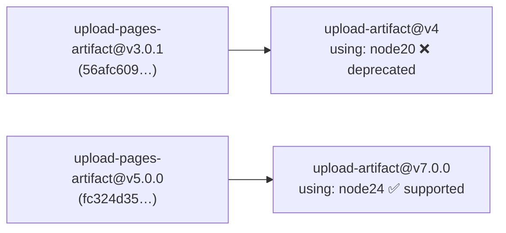

# PR Summary — Issue #297

## Summary

The Pages deploy pinned `actions/upload-pages-artifact@v3.0.1`
(`56afc609e74202658d3ffba0e8f6dda462b719fa`). That composite action wraps
`actions/upload-artifact@v4`, which runs on the deprecated Node.js 20
runtime — scheduled for automatic upgrade on 2026-06-02 and removal from
GitHub-hosted runners on 2026-09-16. The runner flagged the Node 20
deprecation on the "Deploy to GitHub Pages" run.

Bumped the pin to `actions/upload-pages-artifact@v5.0.0`
(`fc324d3547104276b827a68afc52ff2a11cc49c9`), the current major, which
wraps `actions/upload-artifact@v7.0.0` and therefore runs on the supported
Node 24 runtime. The pin remains a 40-char commit SHA, honouring the
SHA-pinning policy (#190).

This mirrors the fix shipped for `actions/configure-pages` in #295.

Closes #297.

## Runtime chain verified



Confirmed against the upstream `action.yml` of each tag:

- `upload-pages-artifact@v3.0.1` → `actions/upload-artifact@v4` → `using: 'node20'`
- `upload-pages-artifact@v5.0.0` → `actions/upload-artifact@v7.0.0` → `using: 'node24'`

## Evidence

Backend/CI-only change — no web interface to screenshot. Verified via the
new unit tests and the full quality gate (`./quality.sh`): **716 passed,
0 failed**.

New test failed against the old v3.0.1 pin and passes after the bump:

```
running 3 tests from ./tests/workflow_upload_pages_artifact_node24_test.ts
at least one workflow uses `actions/upload-pages-artifact` (#297) ... ok
no workflow pins the deprecated Node 20 `actions/upload-pages-artifact` build (#297) ... ok
every `actions/upload-pages-artifact` reference pins the Node 24 build (#297) ... ok
```

## Test Plan

- Added `tests/workflow_upload_pages_artifact_node24_test.ts` (mirrors the
  #295 `configure_pages` guard). It parses every workflow YAML and asserts:
  - at least one `actions/upload-pages-artifact` reference exists;
  - none resolve to the deprecated Node 20 build (`56afc609…`, v3.0.1);
  - every reference resolves to the Node 24 build (`fc324d35…`, v5.0.0).
- Regression linkage: the second and third assertions fail against the
  unfixed `deploy.yml` (v3.0.1 pin) and pass after the bump to v5.0.0.
