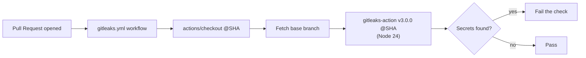

## Summary

Bumped `gitleaks/gitleaks-action` from v2.3.9 (Node 20 runtime) to v3.0.0
(Node 24 runtime) in `.github/workflows/gitleaks.yml`. The runner flagged a
Node.js 20 actions deprecation warning for the old pin; GitHub flips the
runner default to Node 24 on 2026-06-02 and removes Node 20 entirely on
2026-09-16. gitleaks-action v3.0.0 migrates the runtime from Node 20 to
Node 24 with **no changes to inputs, outputs, or behaviour** — a drop-in
swap. Closes #298.

- Old pin: `gitleaks/gitleaks-action@ff98106e4c7b2bc287b24eaf42907196329070c7` (v2.3.9, `using: node20`)
- New pin: `gitleaks/gitleaks-action@e0c47f4f8be36e29cdc102c57e68cb5cbf0e8d1e` (v3.0.0, `using: node24`)

The action stays pinned to a 40-character commit SHA per the supply-chain
policy (Issue #190/#1756). v3.0.0 was published 2026-05-30, more than 24h
before this change, so it is clear of the dependency-bump quarantine window.

## Evidence

Backend/CI-only change — no web interface to screenshot. Verified by:

- `gh api .../action.yml?ref=e0c47f4f...` confirms v3.0.0 declares
  `using: "node24"` (the old v2.3.9 pin declared `node20`).
- New regression tests parse the workflow YAML and assert the pin resolves
  to the Node 24 build and never to the deprecated Node 20 build.
- Full quality gate passes: `722 passed | 0 failed`.

## Test Plan

Added `tests/workflow_gitleaks_node24_test.ts` (mirrors the established
`workflow_*_node24_test.ts` pattern):

- `at least one workflow uses gitleaks/gitleaks-action (#298)` — guards
  against the reference disappearing.
- `no workflow pins the deprecated Node 20 gitleaks/gitleaks-action build
  (#298)` — fails on the old v2.3.9 SHA. Confirmed it failed against the
  unfixed workflow and passes after the bump.
- `every gitleaks/gitleaks-action reference pins the Node 24 build (#298)` —
  asserts the v3.0.0 SHA across all workflows.
