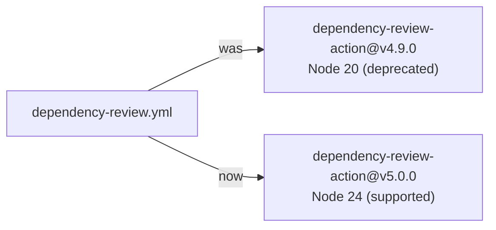

# Bump `actions/dependency-review-action` to v5.0.0 (Node 24)

## Summary

The Dependency Review workflow pinned `actions/dependency-review-action` to
`2031cfc080254a8a887f58cffee85186f0e49e48` (v4.9.0), which runs on the
deprecated Node.js 20 runtime. GitHub will remove the Node 20 runner from
hosted runners on 2026-09-16, so the action was emitting a deprecation
warning. Bumped the pin to `a1d282b36b6f3519aa1f3fc636f609c47dddb294`
(v5.0.0), the current major, which runs on Node 24 (verified against the
upstream `action.yml` runtime). The SHA-pin policy (#190) is preserved —
the reference remains a 40-char commit SHA with a version comment. Closes #299.

## Evidence

Backend/CI change — no web interface to screenshot. Verified by the new
runner-currency tests and the full quality gate (`./quality.sh`):
`722 passed | 0 failed`.

- Upstream `action.yml` at v5.0.0
  (`a1d282b36b6f3519aa1f3fc636f609c47dddb294`) declares `using: 'node24'`.
- v5.0.0 was published 2026-05-08, well clear of the external-dependency
  quarantine window.

## Test Plan

Added `tests/workflow_dependency_review_node24_test.ts` (following the
existing `workflow_configure_pages_node24_test.ts` pattern):

- asserts at least one workflow uses `actions/dependency-review-action`;
- asserts no workflow pins the deprecated Node 20 build
  (`2031cfc080254a8a887f58cffee85186f0e49e48`);
- asserts every reference pins the Node 24 build
  (`a1d282b36b6f3519aa1f3fc636f609c47dddb294`).

The pinning assertions failed against the unfixed workflow and pass after
the bump.
