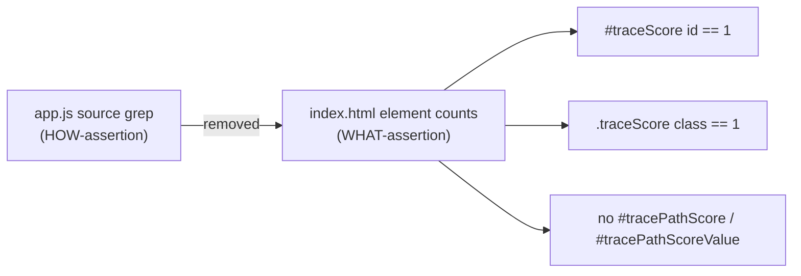

## Summary

Removed the HOW-assertion source-grep test from
`tests/trace_score_single_label_test.ts`. The retired test
(`docs/app.js no longer wires the retired tracePathScore badge`) read the raw
source text of `docs/app.js` and asserted on JavaScript symbol names —
`updateTracePathScoreUI`, `renderTraceScore(`, `getElementById("traceScore")`.
That is a HOW-assertion layered on a source-text grep: a behaviour-preserving
refactor (renaming a helper, caching a handle, inlining a function) would break
it, while a genuine duplicate introduced under a differently-named helper would
slip straight through.

The companion behavioural test already pins the user-visible contract by
counting rendered elements in the `<nav class="traceBar">` block. I kept that
test and strengthened it to also count score badges by class (`.traceScore`),
not just by the canonical `#traceScore` id — so a future duplicate badge
introduced under a different id is still caught behaviourally, closing the one
protection the deleted grep test nominally offered.

Closes #310.

## Evidence

This is a test-only change to a Deno test file — no web interface to screenshot.
Verification is the quality gate:

- `./quality.sh` passes cleanly: `727 passed | 0 failed`.
- The remaining test asserts on rendered markup structure (element counts in the
  trace bar), not on the spelling of identifiers inside `docs/app.js`.

## Test Plan

- Modified `tests/trace_score_single_label_test.ts`:
  - Removed `docs/app.js no longer wires the retired tracePathScore badge` (the
    source-text grep over `docs/app.js` symbols).
  - Dropped the now-unused `loadAppJs` helper and `APP_JS_PATH` constant.
  - Strengthened
    `index.html exposes exactly one Score badge inside the
    trace bar` to
    also assert exactly one `.traceScore` badge by class.
- Documented the removal in the test file's module docstring (per the "do not
  silently remove tests" guideline).
- Ran `./quality.sh < /dev/null` — format, lint, and all 727 tests pass.
