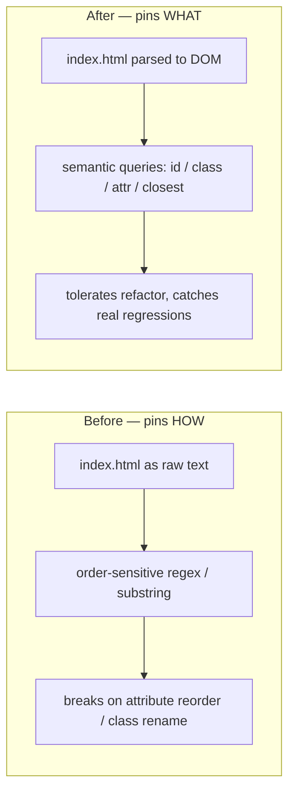

# Replace source-text HTML greps with semantic DOM assertions

## Summary

Four markup tests read `docs/index.html` as raw text and asserted invariants via
order-sensitive regex / substring matching. That is the source-text-grep
anti-pattern: renaming a CSS class, reordering attributes, or swapping a
collapse element from `<details>` to a popover `<div>` left user-observable
behaviour identical yet broke the tests, while a real regression expressed
through different-but-grep-matching markup could slip through.

This change parses `index.html` once into a real DOM (`@b-fuze/deno-dom`) and
asserts the structural / accessibility contract via semantic queries
(`getElementById`, `querySelectorAll`, `getAttribute`, `closest`). The new
assertions tolerate attribute-order, class-rename, and whitespace changes while
still pinning the contract a user or assistive technology observes.

Closes #312.

Affected files:

- `tests/theme_button_singleton_test.ts` — count `.themeToggle` via
  `querySelectorAll`; assert `#themeToggleTrace` absence and `#themeToggle`
  presence via `getElementById`.
- `tests/synapse_filters_inline_test.ts` — assert `data-filters-mode="inline"`
  on `.synapseHeader` via `getAttribute`; assert the filter inputs are not
  inside a collapsible `<details>` via `closest("details")` (a behavioural
  framing that tolerates renaming/swapping the collapse element rather than
  pinning the literal `filterDetails` class); assert `aria-controls` on the
  toggle.
- `tests/topo_modal_markup_test.ts` — assert `#topoModal` `role`, `aria-modal`,
  `aria-labelledby`, and the `hidden` default via DOM; assert close button
  `aria-label`, title, body, and backdrop via queries. The unrelated
  `styles.css` assertions (test 3) are unchanged — they were not source-text
  HTML greps.
- `tests/trace_score_single_label_test.ts` — scope to `nav.traceBar` and count
  `#traceScore` / `.traceScore` and check `#tracePathScore*` absence via scoped
  DOM queries instead of slicing the nav block out with a regex.

Shared parsing lives in a new `tests/dom_helpers.ts` (`parseHtml` /
`loadDocument` / `loadIndexDocument`).

## What vs how



## Evidence

CLI/test-only change — no web UI was altered, so no screenshot applies. The
behaviour is verified by the test suite. The four rewritten files pass, and the
full quality gate is green:

```
deno test -A tests/theme_button_singleton_test.ts \
  tests/synapse_filters_inline_test.ts \
  tests/topo_modal_markup_test.ts \
  tests/trace_score_single_label_test.ts
ok | 11 passed | 0 failed

./quality.sh
fmt + lint + type-check + tests: ok | 727 passed | 0 failed → OK
```

## Test Plan

- Rewrote the four test files above to assert on the parsed DOM; all 11 of their
  cases pass.
- Added `tests/dom_helpers.ts` for shared HTML→DOM parsing.
- Added `@b-fuze/deno-dom@^0.1.56` to `deno.json` imports (mature dependency,
  well past the supply-chain quarantine window; wasm backend runs under the
  existing `--allow-read` test permission once cached).
- `./quality.sh` passes cleanly (fmt, lint, type-check, 727 tests).

### Deno regression avoided

Used the Deno-native JSR dependency `@b-fuze/deno-dom` and Deno's permission
model rather than introducing any Node tooling.
