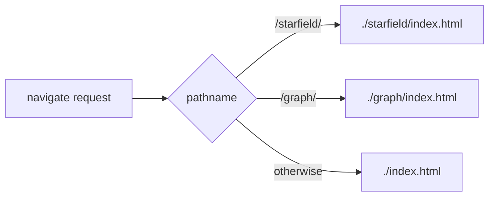

## Summary

Replaced the source-text greps in `tests/pwa_test.ts` with behaviour tests that
exercise what `docs/sw.js` and `scripts/inject_build_id.ts` actually do, rather
than asserting on their source representation. A behaviour-preserving refactor
(reordering `STATIC_FILES`, changing quote/template style, renaming a constant)
now keeps these tests green, and the previously useless `includes("starfield")`
test is replaced by one that drives the Service Worker's navigation handler.
Closes #330.

### What changed

- **New `tests/pwa_sw_harness.ts`** — shared helpers:
  - `parseStaticFiles(swSource)` — structurally parses the `STATIC_FILES` array
    and strips the `?v=${VERSION}` cache-busting suffix (extracted from
    `sw_static_files_test.ts` so both suites share one parser — DRY).
  - `loadServiceWorker(swSource)` — evaluates `sw.js` in a sandboxed scope with
    stubbed worker globals (`self`, `caches`, `fetch`) and drives its `fetch`
    listener with fake navigation requests, returning the served shell path.

- **`tests/pwa_test.ts`** — the four brittle tests are now behaviour tests:
  - *"sw.js STATIC_FILES precaches starfield assets"* — asserts the parsed
    `STATIC_FILES` array **contains** the resolved starfield paths.
  - *"sw.js navigation handler routes each entry point to its app shell"* —
    replaces the meaningless `includes("starfield")` grep. Drives the SW's fetch
    handler with `/starfield/`, `/graph/` and `/` navigations and asserts the
    shell it actually serves.
  - *"sw.js STATIC_FILES precaches the per-page boot.js scripts (#218)"* —
    asserts the parsed array contains the resolved `boot.js` paths (no longer
    matching the literal `${VERSION}` template syntax).
  - *"inject_build_id.ts substitutes __BUILD_ID__ across the app shell (#218)"* —
    runs the real script over a temporary fixture tree and asserts the
    placeholder was actually replaced in every expected output file.

- **`tests/sw_static_files_test.ts`** — now imports `parseStaticFiles` from the
  shared harness instead of holding its own copy.

## Evidence

Backend/test-only change — no UI to screenshot. Verified via the test suite.

Behaviour the navigation test now proves (previously unverified):



Test run (affected suites):

```
running 8 tests from ./tests/pwa_test.ts
sw.js STATIC_FILES precaches starfield assets ... ok
sw.js navigation handler routes each entry point to its app shell ... ok
sw.js STATIC_FILES precaches the per-page boot.js scripts (#218) ... ok
inject_build_id.ts substitutes __BUILD_ID__ across the app shell (#218) ... ok
...
ok | 726 passed | 0 failed
```

`deno lint` and `deno check` pass clean. Note: `deno fmt --check` reports three
**pre-existing** unformatted files under `docs/` (`docs/evidence/loading-fix-evidence.html`,
`docs/starfield/index.html`, `docs/graph/index.html`) that fail on pristine
`HEAD` and are unrelated to this change — left untouched to keep scope tight.

## Test Plan

- Rewrote `tests/pwa_test.ts::sw.js STATIC_FILES precaches starfield assets`
- Added `tests/pwa_test.ts::sw.js navigation handler routes each entry point to its app shell` (replaces the deleted `includes("starfield")` assertion with a real handler test)
- Rewrote `tests/pwa_test.ts::sw.js STATIC_FILES precaches the per-page boot.js scripts (#218)`
- Rewrote `tests/pwa_test.ts::inject_build_id.ts substitutes __BUILD_ID__ across the app shell (#218)` to run the script over a fixture tree
- Added `tests/pwa_sw_harness.ts` (`parseStaticFiles`, `loadServiceWorker`)
- Updated `tests/sw_static_files_test.ts` to import the shared `parseStaticFiles`
- Full suite: `deno test -A` → 726 passed, 0 failed
