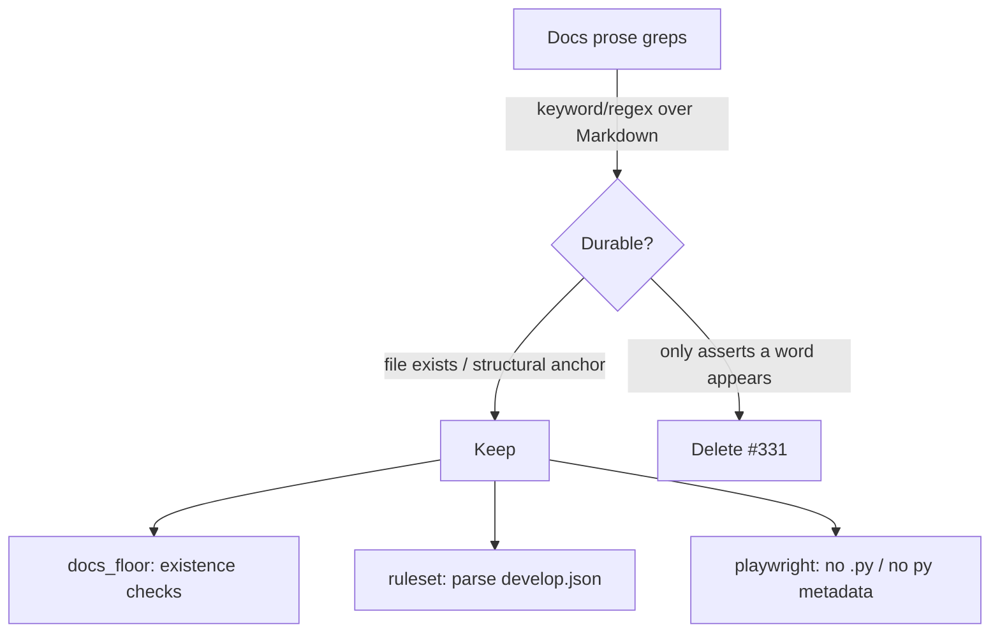

# Remove documentation-prose keyword greps used as assertions in docs tests

## Summary

Several tests asserted on **documentation prose** by grepping Markdown files
for keywords/regexes rather than on any observable behaviour. They were
grep-as-assertions: coupled to exact wording, they broke on routine rewording
without any functional regression, while the loose matches could stay green
even when the surrounding guidance was wrong. This PR removes those prose
greps and keeps only the durable, structural checks. Closes #331.

Per the issue guidance, checks that only assert "the word appears somewhere"
were **deleted** (deletion is an acceptable outcome); the structural anchors
that a human controls deliberately were retained.

### Changes

- `tests/docs_floor_test.ts` — removed the CONTRIBUTING.md keyword greps
  (`includes("Develop")`, `quality.sh`, `deno fmt`, `deno lint`,
  `docs/pr-summary-`) and the CHANGELOG.md greps (`keep a changelog`,
  `## [`). Kept the durable **file-existence** checks for both files. Removed
  the now-unused `readText` helper.
- `tests/develop_ruleset_test.ts` — removed the README prose grep
  (`/Required checks/i`, `/deno-quality\.yml|Deno Quality/i`). The required
  `quality` status check is already pinned durably by the structural ruleset
  assertions in the same file, which parse `.github/rulesets/develop.json`
  (the source of truth), so no signal is lost.
- `tests/deno_lock_playwright_test.ts` — removed the forbidden-pattern prose
  grep (`/pip\s+install[^\n]*playwright/i`) over README/CONTRIBUTING. A
  forbidden free-text pattern in docs is a lint/CI policy concern, not a unit
  test. The durable artefact regression guards (no `*.py` under `scripts/`,
  no Python project metadata at root, lockfile playwright pin) remain.

Each removal leaves an in-file comment referencing #331 explaining why the
grep was dropped and which durable check (if any) still covers the intent.

### Note on test removal

The repo guideline to not remove tests is overridden here by the issue's
explicit intent (label `test-audit`): the whole purpose of #331 is to delete
or rewrite these low-value prose greps. The removed checks asserted on
wording, not behaviour, so deleting them removes false-failure surface
without reducing real coverage.

## Evidence

Backend/test-only change — no web interface to screenshot. Verified via the
full quality gate:

```
ok | 719 passed | 0 failed (2s)

==> OK
```



## Test Plan

- Removed prose-grep tests from `tests/docs_floor_test.ts`,
  `tests/develop_ruleset_test.ts`, and `tests/deno_lock_playwright_test.ts`.
- Retained durable checks in those files (file existence, ruleset JSON shape,
  Python artefact sweep).
- `./quality.sh` passes cleanly: `deno fmt --check`, `deno lint`,
  `deno check`, and the full `deno test` suite (719 passed, 0 failed).
