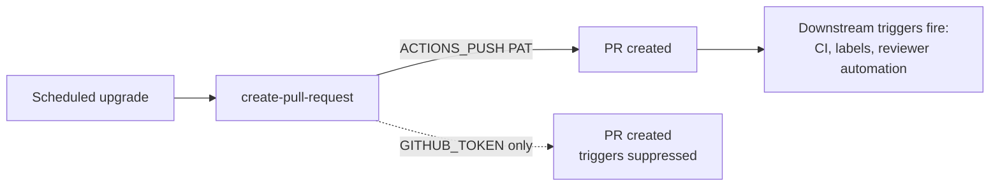

## Summary

Fixed the `pr-creator-token` best-practice finding in
`.github/workflows/upgrade-dependencies.yml`. The
`peter-evans/create-pull-request` step authenticated with
`${{ secrets.GITHUB_TOKEN }}` directly, which causes GitHub to suppress
downstream workflow triggers on the created pull request — CI checks, labels,
and reviewer automation never fire until somebody pushes a new commit. The step
now prefers the org-level PAT and falls back to `GITHUB_TOKEN` only when that
secret is unset (#1636). Closes #344.

```yaml
token: ${{ secrets.ACTIONS_PUSH || secrets.GITHUB_TOKEN }}
```

## Evidence

Backend/CI-only change — no web interface to screenshot. Verified via the new
workflow test and the full quality gate (`721 passed | 0 failed`).



## Test Plan

- Added `tests/workflow_pr_creator_token_test.ts`:
  - `create-pull-request step exists (#344)` — asserts the workflow has a
    `peter-evans/create-pull-request` step.
  - `create-pull-request prefers ACTIONS_PUSH, falls back to GITHUB_TOKEN (#344)`
    — asserts every such step's `token` is
    `${{ secrets.ACTIONS_PUSH || secrets.GITHUB_TOKEN }}`. This test fails
    against the unfixed workflow and passes after the fix.
- Full quality gate (`./quality.sh`) passes: 721 passed, 0 failed.
