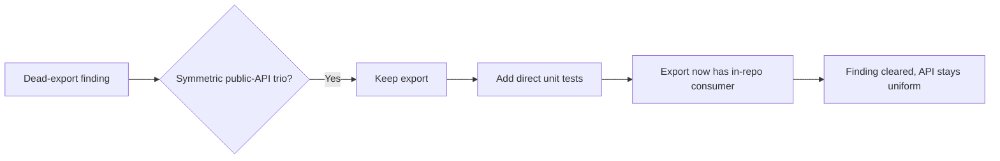

## Summary

The dead-code scan flagged `fetchLatestVersion` in `scripts/jsr_quarantine_check.ts`
as an unused export — exported but with no in-repo importer. The issue offered two
fixes and explicitly called out the deciding caveat: the function sits in a
**symmetric trio** of registry fetchers, and its siblings `fetchLatestVersionNpm`
and `fetchLatestVersionDenoLandX` are both exported **and** directly unit-tested.

That trio is a uniform, stable public API, so the better fix (per the issue's own
guidance) is to **keep the `export`** and give it a direct in-repo consumer rather
than de-exporting the odd one out. This change adds direct unit tests for
`fetchLatestVersion`, matching the coverage its siblings already have. The export
now has a genuine importer (the test module), which clears the dead-export finding
without breaking the API symmetry.

Confirmed before changing anything: no dynamic/reflective or string-keyed access to
`fetchLatestVersion` exists anywhere in the repo (only the three in-file references).

Closes #351.

## Evidence

Backend/CLI change only — no web interface to screenshot.

- Targeted suite: `deno test --allow-all tests/jsr_quarantine_check_test.ts` →
  **30 passed | 0 failed** (5 new `fetchLatestVersion` tests).
- Full quality gate: `./quality.sh` → **726 passed | 0 failed**, format and lint clean.

The new tests are the verification: each calls the real `fetchLatestVersion` with a
mock `Fetcher` and asserts on the returned `VersionRecord` (or thrown error), never
inspecting source text.

## Test Plan

Added to `tests/jsr_quarantine_check_test.ts` (imports `fetchLatestVersion`):

- `fetchLatestVersion returns the newest non-yanked JSR version` — happy path.
- `fetchLatestVersion accepts the bare-array response shape` — alternate response shape.
- `fetchLatestVersion skips yanked versions when picking the latest` — edge case.
- `fetchLatestVersion throws on a non-OK registry status` — error path.
- `fetchLatestVersion throws when no usable (non-yanked) versions exist` — error path.

No existing tests were modified or removed; no production code changed.
