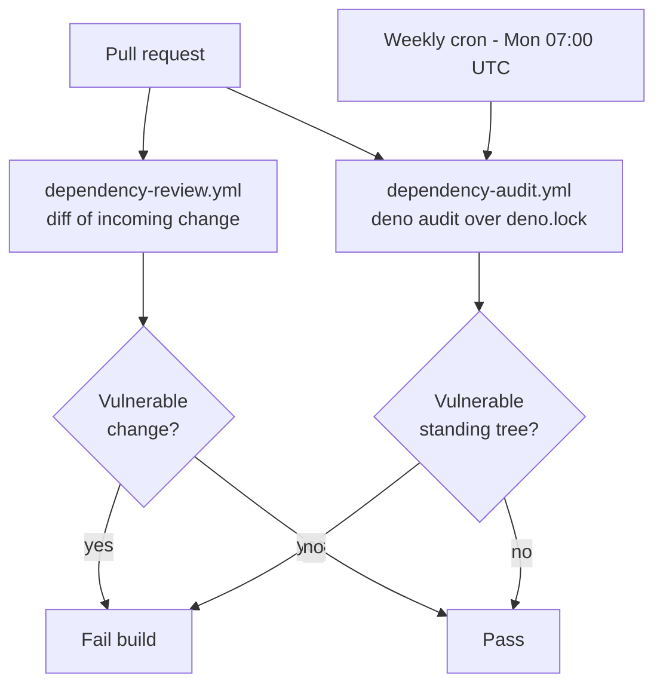

# SCR-VULN-SCAN: standing dependency vulnerability scanner

## Summary

Added a standing dependency vulnerability scanner to CI so newly-disclosed
advisories against already-merged dependencies no longer sit undetected until
the next bump. `dependency-review.yml` only inspects the diff of an incoming
change on a PR — it never re-evaluates the resolved standing tree. The new
`.github/workflows/dependency-audit.yml` runs Deno's native `deno audit` over
the lockfile (`deno.lock`) on a **weekly schedule** (Mondays 07:00 UTC, one hour
ahead of the upgrade cron) **and** on **every pull request**, so a fresh
advisory against a pinned (possibly transitive) dependency surfaces promptly.

Deno-native first, per the issue's smallest concrete change. The workflow obeys
the repo-wide workflow policies: SHA-pinned actions (40-char commit SHAs,
matching the existing `actions/checkout` SHA), a 10-minute job timeout, a
cancelling concurrency group, and least-privilege `contents: read` permissions.

Closes #355.

## Evidence

This is a CI/workflow change with no web interface to screenshot. Evidence is
the new test suite plus a local `deno audit` run
(`No known vulnerabilities
found`, exit 0) and `actionlint` passing on the new
workflow.

Where the new scanner sits relative to the existing PR-time gate:

The full quality gate (`./quality.sh`) passes: **733 tests, 0 failed**.

## Test Plan

Added `tests/workflow_dependency_audit_test.ts` — parser-walk assertions over
`.github/workflows/dependency-audit.yml`:

- runs `deno audit` over the lockfile
- declares a `schedule` trigger with a cron expression
- also triggers on `pull_request`
- sets up Deno via `denoland/setup-deno`
- caps its job timeout (positive integer ≤ 60)
- declares a cancelling concurrency group keyed on `github.workflow` +
  `github.ref`
- requests least-privilege `contents: read` permissions

The new workflow also satisfies the existing cross-workflow policy tests (SHA
pinning #190, checkout consistency #293, job timeout #257, PR concurrency #258)
— all green.
