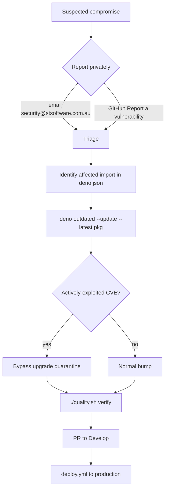

# PR Summary — SECURITY.md supply-chain readiness runbook

## Summary

The repository had **no `SECURITY.md`**, so there was no discoverable disclosure
contact and no documented emergency dependency-bump procedure — the
`SCR-RUNBOOK` supply-chain readiness check. This PR adds a short root
`SECURITY.md` covering the two things the check requires:

1. **Reporting a vulnerability** — a private disclosure channel
   (`security@stsoftware.com.au`, or GitHub's "Report a vulnerability" flow),
   with a "do not open a public issue" steer.
2. **Emergency dependency bump** — a numbered runbook that identifies the
   affected import in `deno.json`, applies the fix with
   `deno outdated --update --latest`, explains how/why to bypass the upgrade
   **quarantine** (`scripts/jsr_quarantine_check.ts` /
   `VIBE_BUMP_QUARANTINE_HOURS`) for an actively-exploited CVE, verifies via
   `./quality.sh`, and opens a PR to `Develop` (deployed by `deploy.yml`).

The file cross-links the related `SCR-QUARANTINE-OVERRIDE` finding and the
`security-scan`-owned quarantine window, and links back to `CONTRIBUTING.md`'s
supply-chain section. A `CHANGELOG.md` entry records the addition.

Closes #356.

## Evidence

Backend/docs change — no web UI to screenshot. Verified by the full quality gate
(`./quality.sh < /dev/null`): `deno fmt --check`, `deno lint`, `deno check`, and
`deno test -A` all pass (**736 tests, 0 failed**). `markdownlint-cli2` reports 0
errors on the new file.

The disclosure → emergency-bump flow documented in `SECURITY.md`:

## Test Plan

Added `tests/security_policy_test.ts` (mirrors the `docs_floor_test.ts`
convention — structural, not wording-coupled):

- `SECURITY.md exists at repo root` — asserts the file is present.
- `SECURITY.md documents a private disclosure contact` — asserts a
  report/vulnerability section and the disclosure email.
- `SECURITY.md documents an emergency dependency-bump procedure` — asserts the
  emergency section references the upgrade command and the quarantine bypass.

The tests were confirmed to fail before `SECURITY.md` existed (TDD) and pass
after it was added.
