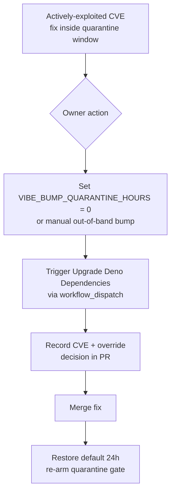

## Summary

Documented the emergency **quarantine override** (fast-lane) procedure in
`SECURITY.md`, closing the `SCR-QUARANTINE-OVERRIDE` finding. The override
*lever* already existed — `.github/workflows/upgrade-dependencies.yml` reads the
`VIBE_BUMP_QUARANTINE_HOURS` repository variable and exposes a
`workflow_dispatch` trigger — but no document described it as a deliberate
emergency procedure, so responders would have had to improvise under pressure
during an actively-exploited supply-chain incident.

No code change was required. A new **Emergency quarantine bypass** section in
`SECURITY.md` now records the deliberate path: an owner sets
`VIBE_BUMP_QUARANTINE_HOURS` to `0` (or applies a manual out-of-band bump),
triggers **Upgrade Deno Dependencies** via `workflow_dispatch`, records the CVE
and override decision in the PR, then restores the default (`24`) once merged.
The earlier runbook step and the Related section were updated to point at this
section.

Closes #357.

## Evidence

This is a documentation-only change (no web interface). Verified via the
existing `tests/security_policy_test.ts` suite, extended with a new test that
asserts the override path is documented, and the full quality gate
(`./quality.sh`) — **737 passed, 0 failed**, format/lint/type-check clean.

## Test Plan

- Added `tests/security_policy_test.ts::SECURITY.md documents the quarantine override (SCR-QUARANTINE-OVERRIDE)`
  — asserts `SECURITY.md` names the `VIBE_BUMP_QUARANTINE_HOURS` override
  variable, references the `workflow_dispatch` manual trigger, and requires
  restoring the default window. This test failed before the `SECURITY.md`
  change and passes after it.
- Existing `security_policy_test.ts` checks (file exists, disclosure contact,
  emergency-bump procedure) continue to pass.
- `./quality.sh < /dev/null` — full suite green (737 passed).
