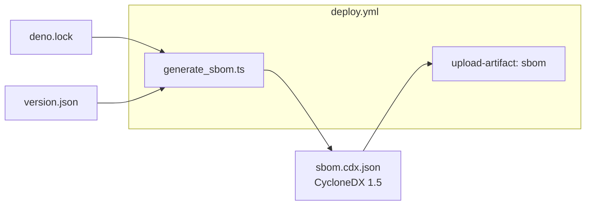

# SCR-SBOM: produce a CycloneDX SBOM for the deployed app

## Summary

The repo shipped no Software Bill of Materials, so when an ecosystem advisory
later names a compromised package there was no fast way to answer "are we
affected, and in which release?". This PR adds a **Deno-native** CycloneDX 1.5
SBOM generator and wires it into the deploy workflow so an SBOM describing
exactly what shipped is produced on every deploy. No Node tooling is introduced
— consistent with the repo's existing supply-chain scripts. Closes #358.

What changed:

- **`scripts/generate_sbom.ts`** — reads the resolved dependency closure from
  `deno.lock` and emits a CycloneDX 1.5 BOM. One component per JSR and npm
  package, each carrying its Package URL (`pkg:jsr/…`, `pkg:npm/…`) and the
  integrity hash Deno already pinned (SHA-256 hex for JSR, SHA-512 decoded from
  the npm SRI string). Output is deterministic (sorted by ecosystem then purl).
- **`.github/workflows/deploy.yml`** — generates `sbom.cdx.json` and uploads it
  as a build artefact named `sbom` (`actions/upload-artifact` pinned to the
  v4.6.2 commit SHA, `if-no-files-found: error`).
- **`README.md`** — documents the SBOM step in the supply-chain section.

## Evidence

This is a backend/CI change with no web interface, so no screenshot applies.
Verified by running the generator against the real lockfile
(`deno run --allow-read --allow-write scripts/generate_sbom.ts deno.lock
sbom.cdx.json`
→ `Wrote 80 components`) and by the unit/integration tests below. `./quality.sh`
passes cleanly (755 tests, 0 failures).

## Test Plan

Added `tests/generate_sbom_test.ts`:

- `splitNameVersion` — unscoped, scoped (keeps `@scope`), and no-separator
  (null) cases.
- `npmPurl` / `jsrPurl` — unscoped and scope percent-encoding.
- `integrityToHash` — bare SHA-256 hex, `sha512-<base64>` → hex, and
  empty/unrecognised → null.
- `lockToComponents` — enumerates every entry, jsr-before-npm ordering, carries
  purl/version/hash, omits hashes when integrity is absent.
- `buildSbom` — CycloneDX envelope fields, per-component ecosystem property,
  optional timestamp/serial number, empty-lock case.
- Real-lockfile smoke test asserting both `pkg:jsr/` and `pkg:npm/` components
  are present.

## Deno regression avoided

Chose a pure-Deno lockfile parser over the `@cyclonedx/cyclonedx-npm` Node tool
suggested in the issue, keeping the repo free of Node tooling.
