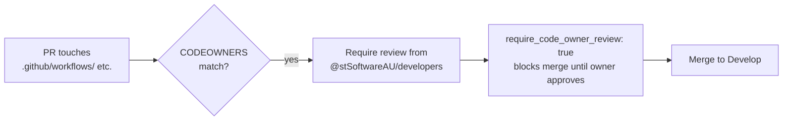

# PR Summary — Add CODEOWNERS coverage for privileged CI paths

## Summary

The repository shipped privileged workflows under `.github/workflows/` but had
**no `CODEOWNERS` file** in any of the three GitHub-recognised locations, and
the `Develop` ruleset set `"require_code_owner_review": false`. A single
contributor with merge rights could therefore alter a privileged workflow —
which runs with the repo's secrets (`ACTIONS_PUSH`, `CODECOV_TOKEN`,
`SEMGREP_APP_TOKEN`, `GITLEAKS_LICENSE`) and, for `deploy.yml`, an OIDC
`id-token` — to exfiltrate secrets, push to `Develop`, or publish
attacker-controlled content to the public GitHub Pages site.

This PR closes that gap:

- Adds **`.github/CODEOWNERS`** naming `@stSoftwareAU/developers` (the
  `developers` team, id `2166335`, already the required reviewer in the ruleset)
  as the owner of the privileged paths `/.github/workflows/`,
  `/.github/actions/`, and `/.github/rulesets/`.
- Flips **`"require_code_owner_review": true`** in
  `.github/rulesets/develop.json` so the CODEOWNERS rules are enforced at merge
  time. (As with the rest of the ruleset, this settings-as-code change requires
  a repo admin to re-apply the live ruleset — see the file's `_comment`.)
- Documents the new control under **Required checks (branch protection)** in
  `README.md`.

This is defence-in-depth on top of the existing generic single-review rule and
addresses the class of attack seen in the 2025–2026 CI-hijack incidents.

`Closes #361`.

## Evidence

This is a CI/repo-hygiene change with no web interface to screenshot. Evidence
is the new test suite plus the passing quality gate (`./quality.sh`: 760 passed
| 0 failed).

## Test Plan

Added `tests/codeowners_test.ts` (TDD — written failing first, then made to
pass):

- `a CODEOWNERS file exists in a GitHub-recognised location (#361)`
- `CODEOWNERS covers every privileged path (#361)` — `/.github/workflows/`,
  `/.github/actions/`, `/.github/rulesets/`
- `each privileged path names the reviewing team as owner (#361)`
- `every CODEOWNERS rule names at least one owner (#361)`
- `develop ruleset enables code-owner review (#361)` — asserts
  `require_code_owner_review === true`

Existing `tests/develop_ruleset_test.ts` continues to pass unchanged. Full
suite: `760 passed | 0 failed`.
