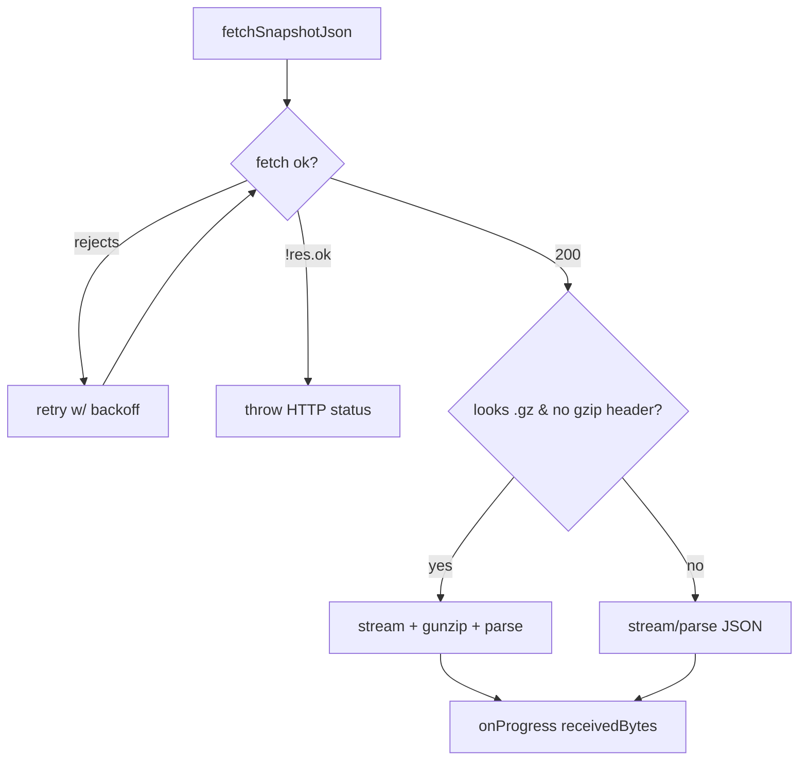

## Summary

`fetchSnapshotJson` in `docs/shared/snapshot_loader.js` — the load-bearing
snapshot ingestion path (network-first fetch with exponential-backoff retry,
streaming progress reporting, client-side gzip fallback, HTTP-error handling,
JSON parse) — had **no** referencing test, while every sibling helper in the
module did. This PR closes that coverage gap with WHAT-tests that exercise the
observable behaviour of each branch via a stubbed `globalThis.fetch`. No
production code changed. Closes #372.

## Evidence

Backend-only change (a pure module loaded in the browser); no UI to screenshot.
Verified by the new test file and the full quality gate.

```
deno test -A tests/snapshot_loader_fetch_test.ts
running 5 tests from ./tests/snapshot_loader_fetch_test.ts
fetchSnapshotJson happy path returns parsed JSON ... ok
fetchSnapshotJson absorbs a transient failure then succeeds ... ok
fetchSnapshotJson throws on HTTP error status ... ok
fetchSnapshotJson client-side decompresses a .gz response ... ok
fetchSnapshotJson reports monotonically increasing progress ... ok
ok | 5 passed | 0 failed

./quality.sh -> ok | 767 passed | 0 failed
```

The tests assert only on return values and `onProgress` callback observations —
never on internal call order — so they survive refactors of the retry policy,
gz-detection heuristic, or streaming reader.



## Test Plan

Added `tests/snapshot_loader_fetch_test.ts` with five WHAT-tests:

- **happy path** — 200 + JSON body; asserts the parsed object equals the input.
- **retry/backoff** — `fetch` rejects once then resolves; asserts the transient
  failure is absorbed and the value is returned. `setTimeout` is stubbed to fire
  immediately so the test stays fast.
- **HTTP error** — `{ ok: false, status: 503 }`; asserts it throws `HTTP 503`.
- **client-side decompress** — a `.gz` URL with gzipped bytes and no
  `content-encoding: gzip` header; asserts the JSON is decoded.
- **progress** — multi-chunk stream with `content-length`; asserts `onProgress`
  fires more than once with monotonically non-decreasing `receivedBytes` ending
  at the total.
