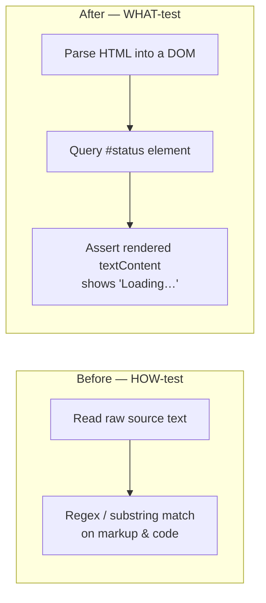

## Summary

Replaced the three source-text grep "tests" in `tests/sw_static_files_test.ts`
with behaviour-based assertions (or removal where the behaviour is already
covered observably elsewhere). These cases read an implementation file's raw
text and asserted on substrings of it, so any behaviour-preserving rewrite —
wrapping the import in `.catch()`, aliasing the recovery import, rewording the
error message, or rendering the loading status from a template — broke them
without changing what a user observes. Closes #373.

The neighbouring `parseStaticFiles(...)` cases were left untouched: they parse
the Service Worker's `STATIC_FILES` array structurally and assert on the parsed
list, which is genuine config validation, not the grep anti-pattern.

## Changes

| Old grep case | Resolution |
| --- | --- |
| *"boot.js has error handling"* — `boot.includes("catch") && boot.includes("import(")` | **Removed.** The recovery path is exercised end-to-end against the real helper in `tests/pwa_recovery_test.ts`. |
| *"Boot scripts do not tell PWA users to clear browser cache"* — substring checks over each boot script | **Removed.** Offline reachability of `pwa_recovery.js` is asserted structurally by the retained *"SW STATIC_FILES caches pwa_recovery.js"* case; the recovery behaviour itself is covered in `tests/pwa_recovery_test.ts`. |
| *"index.html shows initial loading status"* — `/id="status"[^>]*>Loading/.test(html)` | **Rewritten** as a DOM query (option (a)): parse the page into a real document via `dom_helpers.loadDocument`, locate `#status`, and assert its rendered `textContent` shows a loading state. |

A documentation comment in the test file records why the two greps were removed
and where their gestured behaviour is now verified, so the deletion is
traceable rather than silent.

The rewritten loading-status test now also covers `graph/index.html` (which
shares the same loading contract), broadening real coverage. `starfield/index.html`
intentionally ships an empty `#status` span, so it is not asserted against.

### Why this is a WHAT-test, not a HOW-test

The DOM-based assertion tolerates attribute reordering and whitespace changes
while still catching a genuinely empty or missing status element.

## Evidence

Backend/test-only change — no web UI was altered, so no screenshot applies.
Verification is via the test suite:

- Targeted run of `tests/sw_static_files_test.ts`: `5 passed | 0 failed`.
- Full quality gate `./quality.sh`: `762 passed | 0 failed`, `==> OK`.

## Test Plan

- Modified `tests/sw_static_files_test.ts`:
  - Removed two source-text grep cases (boot-script error handling and
    clear-cache message), documenting where their behaviour is verified.
  - Rewrote the index loading-status case as a DOM behavioural test
    (`index.html renders a visible loading status before JS runs`), and added
    the equivalent case for `graph/index.html`.
  - Retained the structural `parseStaticFiles(...)` and
    `STATIC_FILES caches pwa_recovery.js` cases unchanged.
